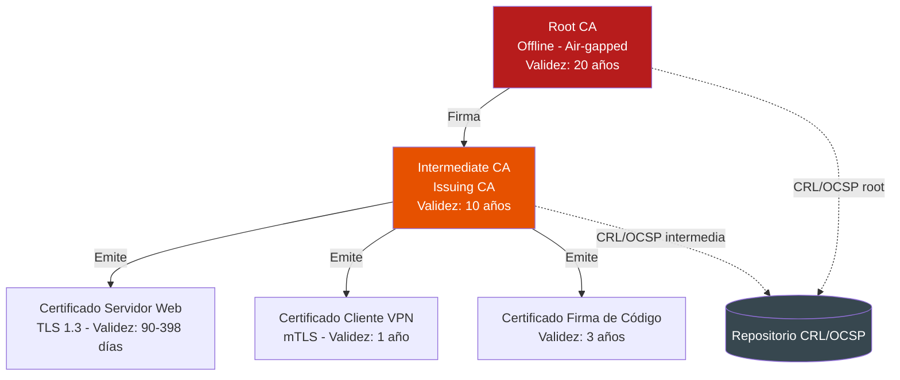
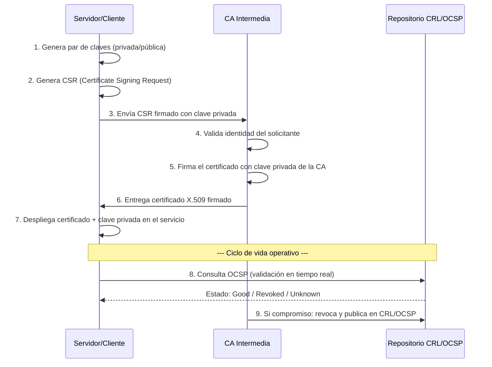

# UD 1: Criptografía Aplicada, Mecanismos de Cifrado y Infraestructura PKI

!!! info "Ficha Técnica de la Unidad"
    * **Resultados de Aprendizaje (RA):** RA1 - Reconoce la legislación y normativa sobre seguridad y protección de datos, y aplica mecanismos de seguridad activa describiendo sus características y relacionándolas con las necesidades de uso del sistema informático.
    * **Criterios de Evaluación (CE):** RA1 - a) Se han valorado las necesidades de protección de la información; b) Se ha analizado la importancia del cifrado de la información; c) Se han descrito los tipos de algoritmos criptográficos y sus aplicaciones; d) Se ha implementado una infraestructura de clave pública (PKI).
    * **Tecnologías Involucradas:** [OpenSSL / PKI](../tech/openssl-pki.md)
    * **Marcos y Estándares:** ENS (RD 311/2022) - Medida `mp.info.3` (Cifrado de la información); CCN-STIC 807 (Criptología de empleo en el ENS); ISO/IEC 27001 - Anexo A.10 (Criptografía); NIST SP 800-57 (Gestión de claves criptográficas); RFC 5280 (X.509 PKI); RFC 8446 (TLS 1.3); RFC 2986/PKCS#10.

!!! tip "Cómo está organizada esta unidad"
    Esta es la primera unidad del módulo y parte completamente de cero: nadie ha cifrado nada nunca ni ha visto un certificado por dentro. Los bloques 0 y 2 construyen la intuición y el vocabulario a mano, con comandos de una sola línea, **antes** de llegar a la PKI jerárquica de producción del bloque 3. Si te saltas los bloques 0 y 2, el bloque 3 va a parecer una colección de ficheros de configuración sin sentido.

---

## 📖 0. Fundamentos Absolutos: ¿Qué Significa Realmente "Cifrar" Algo?

### 0.1 La caja fuerte y la llave

Imagina que quieres enviarle un mensaje en papel a un compañero, pero el mensaje tiene que pasar por manos de gente en la que no confías (el cartero, cualquiera que intercepte el sobre). La solución de toda la vida: metes el papel en una caja fuerte y le das la llave a tu compañero **por otro canal, de antemano**. Quien intercepte la caja no puede leer el mensaje sin la llave.

**Cifrar** es exactamente eso, pero matemático: coges un mensaje legible (**texto en claro**, *plaintext*), le aplicas un **algoritmo** usando una **clave**, y obtienes un resultado ilegible (**texto cifrado**, *ciphertext*). Solo quien tiene la clave correcta puede revertir el proceso (**descifrar**) y recuperar el mensaje original.


### 0.2 Tu primer cifrado real, en una sola línea

Vamos a cifrar un fichero de verdad con una única clave (esto se llama **cifrado simétrico**, porque la misma clave sirve para cifrar y para descifrar):

```bash title="Cifrado simétrico con OpenSSL" linenums="1"
echo "Esto es secreto" > mensaje.txt

# Cifrar con AES-256, pidiendo una passphrase interactivamente
openssl enc -aes-256-cbc -pbkdf2 -salt -in mensaje.txt -out mensaje.enc

# Mirar el resultado: es binario, ilegible sin la clave
cat mensaje.enc

# Descifrar con la MISMA clave
openssl enc -d -aes-256-cbc -pbkdf2 -in mensaje.enc -out mensaje-descifrado.txt
cat mensaje-descifrado.txt
```

Con esto ya has hecho, en la práctica, lo mismo que hace tu VPN o el disco cifrado de tu portátil: un algoritmo (`AES-256`) más una clave (tu passphrase) transforman el mensaje en algo ilegible y viceversa.

### 0.3 El problema que no resuelve el cifrado simétrico

Este método funciona perfectamente si **tú y tu compañero ya habéis quedado en persona** para acordar la clave. Pero en la vida real de una red informática, casi nunca es así: quieres comunicarte de forma segura con un servidor web que no has visto nunca, sin haber quedado antes para intercambiar ninguna clave secreta.

Este es **el problema de la distribución de claves**, y es la razón por la que existe el cifrado asimétrico.

### 0.4 Un par de claves de verdad

En el cifrado **asimétrico**, en vez de una única clave, generas un **par matemáticamente relacionado**: una **clave privada** (que nunca sale de tu equipo) y una **clave pública** (que puedes repartir libremente, incluso publicarla). Lo que se cifra con una, solo se puede descifrar con la otra.

```bash title="Generar tu primer par de claves asimetricas" linenums="1"
# Genera una clave privada RSA de 2048 bits
openssl genpkey -algorithm RSA -pkeyopt rsa_keygen_bits:2048 -out mi_clave_privada.pem

# Extrae la clave publica correspondiente a partir de la privada
openssl pkey -in mi_clave_privada.pem -pubout -out mi_clave_publica.pem

# Mira el contenido (son texto Base64, pero el contenido matematico es ilegible a simple vista)
cat mi_clave_privada.pem
cat mi_clave_publica.pem
```

**La idea clave que resuelve el problema de 0.3:** puedes publicar `mi_clave_publica.pem` en cualquier sitio, sin ningún canal seguro previo. Cualquiera puede usarla para cifrarte un mensaje que **solo tú** (con la privada) podrás leer. No hace falta quedar en persona.

!!! note "¿Por qué no usar siempre cifrado asimétrico entonces?"
    Las operaciones matemáticas del cifrado asimétrico (basadas en factorización de números enormes para RSA, o en curvas elípticas para ECC) son **mucho más lentas** que el cifrado simétrico. Por eso, en la práctica (y lo verás en TLS más adelante), el asimétrico se usa solo para el momento inicial de "ponerse de acuerdo en una clave secreta compartida", y a partir de ahí se cambia a cifrado simétrico (mucho más rápido) para el resto de la conversación. Es lo mejor de los dos mundos.

### 0.5 Qué es un hash y por qué no es lo mismo que cifrar

Un **hash** no cifra nada: coge una entrada de **cualquier tamaño** y produce una huella de **tamaño fijo**, de forma que es prácticamente imposible ir hacia atrás (obtener la entrada a partir de la huella) y cualquier cambio mínimo en la entrada produce una huella completamente distinta.

```bash title="Efecto avalancha: un solo caracter lo cambia todo" linenums="1"
echo -n "Hola mundo" | sha256sum
echo -n "Hola mundo!" | sha256sum
```

Verás dos huellas completamente diferentes, aunque solo hayas añadido un signo de exclamación. Esta propiedad es lo que permite usar un hash para **verificar integridad**: si descargas un fichero y su hash coincide con el publicado por el autor, sabes que no se ha modificado ni un solo bit.

---

## 🧭 1. Fundamentos Teóricos y Arquitectura de Seguridad

### 1.1 La tríada CIA y el papel de la criptografía

Toda decisión de bastionado en este módulo se apoya sobre los tres pilares clásicos de la seguridad de la información:

- **Confidencialidad**: garantizar que solo entidades autorizadas acceden a la información. Se implementa mediante **cifrado simétrico y asimétrico** (bloque 0).
- **Integridad**: garantizar que la información no ha sido alterada. Se implementa mediante **funciones hash** y **HMAC**.
- **Autenticidad y no repudio**: garantizar el origen de la información. Se implementa mediante **firmas digitales** y **certificados X.509** (bloque 2).

!!! note "Normativa y Estándares (ENS / ISO 27001 / RFC)"
    El **ENS (RD 311/2022)**, en su medida `mp.info.3`, exige que la información con calificación de nivel MEDIO o ALTO en confidencialidad se cifre tanto en tránsito como en reposo, empleando algoritmos y longitudes de clave acreditados por el **CCN (Centro Criptológico Nacional)**, recogidos en la guía **CCN-STIC 807**. Este documento es la referencia obligatoria en España para decidir qué algoritmos son admisibles en sistemas de las Administraciones Públicas y sus proveedores.

### 1.2 Cifrado simétrico vs. asimétrico

| Característica | Cifrado Simétrico | Cifrado Asimétrico |
|---|---|---|
| Nº de claves | 1 clave compartida | Par de claves (pública/privada) |
| Velocidad | Muy alta (AES-NI hardware) | Lenta (operaciones modulares grandes) |
| Uso típico | Cifrado masivo de datos (discos, VPN, TLS payload) | Intercambio de claves, firma digital, PKI |
| Algoritmos de referencia (CCN-STIC 807) | AES-256-GCM, ChaCha20-Poly1305 | RSA-3072/4096, ECDSA (curvas NIST P-256/P-384), Ed25519 |
| Problema principal | Distribución segura de la clave | Coste computacional |

!!! warning "Vector de Ataque y Vulnerabilidad"
    Algoritmos y modos considerados **obsoletos y prohibidos** en cualquier despliegue de producción, conforme a CCN-STIC 807 y NIST SP 800-131A:

    - **DES / 3DES**: tamaño de bloque de 64 bits vulnerable al ataque **Sweet32** (colisión de bloque en flujos largos).
    - **RC4**: sesgos estadísticos en el flujo de claves, prohibido en TLS desde RFC 7465.
    - **MD5 y SHA-1**: colisiones prácticas demostradas (ataques *shattered* para SHA-1); no deben usarse para firmas ni certificados.
    - **Modos de cifrado sin autenticación** (AES-CBC sin HMAC): vulnerables a ataques de *padding oracle* (ej. POODLE, Lucky13).
    - **RSA con exponente o padding PKCS#1 v1.5 mal implementado**: vulnerable a **ataques de Bleichenbacher**.

### 1.3 Funciones hash y HMAC

Una función hash criptográfica debe cumplir tres propiedades: **resistencia a preimagen** (no se puede deducir la entrada a partir de la huella), **resistencia a segunda preimagen** (no se puede encontrar otra entrada distinta con la misma huella) y **resistencia a colisiones** (no se pueden encontrar dos entradas cualesquiera con la misma huella). El estándar actual recomendado es la familia **SHA-2** (SHA-256, SHA-384, SHA-512) y, en despliegues nuevos, **SHA-3**.

Para garantizar integridad **y** autenticidad de un mensaje con clave compartida se emplea **HMAC** (`HMAC-SHA256`), que combina la función hash con una clave secreta evitando ataques de extensión de longitud (*length extension attack*) a los que sí es vulnerable un hash simple concatenado con la clave.

---

## 🔐 2. El Problema de la Confianza: Por Qué Necesitamos una PKI

### 2.1 El problema que ni el cifrado ni el hash resuelven

Ya sabes cifrar (bloque 0) y ya sabes verificar integridad con un hash (1.3). Pero queda un problema sin resolver: si alguien te envía **su clave pública** para que le cifres algo, **¿cómo sabes que esa clave pública es realmente suya y no de un atacante** que se ha puesto en medio de la comunicación (ataque *man-in-the-middle*)?

Cifrar con la clave pública equivocada no protege nada: simplemente le estarías enviando el secreto directamente al atacante, cifrado con SU clave, y él lo descifraría sin problema con su propia clave privada.

### 2.2 Tu primer certificado autofirmado

Un **certificado digital** es la solución a "esta clave pública es de quien dice ser": es un fichero que contiene una clave pública, unos datos de identidad, y **una firma digital que da fe de esa asociación**. Vamos a crear el más simple posible: uno que se firma a sí mismo.

```bash title="Certificado autofirmado en una sola linea" linenums="1"
openssl req -x509 -newkey rsa:2048 -nodes \
  -keyout servidor.key.pem -out servidor.cert.pem -days 365 \
  -subj "/C=ES/O=Practica/CN=servidor.practica.local"

# Miralo por dentro: identidad, validez, clave publica, y quien lo firma
openssl x509 -in servidor.cert.pem -noout -text
```

Fíjate en el campo `Issuer` (emisor) del certificado: es **el mismo** que el campo `Subject` (sujeto). El certificado "da fe de sí mismo" — nadie externo lo avala.

### 2.3 Por qué un autofirmado no basta

Si instalas este certificado en un servidor web y un navegador se conecta, mostrará una advertencia de seguridad. El navegador no tiene forma de saber si `servidor.practica.local` es realmente quien dice ser, porque **nadie de confianza lo ha verificado** — el propio servidor es el único que lo afirma, y eso es exactamente lo que haría también un atacante suplantándolo.

### 2.4 La solución: una tercera parte de confianza (CA)

La solución es que un tercero, en el que **todos confían de antemano**, verifique la identidad y firme el certificado con su propia clave privada. Ese tercero es una **Autoridad de Certificación (CA)**. Vamos a construir el caso más simple: una CA de un solo nivel que firma el certificado de un servidor.

```bash title="Una CA minima que firma un certificado ajeno" linenums="1"
# 1. La CA genera su propio par de claves y su propio certificado autofirmado
#    (esto es identico a 2.2, pero ahora este certificado va a actuar de "autoridad")
openssl req -x509 -newkey rsa:4096 -nodes \
  -keyout mini-ca.key.pem -out mini-ca.cert.pem -days 1825 \
  -subj "/C=ES/O=Mini CA de Practica/CN=Mini CA"

# 2. El servidor genera SU PROPIA clave privada y una peticion de firma (CSR),
#    en vez de un certificado autofirmado. El CSR contiene su clave publica + identidad,
#    pero NO va firmado por el propio servidor: va a pedir que otro lo firme.
openssl req -newkey rsa:2048 -nodes \
  -keyout servidor2.key.pem -out servidor2.csr.pem \
  -subj "/C=ES/O=Practica/CN=servidor2.practica.local"

# 3. La CA firma el CSR del servidor con SU clave privada
openssl x509 -req -in servidor2.csr.pem \
  -CA mini-ca.cert.pem -CAkey mini-ca.key.pem -CAcreateserial \
  -out servidor2.cert.pem -days 365

# 4. Verificar: ahora el Issuer del certificado del servidor es la Mini CA, no el mismo servidor
openssl x509 -in servidor2.cert.pem -noout -issuer -subject

# 5. Comprobar la cadena de confianza formalmente
openssl verify -CAfile mini-ca.cert.pem servidor2.cert.pem
```

Ahora sí: si un cliente confía en `mini-ca.cert.pem` (la tiene instalada como "raíz de confianza"), automáticamente confía en cualquier certificado que esa CA haya firmado, sin haber tratado nunca directamente con el servidor. **Este es el mecanismo exacto que usan los navegadores con las CAs públicas (DigiCert, Let's Encrypt...) — solo que a mayor escala.**

### 2.5 Infraestructura de Clave Pública (PKI): arquitectura jerárquica

Una PKI empresarial nunca debe operar con una única CA plana como la de 2.4. El modelo recomendado por CCN-STIC y NIST SP 800-57 es una **jerarquía de dos o tres niveles**:



**Justificación técnica del diseño** (ahora que ya sabes, por 2.4, cómo firma una CA):

1. **La Root CA permanece offline** (equipo desconectado de red, en caja fuerte o HSM): si la clave privada de la CA raíz se compromete, **toda** la cadena de confianza queda invalidada. Mantenerla air-gapped reduce drásticamente la superficie de ataque.
2. **La CA intermedia (Issuing CA)** es la que opera en producción, emitiendo y revocando certificados de hoja — exactamente el papel que hacía tu "Mini CA" del apartado 2.4. Si se compromete, basta con revocarla desde la Root y reemitir una nueva intermedia — el impacto queda contenido.
3. **Los certificados de hoja tienen vida corta** (90 días recomendado por CA/Browser Forum para TLS público, hasta 398 días máximo), forzando rotación automática y reduciendo la ventana de exposición ante robo de clave privada.

### 2.6 El ciclo de vida de un certificado X.509



Cada uno de estos 9 pasos ya lo has ejecutado a mano en el apartado 2.4 (pasos 1-6); los pasos 7-9 (uso operativo, revocación) los verás en producción en el bloque 3.

---

## ⚙️ 3. Configuración Avanzada, Despliegue y Hardening

Vamos a desplegar una **PKI jerárquica de dos niveles** (Root CA + Issuing CA) sobre Debian/Ubuntu Server usando OpenSSL 3.x, siguiendo las recomendaciones de CCN-STIC 807 (RSA-4096 para la Root, RSA-3072 o ECDSA P-384 para la intermedia, SHA-256 como mínimo). Esto es, en esencia, la versión de producción de lo que ya construiste a mano en el apartado 2.4 — con ficheros de configuración para no repetir parámetros en cada comando, y con la separación real Root/Intermedia.

### 3.1 Estructura de directorios de la CA

```bash title="Preparación del entorno de CA" linenums="1"
# Estructura estándar recomendada por la documentación de OpenSSL para CAs jerárquicas
mkdir -p /opt/ca/root-ca/{certs,crl,newcerts,private,csr}
mkdir -p /opt/ca/intermediate-ca/{certs,crl,newcerts,private,csr}

# Permisos restrictivos: la clave privada NUNCA debe ser legible por otros usuarios
chmod 700 /opt/ca/root-ca/private
chmod 700 /opt/ca/intermediate-ca/private

# Ficheros de estado requeridos por OpenSSL para llevar el índice de certificados emitidos
touch /opt/ca/root-ca/index.txt
echo 1000 > /opt/ca/root-ca/serial
touch /opt/ca/intermediate-ca/index.txt
echo 1000 > /opt/ca/intermediate-ca/serial
echo 1000 > /opt/ca/intermediate-ca/crlnumber
```

### 3.2 Fichero de configuración de la Root CA

!!! note "Por qué ahora hace falta un fichero .cnf y antes no"
    En el apartado 2.4 pasabas todos los parámetros por línea de comandos porque eran pocos. Aquí, con `policy_strict`, extensiones `v3_ca`, rutas de índice, etc., sería inmanejable repetirlo en cada comando — por eso se centraliza en un fichero de configuración que OpenSSL lee con `-config`.

```ini title="/opt/ca/root-ca/openssl-root.cnf" linenums="1"
[ ca ]
default_ca = CA_default

[ CA_default ]
dir               = /opt/ca/root-ca
certs             = $dir/certs
new_certs_dir     = $dir/newcerts
database          = $dir/index.txt
serial            = $dir/serial
private_key       = $dir/private/root-ca.key.pem
certificate       = $dir/certs/root-ca.cert.pem
crlnumber         = $dir/crlnumber
crl               = $dir/crl/root-ca.crl.pem
crl_extensions    = crl_ext
default_crl_days  = 365
default_md        = sha256
name_opt          = ca_default
cert_opt          = ca_default
default_days      = 7300
preserve          = no
policy            = policy_strict

[ policy_strict ]
countryName             = match
stateOrProvinceName     = match
organizationName        = match
organizationalUnitName  = optional
commonName              = supplied
emailAddress            = optional

[ req ]
default_bits        = 4096
distinguished_name  = req_distinguished_name
string_mask         = utf8only
default_md          = sha256
x509_extensions     = v3_ca

[ req_distinguished_name ]
countryName                    = Country Name (2 letter code)
stateOrProvinceName             = State or Province Name
organizationName                = Organization Name
commonName                      = Common Name

[ v3_ca ]
subjectKeyIdentifier   = hash
authorityKeyIdentifier = keyid:always,issuer
basicConstraints       = critical, CA:true
keyUsage                = critical, digitalSignature, cRLSign, keyCertSign

[ v3_intermediate_ca ]
subjectKeyIdentifier   = hash
authorityKeyIdentifier = keyid:always,issuer
basicConstraints       = critical, CA:true, pathlen:0
keyUsage                = critical, digitalSignature, cRLSign, keyCertSign

[ crl_ext ]
authorityKeyIdentifier = keyid:always
```

!!! danger "Alerta Crítica y Bastionado (CIS / CCN-CERT)"
    `pathlen:0` en `v3_intermediate_ca` es una directiva **crítica**: impide que la CA intermedia pueda a su vez firmar otras CAs subordinadas, limitando su capacidad exclusivamente a emitir certificados de entidad final (servidores, clientes). Omitir esta restricción permitiría una escalada de la jerarquía de confianza no controlada si la intermedia se ve comprometida.

### 3.3 Generación de la clave y certificado Root CA

```bash title="Generación Root CA (offline)" linenums="1"
cd /opt/ca/root-ca

# 1. Generar clave privada RSA-4096 cifrada con AES-256 (passphrase obligatoria)
openssl genpkey -algorithm RSA -pkeyopt rsa_keygen_bits:4096 \
  -aes-256-cbc -out private/root-ca.key.pem
chmod 400 private/root-ca.key.pem

# 2. Generar certificado autofirmado, validez 20 años (7300 días)
openssl req -config openssl-root.cnf \
  -key private/root-ca.key.pem \
  -new -x509 -days 7300 -sha256 -extensions v3_ca \
  -out certs/root-ca.cert.pem \
  -subj "/C=ES/ST=Sevilla/O=ASIR-CORP/CN=ASIR-CORP Root CA G1"

chmod 444 certs/root-ca.cert.pem

# 3. Verificación del certificado generado
openssl x509 -noout -text -in certs/root-ca.cert.pem | grep -A2 "Validity\|Public-Key\|Signature Algorithm"
```

### 3.4 Generación de la CA Intermedia (Issuing CA)

```bash title="Generación Intermediate CA" linenums="1"
cd /opt/ca/intermediate-ca

# 1. Clave privada de la intermedia: ECDSA P-384 (más rápida y equivalente en seguridad a RSA-7680)
openssl genpkey -algorithm EC -pkeyopt ec_paramgen_curve:P-384 \
  -aes-256-cbc -out private/intermediate-ca.key.pem
chmod 400 private/intermediate-ca.key.pem

# 2. Generar el CSR de la intermedia
openssl req -config openssl-root.cnf -new -sha256 \
  -key private/intermediate-ca.key.pem \
  -out csr/intermediate-ca.csr.pem \
  -subj "/C=ES/ST=Sevilla/O=ASIR-CORP/CN=ASIR-CORP Issuing CA G1"

# 3. La Root CA firma el CSR de la intermedia (operación que solo ocurre en el equipo offline)
cd /opt/ca/root-ca
openssl ca -config openssl-root.cnf -extensions v3_intermediate_ca \
  -days 3650 -notext -md sha256 \
  -in ../intermediate-ca/csr/intermediate-ca.csr.pem \
  -out ../intermediate-ca/certs/intermediate-ca.cert.pem

# 4. Construir la cadena de confianza completa (chain of trust)
cat /opt/ca/intermediate-ca/certs/intermediate-ca.cert.pem \
    /opt/ca/root-ca/certs/root-ca.cert.pem \
    > /opt/ca/intermediate-ca/certs/ca-chain.cert.pem
chmod 444 /opt/ca/intermediate-ca/certs/ca-chain.cert.pem
```

!!! tip "Buenas Prácticas Sysadmin / SecOps"
    Tras firmar la CA intermedia, la máquina Root CA se **apaga y se retira de la red física**. El disco cifrado (LUKS) se custodia en caja fuerte. Solo se reactiva para: (a) renovar la propia intermedia, (b) revocar la intermedia en caso de compromiso, o (c) emitir una nueva CRL raíz anual. Documentar este procedimiento es un requisito auditable bajo ENS `op.exp.10` (Protección de claves criptográficas).

### 3.5 Emisión de un certificado de servidor (hoja) con SAN

Los navegadores modernos y clientes TLS **ignoran el CommonName** desde 2017; es obligatorio usar `subjectAltName` (SAN).

```ini title="/opt/ca/intermediate-ca/openssl-server-ext.cnf" linenums="1"
basicConstraints = CA:FALSE
nsCertType = server
nsComment = "OpenSSL Generated Server Certificate"
subjectKeyIdentifier = hash
authorityKeyIdentifier = keyid,issuer:always
keyUsage = critical, digitalSignature, keyEncipherment
extendedKeyUsage = serverAuth
subjectAltName = @alt_names

[alt_names]
DNS.1 = intranet.asir-corp.local
DNS.2 = www.intranet.asir-corp.local
IP.1  = 10.10.10.50
```

```bash title="Emisión certificado servidor web" linenums="1"
cd /opt/ca/intermediate-ca

# 1. Clave privada del servidor (ECDSA P-256, óptimo para TLS de alto rendimiento)
openssl genpkey -algorithm EC -pkeyopt ec_paramgen_curve:P-256 \
  -out private/intranet.asir-corp.local.key.pem
chmod 400 private/intranet.asir-corp.local.key.pem

# 2. CSR del servidor
openssl req -config ../root-ca/openssl-root.cnf -new -sha256 \
  -key private/intranet.asir-corp.local.key.pem \
  -out csr/intranet.asir-corp.local.csr.pem \
  -subj "/C=ES/ST=Sevilla/O=ASIR-CORP/CN=intranet.asir-corp.local"

# 3. Firma por la CA Intermedia (esta sí opera en caliente, en producción)
openssl ca -config ../root-ca/openssl-root.cnf \
  -extfile openssl-server-ext.cnf \
  -days 90 -notext -md sha256 \
  -in csr/intranet.asir-corp.local.csr.pem \
  -out certs/intranet.asir-corp.local.cert.pem \
  -cert certs/intermediate-ca.cert.pem \
  -keyfile private/intermediate-ca.key.pem

# 4. Verificar la cadena completa
openssl verify -CAfile certs/ca-chain.cert.pem certs/intranet.asir-corp.local.cert.pem
```

### 3.6 Publicación de listas de revocación (CRL) y OCSP

```bash title="Generación y publicación de CRL" linenums="1"
cd /opt/ca/intermediate-ca

# Generar CRL actualizada (debe regenerarse cada vez que se revoca un certificado)
openssl ca -config ../root-ca/openssl-root.cnf -gencrl \
  -out crl/intermediate-ca.crl.pem

# Revocar un certificado comprometido
openssl ca -config ../root-ca/openssl-root.cnf \
  -revoke certs/intranet.asir-corp.local.cert.pem \
  -crl_reason keyCompromise

# Regenerar la CRL tras la revocación (obligatorio)
openssl ca -config ../root-ca/openssl-root.cnf -gencrl \
  -out crl/intermediate-ca.crl.pem
```

```bash title="Servicio OCSP responder (systemd)" linenums="1"
# Lanzar un responder OCSP ligero para validación en tiempo real
openssl ocsp -index /opt/ca/intermediate-ca/index.txt \
  -port 2560 \
  -rsignkey /opt/ca/intermediate-ca/private/intermediate-ca.key.pem \
  -rsigner /opt/ca/intermediate-ca/certs/intermediate-ca.cert.pem \
  -CA /opt/ca/intermediate-ca/certs/ca-chain.cert.pem \
  -text -out /var/log/ocsp-responder.log
```

!!! note "Normativa y Estándares (ENS / ISO 27001 / RFC)"
    El uso de **OCSP** (RFC 6960) frente a la descarga tradicional de **CRL** (RFC 5280 §5) es preferible en entornos de alta disponibilidad porque reduce la latencia de validación y evita la descarga de listas potencialmente grandes; sin embargo, ENS exige un mecanismo de **degradación segura** (*fail hard* vs *fail soft*): en sistemas de nivel ALTO, si el OCSP no responde, la conexión debe rechazarse (fail hard), nunca aceptarse por defecto.

### 3.7 Hardening de parámetros TLS a nivel de kernel y servicio

```ini title="/etc/ssl/openssl.cnf (fragmento de sistema)" linenums="1"
# Fuerza TLS 1.2 como mínimo en toda la pila OpenSSL del sistema (CCN-STIC 807 / CIS)
[system_default_sect]
MinProtocol = TLSv1.2
CipherString = DEFAULT@SECLEVEL=2
```

```bash title="Directivas sysctl relacionadas con entropía criptográfica" linenums="1"
# /etc/sysctl.d/99-crypto-hardening.conf
# Justificación: garantiza un pool de entropía suficiente para la generación
# de claves criptográficas (RSA/EC) evitando claves débiles por falta de aleatoriedad,
# problema documentado en dispositivos embebidos y máquinas virtuales recién clonadas.
kernel.random.write_wakeup_threshold = 256
```

!!! note "¿Por qué importa la entropía? Un caso real"
    En 2008, una modificación defectuosa de OpenSSL en Debian redujo drásticamente la aleatoriedad disponible al generar claves, haciendo que **miles de claves SSH y certificados generados en esos sistemas fueran adivinables** por fuerza bruta en minutos. Este parámetro `sysctl` existe precisamente para que ese tipo de fallo (poca entropía disponible al arrancar una VM recién clonada) no se repita.

---

## 🛠️ 4. Laboratorio Práctico Dirigido

!!! example "Laboratorio Práctico Paso a Paso"
    **Objetivo:** Desplegar la PKI jerárquica completa, emitir un certificado de servidor, configurarlo en Nginx con TLS 1.3 y validar la configuración con herramientas de auditoría externa.

    **Paso 1 — Despliegue de la PKI.** Ejecutar íntegramente los comandos de las secciones 3.1 a 3.5 en una VM Debian 12 dedicada (`ca-server`).

    **Paso 2 — Configurar Nginx con el certificado emitido:**

    ```nginx title="/etc/nginx/sites-available/intranet.conf" linenums="1"
    server {
        listen 443 ssl;
        http2 on;
        server_name intranet.asir-corp.local;

        ssl_certificate     /opt/ca/intermediate-ca/certs/intranet.asir-corp.local.cert.pem;
        ssl_certificate_key /opt/ca/intermediate-ca/private/intranet.asir-corp.local.key.pem;
        ssl_trusted_certificate /opt/ca/intermediate-ca/certs/ca-chain.cert.pem;

        # Bastionado TLS: solo TLS 1.2/1.3, cifrados AEAD (CCN-STIC 807)
        ssl_protocols TLSv1.2 TLSv1.3;
        ssl_ciphers ECDHE-ECDSA-AES256-GCM-SHA384:ECDHE-RSA-AES256-GCM-SHA384:ECDHE-ECDSA-CHACHA20-POLY1305;
        ssl_prefer_server_ciphers off;
        ssl_session_timeout 1d;
        ssl_session_cache shared:SSL:10m;
        ssl_session_tickets off;

        # OCSP Stapling: el propio servidor entrega la validación de revocación,
        # evitando que el cliente consulte directamente a la CA (mejora privacidad y rendimiento)
        ssl_stapling on;
        ssl_stapling_verify on;

        # HSTS: fuerza HTTPS en el navegador durante 1 año, incluyendo subdominios
        add_header Strict-Transport-Security "max-age=31536000; includeSubDomains" always;

        root /var/www/intranet;
        index index.html;
    }

    server {
        listen 80;
        server_name intranet.asir-corp.local;
        return 301 https://$host$request_uri;
    }
    ```

    **Paso 3 — Recargar y validar sintaxis:**

    ```bash
    nginx -t && systemctl reload nginx
    ```

    **Paso 4 — Auditoría de la configuración TLS desde el cliente:**

    ```bash
    # Comprobar protocolo negociado y cifrado
    openssl s_client -connect intranet.asir-corp.local:443 -tls1_3 -CAfile /opt/ca/intermediate-ca/certs/ca-chain.cert.pem

    # Escaneo completo de configuración TLS (cifrados débiles, vulnerabilidades conocidas)
    nmap --script ssl-enum-ciphers -p 443 intranet.asir-corp.local

    # Auditoría automatizada con testssl.sh (herramienta de referencia OWASP)
    testssl.sh --full https://intranet.asir-corp.local
    ```

    **Paso 5 — Prueba de revocación:** revocar el certificado (sección 3.6), reiniciar el responder OCSP, y comprobar que `openssl s_client -status` refleja el estado `REVOKED`.

    **Si algo no funciona, comprueba en este orden:** (1) ¿coinciden los permisos de la clave privada del servidor con lo que Nginx puede leer? (2) `openssl verify -CAfile ca-chain.cert.pem` sobre el certificado del servidor, ¿da `OK`? (3) ¿el `subjectAltName` del certificado incluye el nombre exacto que estás usando para conectarte?

    **Criterio de éxito:** `nmap --script ssl-enum-ciphers` no debe reportar ningún cifrado por debajo de `A`, y `testssl.sh` no debe marcar vulnerabilidades a POODLE, BEAST, Heartbleed ni Sweet32.

---

## 🛡️ 5. Monitoreo, Análisis de Eventos y Respuesta a Incidentes

### 5.1 Ubicación de logs relevantes

| Log | Ruta | Contenido |
|---|---|---|
| Log de acceso Nginx TLS | `/var/log/nginx/access.log` | Negociaciones TLS, códigos de respuesta |
| Log de errores Nginx | `/var/log/nginx/error.log` | Fallos de handshake, certificados caducados |
| Índice de la CA | `/opt/ca/intermediate-ca/index.txt` | Registro de todos los certificados emitidos/revocados |
| Auditoría del sistema | `/var/log/audit/audit.log` | Accesos a ficheros de clave privada (con reglas `auditd`) |

### 5.2 Auditoría de acceso a claves privadas con `auditd`

```bash title="Regla auditd para claves privadas de la CA" linenums="1"
# /etc/audit/rules.d/pki-monitoring.rules
-w /opt/ca/root-ca/private/ -p rwxa -k root_ca_key_access
-w /opt/ca/intermediate-ca/private/ -p rwxa -k intermediate_ca_key_access

# Recargar reglas
augenrules --load
```

```bash title="Consulta de accesos sospechosos" linenums="1"
ausearch -k intermediate_ca_key_access -ts today
```

!!! danger "Alerta Crítica y Bastionado (CIS / CCN-CERT)"
    Cualquier acceso de lectura a `intermediate-ca.key.pem` fuera de la ventana horaria de emisión programada de certificados debe generar una **alerta P1** en el SIEM (ver UD8). El acceso no autorizado a la clave privada de una CA intermedia es indicador directo de un compromiso de infraestructura crítica.

### 5.3 Indicadores de expiración y renovación proactiva

```bash title="Script de comprobación de expiración (cron diario)" linenums="1"
#!/bin/bash
# /usr/local/sbin/check-cert-expiry.sh
CERT="/opt/ca/intermediate-ca/certs/intranet.asir-corp.local.cert.pem"
DAYS_WARNING=15

EXPIRY_EPOCH=$(openssl x509 -enddate -noout -in "$CERT" | cut -d= -f2 | xargs -I{} date -d {} +%s)
NOW_EPOCH=$(date +%s)
DAYS_LEFT=$(( (EXPIRY_EPOCH - NOW_EPOCH) / 86400 ))

if [ "$DAYS_LEFT" -le "$DAYS_WARNING" ]; then
    logger -t cert-monitor "ALERTA: certificado $CERT caduca en $DAYS_LEFT días"
    echo "ALERTA: certificado $CERT caduca en $DAYS_LEFT días" | mail -s "Certificado próximo a caducar" secops@asir-corp.local
fi
```

---

## ❓ 6. Casos Prácticos y Autoevaluación Técnica

**Caso 1 — Compromiso de clave privada de servidor.**
*Escenario:* Un desarrollador sube por error la clave privada `intranet.asir-corp.local.key.pem` a un repositorio Git público.
*Resolución:* (1) Revocar inmediatamente el certificado con `-crl_reason keyCompromise`; (2) regenerar la CRL y verificar propagación OCSP; (3) generar nuevo par de claves y CSR, jamás reutilizar la clave comprometida; (4) purgar el historial de Git (`git filter-repo`) y rotar cualquier credencial expuesta en el mismo commit; (5) documentar el incidente conforme a ENS `op.exp.8` (Registro de incidentes).

**Caso 2 — Certificado autofirmado detectado en producción.**
*Escenario:* Un escaneo de red revela un servicio interno usando un certificado autofirmado con RSA-1024 y SHA-1.
*Resolución:* RSA-1024 y SHA-1 incumplen CCN-STIC 807. Emitir un certificado nuevo desde la CA intermedia corporativa con ECDSA P-256/SHA-256, desplegarlo, y añadir el servicio al inventario de activos sujetos a rotación automática (ver UD6, gestión de configuración).

**Caso 3 — Fallo de validación OCSP en cliente crítico.**
*Escenario:* El responder OCSP cae y los clientes de VPN empresarial (mTLS) no pueden validar el estado de revocación.
*Resolución:* En sistemas de nivel ALTO (ENS), la política debe ser *fail hard*: denegar el acceso. La solución estructural es desplegar el responder OCSP en alta disponibilidad (ver UD9/UD10, HAProxy + Keepalived) y considerar **OCSP Stapling** para reducir la dependencia de disponibilidad en tiempo real del responder externo.

**Caso 4 — Ataque de degradación de protocolo (downgrade).**
*Escenario:* Un pentest detecta que el servidor Nginx acepta TLS 1.0 además de TLS 1.2/1.3, pese a la configuración.
*Resolución:* Revisar si existe un balanceador o proxy inverso delante de Nginx (ver UD9) que reintroduce protocolos antiguos por configuración heredada. Auditar **todos** los puntos de terminación TLS de la cadena, no solo el servidor final, y aplicar `ssl_protocols TLSv1.2 TLSv1.3;` de forma consistente en cada capa.

**Caso 5 — Expiración no planificada de la CA intermedia.**
*Escenario:* La CA intermedia caduca sin haberse renovado, invalidando de golpe todos los certificados de hoja emitidos por ella (aunque estos individualmente no hayan caducado).
*Resolución:* Esto evidencia un fallo de proceso, no técnico. La solución preventiva es un **sistema de alertas de expiración en cascada** (sección 5.3) aplicado también a los certificados de las propias CAs, con antelación mínima de 90 días para la intermedia (dado el tiempo necesario para coordinar la operación offline con la Root CA).

---

## 📋 7. Glosario Rápido de Repaso

| Término | Definición en una línea |
|---|---|
| **Texto en claro / cifrado** | El mensaje legible original, y su versión ilegible tras aplicar algoritmo + clave |
| **Cifrado simétrico** | Una única clave sirve para cifrar y descifrar; rápido, problema: distribuir la clave |
| **Cifrado asimétrico** | Par de claves (pública/privada); lo cifrado con una solo se descifra con la otra |
| **Hash** | Huella de tamaño fijo a partir de una entrada de cualquier tamaño; no es reversible |
| **CSR** | Petición de firma de certificado: clave pública + identidad, sin firmar todavía |
| **Certificado X.509** | Clave pública + identidad + firma de una CA que da fe de esa asociación |
| **CA (Autoridad de Certificación)** | Tercero de confianza que firma certificados, avalando la identidad del titular |
| **Cadena de confianza** | El recorrido certificado hoja → CA intermedia → CA raíz, hasta llegar a algo ya confiado |
| **CRL / OCSP** | Dos mecanismos para consultar si un certificado ha sido revocado antes de su caducidad |

!!! question "Autoevaluación final antes de pasar a la práctica"
    1. ¿Por qué el cifrado asimétrico no sustituye por completo al simétrico, si resuelve el problema de la distribución de claves?
    2. ¿Qué diferencia hay entre un certificado autofirmado y uno firmado por una CA, y por qué esa diferencia importa para la confianza?
    3. Si la clave privada de la CA raíz se compromete, ¿por qué es mucho peor que si se compromete la de la CA intermedia?
    4. ¿Qué comprueba exactamente `openssl verify -CAfile ca-chain.cert.pem certificado.pem`?
