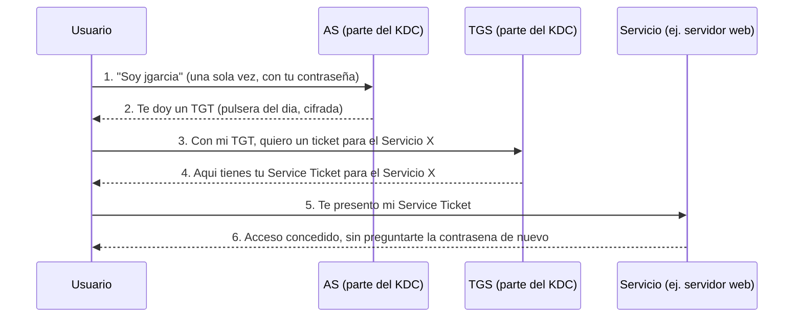
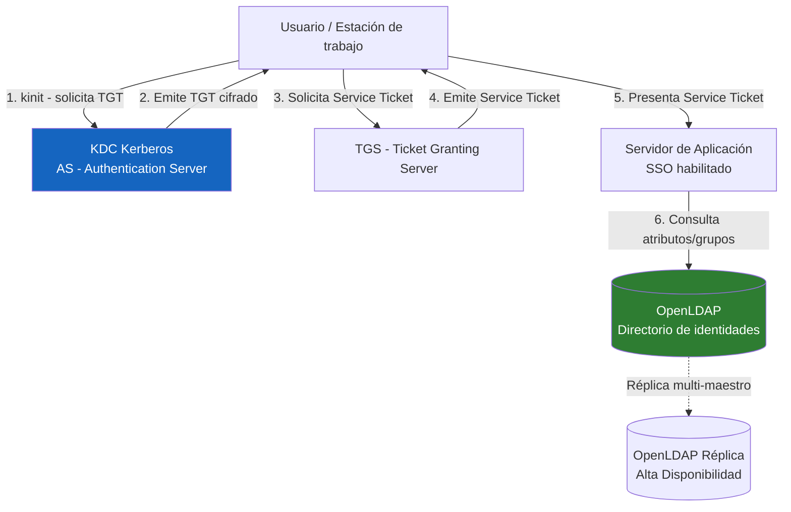

# UD 2: Autenticación Avanzada, Control de Acceso y Servicios de Directorio Seguros

!!! info "Ficha Técnica de la Unidad"
    * **Resultados de Aprendizaje (RA):** RA1 - Aplica mecanismos de seguridad activa; RA2 - Implementa mecanismos de seguridad pasiva y control de acceso a redes.
    * **Criterios de Evaluación (CE):** RA1 - e) Se han descrito los mecanismos de autenticación fuerte; f) Se han implementado políticas de contraseñas robustas; g) Se ha configurado un servicio de directorio seguro. RA2 - a) Se ha analizado la necesidad del control de acceso a la red.
    * **Tecnologías Involucradas:** [OpenLDAP y Kerberos](../tech/ldap-kerberos.md)
    * **Marcos y Estándares:** ENS `mp.per.4` (Formación/concienciación), `op.acc` (Control de acceso); NIST SP 800-63B (Digital Identity Guidelines - autenticación); ISO 27001 Anexo A.9 (Control de acceso); RFC 4511 (LDAPv3), RFC 4120 (Kerberos v5).

!!! tip "Cómo está organizada esta unidad"
    Esta unidad mete de golpe tres tecnologías nuevas a la vez: LDAP, Kerberos y PAM. Si las tres se presentan mezcladas desde el principio (que es como aparecen en un sistema real), es fácil perderse. Por eso el bloque 0 presenta **cada una por separado**, con su propio ejemplo mínimo, antes de que el bloque 2 las combine en la arquitectura conjunta que verás en producción.

---

## 📖 0. Fundamentos Absolutos: Tres Piezas que hay que Entender por Separado

### 0.1 El problema de fondo: identidad repartida por 50 máquinas

Imagina una empresa con 50 ordenadores. Sin nada de lo que vas a ver hoy, cada máquina tendría su propio fichero `/etc/passwd` con sus propios usuarios. Si Juan cambia de contraseña, tendría que cambiarla en las 50 máquinas. Si Juan se va de la empresa, alguien tendría que acordarse de borrarlo de las 50. Esto es inviable a cualquier escala real.

La solución: centralizar **dónde vive la identidad** (LDAP) y **cómo se demuestra esa identidad** (Kerberos), de forma que las 50 máquinas consulten a un servicio central en vez de mantener su propia copia.

### 0.2 Qué es LDAP: una agenda de contactos jerárquica

**LDAP (Lightweight Directory Access Protocol)** es, en esencia, una base de datos especializada en almacenar información organizada **en árbol**, pensada para leerse mucho y escribirse poco — perfecto para datos de identidad (usuarios, grupos, departamentos), que cambian poco comparado con las veces que se consultan.

Piensa en el árbol de directorios de tu sistema de ficheros: `/home/juan/documentos/factura.pdf` se lee "de más general a más específico". En LDAP ocurre lo mismo pero al revés y con otro vocabulario: se llama **DN (Distinguished Name)** y se lee de más específico a más general:

```
uid=jgarcia,ou=people,dc=asir-corp,dc=local
```

Se lee así: "el usuario `jgarcia`, dentro de la unidad organizativa `people`, dentro del dominio `asir-corp.local`". Cada entrada del árbol tiene, además, uno o varios **`objectClass`**, que son como "plantillas" que definen qué atributos puede o debe tener esa entrada (por ejemplo, la clase `inetOrgPerson` exige tener un `cn` y un `sn`).

### 0.3 Mirar antes de escribir: tu primera consulta LDAP

Antes de crear nada, vamos a **consultar** un directorio LDAP de ejemplo ya instalado, para ver la forma de los datos con los que vamos a trabajar:

```bash title="Tu primera consulta LDAP" linenums="1"
# Instala un servidor OpenLDAP local minimo para practicar (se configurara a fondo en el bloque 2)
apt install slapd ldap-utils -y

# Busca TODO lo que hay bajo la raiz del directorio (-x = autenticacion simple/anonima)
ldapsearch -x -b "dc=asir-corp,dc=local"

# Busca solo un tipo de entrada concreto
ldapsearch -x -b "dc=asir-corp,dc=local" "(objectClass=organizationalUnit)"
```

El resultado son bloques de texto con formato `atributo: valor`, agrupados por su `dn`. Esto es exactamente lo que verás (y escribirás) en los ficheros LDIF del bloque 2.

### 0.4 Qué es Kerberos: el pase de un solo uso que evita repetir tu contraseña

Kerberos resuelve un problema distinto: **cómo demostrar quién eres sin mandar tu contraseña por la red cada vez que accedes a un servicio nuevo**.

La analogía clásica (y la razón por la que la mascota del protocolo es un perro de tres cabezas, Cerbero): imagina un parque temático con muchas atracciones.

1. **Llegas a la entrada principal** y muestras tu documento de identidad una única vez. A cambio, te dan una **pulsera del día** (esto es el **TGT**, *Ticket Granting Ticket*). Esto lo hace el **AS**, *Authentication Server*.
2. Con esa pulsera, cada vez que quieres subir a una atracción, se la enseñas a un mostrador especializado (el **TGS**, *Ticket Granting Server*) y te dan un **ticket específico para esa atracción concreta**, sin tener que volver a mostrar tu documento de identidad.
3. Le das ese ticket específico al operario de la atracción (el **servicio** al que te quieres conectar), que lo acepta sin necesidad de llamar a la entrada principal para comprobar nada.

**AS + TGS juntos forman lo que se llama el KDC (Key Distribution Center)** — es el mismo servidor haciendo ambos papeles.



**Lo importante:** después del paso 1, **tu contraseña nunca vuelve a viajar por la red**. Todo lo que circula después son tickets cifrados con tiempo de vida limitado.

### 0.5 Qué es PAM y por qué su sintaxis parece un jeroglífico

**PAM (Pluggable Authentication Modules)** es el sistema de Linux que decide, de forma modular, cómo se autentica cualquier programa (login, sudo, ssh...). En vez de que cada programa tenga su propia lógica de "comprobar contraseña", todos delegan en PAM, y PAM ejecuta una **pila (stack) de módulos** en orden, uno detrás de otro.

Cada línea de un fichero de configuración PAM tiene esta forma:

```
tipo    control    modulo.so    argumentos
```

- **tipo**: en qué momento actúa (`auth` = comprobar identidad, `account` = comprobar si la cuenta puede acceder, `password` = cambiar contraseña, `session` = qué hacer al abrir/cerrar sesión)
- **control**: qué pasa según el resultado de ese módulo. Los cuatro valores simples que debes conocer primero:

| Control | Efecto si falla | Efecto si tiene éxito |
|---|---|---|
| `required` | Recuerda el fallo, pero sigue evaluando el resto de la pila | Sigue evaluando el resto |
| `requisite` | Corta inmediatamente, deniega ya | Sigue evaluando el resto |
| `sufficient` | Sigue evaluando el resto | Si nada anterior falló, deniega ya con éxito |
| `optional` | No decide nada por sí solo (salvo que sea el único módulo) | No decide nada por sí solo |

```ini title="Ejemplo minimo de una pila de autenticacion" linenums="1"
# Primero se exige que la cuenta no este bloqueada por intentos fallidos
auth requisite pam_faillock.so
# Despues se comprueba la contrasena contra la base local de usuarios
auth required pam_unix.so
```

Una vez entiendes esta tabla, la sintaxis avanzada que verás en el bloque 2 (`[success=2 default=ignore]`) es simplemente una forma más precisa de decir lo mismo: en vez de una palabra fija, defines exactamente **cuántas líneas saltar** según cada posible resultado (éxito, fallo, error...). Es más flexible, pero se apoya en la misma idea de pila que acabas de ver.

---

## 🧭 1. Fundamentos Teóricos y Arquitectura de Seguridad

### 1.1 El modelo AAA: Autenticación, Autorización y Auditoría (Accounting)

Todo control de acceso robusto se descompone en tres fases independientes que **nunca deben confundirse**:

- **Autenticación (Authentication):** demostrar que un sujeto es quien dice ser (algo que sabe, algo que tiene, algo que es). Es lo que resuelve Kerberos (0.4).
- **Autorización (Authorization):** determinar qué recursos puede usar ese sujeto ya autenticado (RBAC, ACLs). Es lo que resuelve, en parte, la información almacenada en LDAP (0.2): grupos, atributos.
- **Auditoría (Accounting):** registrar qué ha hecho el sujeto autenticado y autorizado, con marca temporal y trazabilidad no repudiable.

!!! note "Normativa y Estándares (ENS / ISO 27001 / RFC)"
    **NIST SP 800-63B** clasifica los "Authenticator Assurance Levels" (AAL1, AAL2, AAL3). El ENS exige, para sistemas de categoría MEDIA o ALTA, un nivel equivalente a **AAL2 como mínimo**: autenticación multifactor (MFA) con al menos dos factores de naturaleza distinta (conocimiento + posesión, o conocimiento + inherencia).

### 1.2 Factores de autenticación y su robustez relativa

| Factor | Ejemplo | Vector de ataque típico |
|---|---|---|
| Algo que se sabe | Contraseña, PIN | Fuerza bruta, phishing, reutilización de credenciales |
| Algo que se tiene | TOTP (Google Authenticator), token FIDO2/YubiKey | SIM-swapping (en SMS OTP), robo físico |
| Algo que se es | Huella, reconocimiento facial | Suplantación biométrica (menos común, mayor coste) |

!!! warning "Vector de Ataque y Vulnerabilidad"
    El **SMS OTP** no se considera un segundo factor robusto según NIST SP 800-63B (Rev. 3), que lo relega a "restricted authenticator" por su vulnerabilidad a *SIM-swapping* e interceptación SS7. Los estándares actuales recomiendan **TOTP (RFC 6238)** o, preferentemente, claves de seguridad **FIDO2/WebAuthn**, resistentes a phishing por diseño (vinculación criptográfica al origen/dominio).

---

## 🏛️ 2. Combinando las Piezas: Arquitectura de Directorio Centralizado

Ahora que conoces LDAP, Kerberos y PAM por separado (bloque 0), vamos a ver cómo se combinan en un sistema real de autenticación centralizada.



**Justificación arquitectónica:** Kerberos resuelve el problema de **autenticación** mediante tickets cifrados con vida limitada (evita transmitir contraseñas por la red, principio de *Single Sign-On*, como viste en 0.4), mientras que LDAP resuelve el problema de **autorización y almacenamiento de identidad** (grupos, atributos, políticas), como viste en 0.2-0.3. Es un error de diseño común confundir ambos roles: Kerberos no almacena usuarios, solo los autentica; LDAP no autentica de forma segura por sí solo salvo mediante *simple bind* sobre TLS.

### 2.1 Políticas de contraseñas y hashing de credenciales

!!! danger "Alerta Crítica y Bastionado (CIS / CCN-CERT)"
    Las contraseñas **nunca** deben almacenarse en texto claro ni con hash simple (MD5/SHA1 sin *salt*). El estándar de facto en Linux es `yescrypt` (sustituyendo a SHA-512crypt desde Debian 11/Ubuntu 22.04), configurado en `/etc/login.defs` y gestionado por PAM (`pam_unix.so`). Para servicios expuestos a Internet, se exige además **rate limiting** de intentos de login (ver `pam_faillock`) para mitigar fuerza bruta.

---

## ⚙️ 3. Configuración Avanzada, Despliegue y Hardening

### 3.1 Despliegue de OpenLDAP como directorio central

Esto es la versión de producción de la consulta que hiciste en el apartado 0.3: ahora vas a **crear** la estructura, no solo consultarla.

```bash title="Instalación y configuración inicial OpenLDAP" linenums="1"
apt install slapd ldap-utils -y

# Configuración interactiva del dominio base (dc=asir-corp,dc=local)
dpkg-reconfigure slapd
```

```ldif title="/opt/ldap/base-structure.ldif" linenums="1"
dn: ou=people,dc=asir-corp,dc=local
objectClass: organizationalUnit
ou: people

dn: ou=groups,dc=asir-corp,dc=local
objectClass: organizationalUnit
ou: groups

dn: cn=sysadmins,ou=groups,dc=asir-corp,dc=local
objectClass: groupOfNames
cn: sysadmins
member: uid=jgarcia,ou=people,dc=asir-corp,dc=local

dn: uid=jgarcia,ou=people,dc=asir-corp,dc=local
objectClass: inetOrgPerson
objectClass: posixAccount
objectClass: shadowAccount
uid: jgarcia
cn: Juan Garcia
sn: Garcia
uidNumber: 10001
gidNumber: 10001
homeDirectory: /home/jgarcia
loginShell: /bin/bash
userPassword: {CRYPT}$y$j9T$...HASH_YESCRYPT_GENERADO...
```

!!! note "Leyendo este LDIF con lo aprendido en 0.2"
    Fíjate en `uid=jgarcia,ou=people,dc=asir-corp,dc=local`: es exactamente la misma estructura de DN que ya leíste en el bloque 0. El `objectClass: inetOrgPerson` es la "plantilla" que exige (entre otras cosas) los atributos `cn` y `sn` que ves justo debajo. Y `member: uid=jgarcia,...` dentro del grupo `sysadmins` es, literalmente, una referencia al DN completo de esa persona — así es como LDAP modela pertenencia a grupos.

```bash title="Carga de la estructura y cifrado TLS obligatorio" linenums="1"
ldapadd -x -D "cn=admin,dc=asir-corp,dc=local" -W -f /opt/ldap/base-structure.ldif

# Forzar LDAPS (TLS) usando el certificado emitido por la PKI corporativa (ver UD1)
cat <<EOF > /opt/ldap/tls-config.ldif
dn: cn=config
changetype: modify
replace: olcTLSCertificateFile
olcTLSCertificateFile: /opt/ca/intermediate-ca/certs/ldap.asir-corp.local.cert.pem
-
replace: olcTLSCertificateKeyFile
olcTLSCertificateKeyFile: /opt/ca/intermediate-ca/private/ldap.asir-corp.local.key.pem
-
replace: olcTLSCACertificateFile
olcTLSCACertificateFile: /opt/ca/intermediate-ca/certs/ca-chain.cert.pem
EOF
ldapmodify -Y EXTERNAL -H ldapi:/// -f /opt/ldap/tls-config.ldif
```

!!! danger "Alerta Crítica y Bastionado (CIS / CCN-CERT)"
    Deshabilitar `ldap://` (puerto 389 en claro) en producción. En `/etc/default/slapd`, la variable `SLAPD_SERVICES` debe restringirse a `"ldaps:/// ldapi:///"`, eliminando el *listener* en texto claro para impedir la captura de credenciales `simple bind` en tránsito.

### 3.2 Despliegue de Kerberos (MIT KRB5) como KDC

Esto despliega el KDC (AS+TGS) que viste conceptualmente en el apartado 0.4. El **realm** (`ASIR-CORP.LOCAL`) es, sencillamente, el nombre del "reino" Kerberos — el equivalente al dominio en LDAP, pero en mayúsculas por convención.

```ini title="/etc/krb5kdc/kdc.conf" linenums="1"
[kdcdefaults]
    kdc_ports = 88
    kdc_tcp_ports = 88

[realms]
    ASIR-CORP.LOCAL = {
        acl_file = /etc/krb5kdc/kadm5.acl
        dict_file = /usr/share/dict/words
        admin_keytab = /etc/krb5kdc/kadm5.keytab
        supported_enctypes = aes256-cts-hmac-sha384-192:normal aes128-cts-hmac-sha256-128:normal
        max_life = 10h 0m 0s
        max_renewable_life = 7d 0h 0m 0s
    }
```

!!! warning "Vector de Ataque y Vulnerabilidad"
    `supported_enctypes` **debe** excluir explícitamente `des-cbc-crc`, `des3-cbc-sha1` y `rc4-hmac` (usado por defecto en NTLM/AD legado), vulnerables a ataques de **Kerberoasting** offline debido a su baja resistencia frente a cracking de fuerza bruta. Restringir a familias **AES-256/AES-128** conforme a RFC 8429.

```ini title="/etc/krb5.conf (cliente)" linenums="1"
[libdefaults]
    default_realm = ASIR-CORP.LOCAL
    dns_lookup_realm = false
    dns_lookup_kdc = false
    ticket_lifetime = 10h
    renew_lifetime = 7d
    forwardable = true
    rdns = false
    default_tgs_enctypes = aes256-cts-hmac-sha384-192
    default_tkt_enctypes = aes256-cts-hmac-sha384-192

[realms]
    ASIR-CORP.LOCAL = {
        kdc = kdc.asir-corp.local
        admin_server = kdc.asir-corp.local
    }

[domain_realm]
    .asir-corp.local = ASIR-CORP.LOCAL
    asir-corp.local = ASIR-CORP.LOCAL
```

```bash title="Inicialización del reino Kerberos y creación de principal" linenums="1"
kdb5_util create -s -r ASIR-CORP.LOCAL

kadmin.local -q "addprinc jgarcia"
kadmin.local -q "addprinc -randkey host/srv-web.asir-corp.local"
kadmin.local -q "ktadd -k /etc/krb5.keytab host/srv-web.asir-corp.local"

systemctl enable --now krb5-kdc krb5-admin-server
```

!!! note "Vocabulario de este bloque, conectado con 0.4"
    Un **principal** (`jgarcia`, o `host/srv-web.asir-corp.local`) es la identidad concreta que Kerberos autentica — puede ser una persona o un servicio. Un **keytab** es un fichero que guarda de forma segura las claves de un principal para que un servicio (no una persona) pueda autenticarse sin que nadie teclee una contraseña — imprescindible para procesos automáticos.

### 3.3 Integración PAM: autenticación centralizada + MFA con TOTP

Con la tabla de controles simples de 0.5 ya interiorizada, esta pila de PAM se lee así: primero se exige TOTP, y **después**, con la sintaxis numérica de saltos, se intenta Kerberos y si falla se cae a la validación local.

```bash title="/etc/pam.d/common-auth" linenums="1"
# Orden crítico: primero MFA (TOTP), después la validación contra Kerberos/LDAP
auth    required                        pam_google_authenticator.so nullok
auth    [success=2 default=ignore]      pam_krb5.so minimum_uid=1000
auth    [success=1 default=ignore]      pam_unix.so nullok_secure try_first_pass
auth    requisite                       pam_deny.so
auth    required                        pam_permit.so
```

!!! note "Leyendo la sintaxis [success=N default=ignore] con lo visto en 0.5"
    `[success=2 default=ignore]` en la línea de `pam_krb5.so` significa: *"si este módulo tiene éxito, salta las 2 líneas siguientes (ya no hace falta comprobar `pam_unix.so`); si el resultado es cualquier otro (`default`), ignóralo y sigue a la siguiente línea sin decidir nada todavía"*. Es la misma idea de `sufficient` de la tabla de 0.5, pero indicando el número exacto de saltos en vez de usar una palabra fija — necesario aquí porque hay más de dos posibles caminos según qué módulo tenga éxito.

```ini title="/etc/security/faillock.conf" linenums="1"
# Bloqueo tras 5 intentos fallidos durante 15 minutos (mitigación de fuerza bruta local)
deny = 5
unlock_time = 900
fail_interval = 900
even_deny_root
audit
```

```ini title="/etc/pam.d/common-password (política de calidad de contraseñas)" linenums="1"
password requisite pam_pwquality.so retry=3 minlen=14 difok=4 ucredit=-1 lcredit=-1 dcredit=-1 ocredit=-1 reject_username enforce_for_root
password [success=1 default=ignore] pam_unix.so obscure use_authtok try_first_pass yescrypt
password requisite pam_deny.so
password required pam_permit.so
```

!!! tip "Buenas Prácticas Sysadmin / SecOps"
    `minlen=14` sigue las recomendaciones actuales de NIST SP 800-63B, que **prioriza longitud sobre complejidad forzada** (las políticas de rotación obligatoria cada 30/60 días están hoy desaconsejadas porque inducen a los usuarios a patrones predecibles). En su lugar, se recomienda longitud mínima alta + comprobación contra listas de contraseñas filtradas (`pam_pwquality` con diccionario `cracklib`) + MFA obligatorio.

---

## 🛠️ 4. Laboratorio Práctico Dirigido

!!! example "Laboratorio Práctico Paso a Paso"
    **Objetivo:** Desplegar un directorio LDAP+Kerberos funcional, unir un cliente Linux al dominio, y validar el flujo SSO completo.

    **Paso 1.** Desplegar OpenLDAP y Kerberos siguiendo 3.1 y 3.2 sobre un servidor Debian dedicado (`kdc-ldap-server`).

    **Paso 2.** Configurar el cliente para autenticación centralizada:
    ```bash
    apt install libpam-krb5 libnss-ldap sssd sssd-tools -y
    ```
    ```ini title="/etc/sssd/sssd.conf" linenums="1"
    [sssd]
    services = nss, pam
    domains = asir-corp.local

    [domain/asir-corp.local]
    id_provider = ldap
    auth_provider = krb5
    ldap_uri = ldaps://kdc-ldap-server.asir-corp.local
    ldap_search_base = dc=asir-corp,dc=local
    ldap_tls_reqcert = demand
    ldap_tls_cacert = /opt/ca/intermediate-ca/certs/ca-chain.cert.pem
    krb5_server = kdc-ldap-server.asir-corp.local
    krb5_realm = ASIR-CORP.LOCAL
    cache_credentials = true
    enumerate = false
    ```
    ```bash
    chmod 600 /etc/sssd/sssd.conf
    systemctl enable --now sssd
    ```

    **Paso 3 — Validar obtención de ticket Kerberos:**
    ```bash
    kinit jgarcia
    klist
    ```

    **Paso 4 — Validar login vía SSSD/PAM y comprobar resolución de grupos LDAP:**
    ```bash
    id jgarcia
    getent group sysadmins
    ```

    **Paso 5 — Prueba de bloqueo por fuerza bruta:** provocar 6 intentos fallidos consecutivos con contraseña incorrecta y verificar bloqueo con `faillock --user jgarcia`.

    **Si algo no funciona, comprueba en este orden:** (1) `kinit jgarcia` a secas, sin SSSD de por medio — ¿el KDC responde? (2) `ldapsearch` contra el servidor LDAP — ¿el TLS es válido y la búsqueda devuelve la entrada esperada? (3) `journalctl -u sssd` — ¿qué error concreto reporta al intentar unir ambas piezas?

    **Criterio de éxito:** `klist` muestra un ticket TGT válido con cifrado `aes256-cts-hmac-sha384-192`, y `id jgarcia` resuelve correctamente el grupo `sysadmins` desde LDAP.

---

## 🛡️ 5. Monitoreo, Análisis de Eventos y Respuesta a Incidentes

| Log | Ruta | Contenido relevante |
|---|---|---|
| Autenticación PAM | `/var/log/auth.log` | Intentos de login, bloqueos `faillock`, uso de `sudo` |
| Kerberos KDC | `/var/log/krb5kdc.log` | Emisión de TGT/tickets, fallos de preautenticación |
| OpenLDAP | `/var/log/slapd.log` (vía syslog local4) | Operaciones `bind`, `search`, `modify` |
| SSSD | `/var/log/sssd/sssd_asir-corp.local.log` | Resolución de identidades, caché, fallos de conexión al KDC/LDAP |

```bash title="Detección de Kerberoasting (solicitudes masivas de Service Tickets)" linenums="1"
grep "TGS_REQ" /var/log/krb5kdc.log | awk '{print $9}' | sort | uniq -c | sort -rn | head -20
```

!!! danger "Alerta Crítica y Bastionado (CIS / CCN-CERT)"
    Un volumen anómalo de solicitudes `TGS_REQ` para múltiples *service principals* distintos desde una única cuenta en un intervalo corto es el indicador clásico de un ataque de **Kerberoasting**: el atacante solicita tickets de servicio masivamente para extraer sus hashes y crackearlos offline. Correlacionar este patrón en el SIEM (UD8) con alerta automática.

---

## ❓ 6. Casos Prácticos y Autoevaluación Técnica

**Caso 1 — Cuenta de servicio con SPN débil.** Un pentest interno crackea offline el hash de un Service Ticket Kerberos en minutos. *Resolución:* la cuenta de servicio tenía una contraseña corta reutilizada. Migrar a `supported_enctypes` solo AES, forzar contraseñas de servicio ≥25 caracteres aleatorios gestionadas por Vault (UD12), y rotarlas periódicamente.

**Caso 2 — Bind LDAP anónimo permitido.** Un escaneo externo revela que `ldapsearch -x -H ldaps://... -b "dc=asir-corp,dc=local"` sin credenciales devuelve el árbol completo. *Resolución:* añadir en `olcAccess` una ACL que deniegue `bind` anónimo salvo para atributos estrictamente necesarios (ej. `rootDSE`), conforme a CIS Benchmark de OpenLDAP.

**Caso 3 — MFA bypass por `nullok`.** Usuarios sin TOTP configurado pueden autenticarse igualmente. *Resolución:* la directiva `nullok` en `pam_google_authenticator.so` permite el bypass durante el periodo de adopción; debe eliminarse tras el despliegue completo, forzando MFA obligatorio para todas las cuentas.

**Caso 4 — Ticket Kerberos con vida excesiva usado tras revocación de cuenta.** Un empleado despedido sigue accediendo a recursos durante horas tras la baja en LDAP. *Resolución:* Kerberos no revoca tickets ya emitidos; reducir `max_life`/`ticket_lifetime` a valores operativos mínimos (8-10h) y sincronizar la baja LDAP con la invalidación de sesiones SSSD (`sss_cache -u usuario`) y purga de cachés locales.

**Caso 5 — Réplica LDAP desincronizada tras fallo de red.** La réplica secundaria queda con datos obsoletos, permitiendo login con una contraseña ya rotada en el maestro. *Resolución:* verificar `syncrepl` con `contextCSN`, forzar resincronización completa (`refreshAndPersist`), y establecer monitorización activa del delta de replicación como parte de la HA de directorio (relacionado con UD9/UD10).

---

## 📋 7. Glosario Rápido de Repaso

| Término | Definición en una línea |
|---|---|
| **DN (Distinguished Name)** | Dirección completa y única de una entrada en el árbol LDAP |
| **objectClass** | "Plantilla" que define qué atributos debe o puede tener una entrada LDAP |
| **Realm** | El "reino" o dominio de confianza de Kerberos (equivalente al dominio LDAP) |
| **Principal** | Identidad concreta que Kerberos autentica: una persona o un servicio |
| **TGT** | Ticket Granting Ticket: la "pulsera del día", obtenida una vez con tu contraseña |
| **Service Ticket** | Ticket específico para un servicio concreto, obtenido a partir del TGT |
| **KDC** | Key Distribution Center: el servidor que hace de AS + TGS a la vez |
| **Keytab** | Fichero que guarda claves de un principal para autenticación automática sin contraseña |
| **PAM stack** | Secuencia ordenada de módulos que deciden, paso a paso, si se concede acceso |

!!! question "Autoevaluación final antes de pasar a la práctica"
    1. ¿Por qué separar identidad (LDAP) y autenticación (Kerberos) en dos sistemas distintos, en vez de que uno haga las dos cosas?
    2. Después de obtener un TGT, ¿por qué tu contraseña ya no vuelve a viajar por la red al acceder a un nuevo servicio?
    3. En la pila PAM del bloque 3.3, ¿qué pasaría si `pam_google_authenticator.so` no tuviera `nullok` y un usuario no tuviera TOTP configurado?
    4. ¿Por qué revocar a un usuario en LDAP no basta por sí solo para cortarle el acceso inmediatamente si ya tiene un TGT válido?
