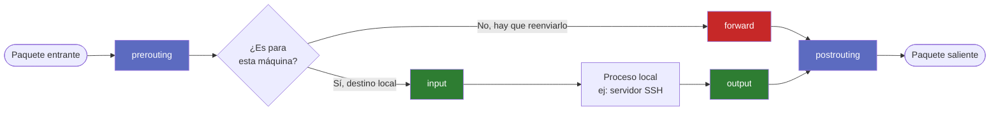
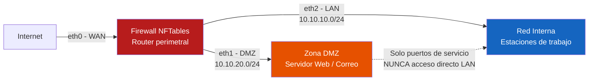

# UD 3: Cortafuegos Stateful y Filtrado Perimetral con IPtables/NFTables

!!! info "Ficha Técnica de la Unidad"
    * **Resultados de Aprendizaje (RA):** RA2 - Implementa mecanismos de seguridad pasiva y control de acceso a redes.
    * **Criterios de Evaluación (CE):** b) Se ha configurado un cortafuegos en un sistema de filtrado de paquetes; c) Se han descrito las arquitecturas de red seguras (DMZ); d) Se han identificado los distintos niveles de filtrado.
    * **Tecnologías Involucradas:** [NFTables](../tech/nftables.md)
    * **Marcos y Estándares:** ENS `mp.com.1` (Perímetro seguro), `mp.com.2` (Protección de la confidencialidad); CIS Benchmark Linux (sección Firewall Configuration); NIST SP 800-41 (Guidelines on Firewalls).

!!! tip "Cómo está organizada esta unidad"
    Esta es una unidad larga porque parte de cero. El orden importa: cada bloque se apoya en el anterior. Si vienes de otra asignatura y ya conoces `iptables` o `nftables`, puedes leer en diagonal los bloques 1-3 y centrarte a partir del bloque 5. Si es la primera vez que oyes hablar de un cortafuegos por reglas, **no te saltes nada**: el ruleset de producción del bloque 6 no se entiende sin haber hecho antes el bloque 2 a mano.

---

## 📖 0. Fundamentos Absolutos: ¿Qué es Realmente un Cortafuegos?

### 0.1 La analogía del portero

Imagina la entrada de un edificio de oficinas con un portero. El portero no lee el contenido de cada maletín que entra — solo mira **de dónde viene la persona, a qué planta va, y si tiene una cita concertada**. Si alguien ya entró por la mañana y ahora vuelve de la cafetería con su tarjeta de visitante, el portero le deja pasar sin volver a comprobarlo todo desde cero, porque **recuerda que ya estableció esa relación** antes.

Un cortafuegos hace exactamente eso con los paquetes de red: no mira el contenido (eso lo hacen otras herramientas, como los IDS/IPS de la UD5), sino **de dónde viene, hacia dónde va, por qué puerto, y si pertenece a una conversación que ya empezó**. Esa última parte — recordar conversaciones — es lo que se llama **stateful**, y es el concepto más importante de toda la unidad. Se explica en detalle en el bloque 2.

### 0.2 Dónde vive el cortafuegos: Netfilter dentro del kernel

En Linux, el cortafuegos no es un programa que se ejecuta como un proceso más — es un conjunto de **puntos de intercepción (hooks)** integrados directamente en el kernel, dentro del subsistema llamado **Netfilter**. Cuando un paquete de red llega, atraviesa el kernel en un orden fijo, y en varios puntos de ese recorrido el kernel se detiene un instante y pregunta: *"¿hay alguna regla de firewall que decida qué hacer con este paquete aquí?"*

`nftables` (y su predecesor `iptables`) son simplemente **la herramienta que te permite escribir esas reglas** para que Netfilter las consulte en cada uno de esos puntos.

### 0.3 El viaje de un paquete: las 5 cadenas base

Todo paquete que llega a una máquina Linux recorre un camino predecible. Este diagrama es el mapa mental más importante de la unidad — vuelve a él cada vez que te pierdas:



| Cadena | ¿Cuándo se recorre? | Ejemplo de uso típico |
|---|---|---|
| `prerouting` | Nada más entrar, antes de decidir si es para esta máquina o hay que reenviarlo | DNAT (redirigir un puerto público a un servidor interno) |
| `input` | El paquete es **para esta máquina** (ej. alguien te hace SSH a ti) | Filtrar qué servicios expones localmente |
| `forward` | El paquete **no es para esta máquina**, hay que reenviarlo a otra (esta máquina actúa de router) | Todo el filtrado entre redes: LAN↔DMZ↔Internet |
| `output` | El paquete **se genera en esta máquina** y sale hacia fuera | Controlar qué puede iniciar conexiones tu propio sistema |
| `postrouting` | Justo antes de salir físicamente por una interfaz | SNAT/Masquerade (cambiar la IP origen para salir a Internet) |

!!! question "Pregunta de control antes de seguir"
    Si tu firewall hace de router entre tu LAN y una DMZ (que es exactamente el escenario de esta unidad), ¿por qué cadena pasan los paquetes que van del cliente de la LAN al servidor web de la DMZ: `input` o `forward`? *(Respuesta: `forward`, porque el firewall no es el destino final del paquete, solo lo está reenviando de una red a otra).*

### 0.4 Los "verdicts": qué puede decidir una regla

Cada regla, al hacer *match* con un paquete, aplica un **verdict** (veredicto). Los tres que verás en toda la unidad:

| Verdict | Efecto | ¿Cuándo usarlo? |
|---|---|---|
| `accept` | Deja pasar el paquete | Tráfico legítimo identificado explícitamente |
| `drop` | Descarta el paquete **en silencio**, sin avisar al emisor | Política por defecto de seguridad — el atacante ni sabe si el puerto existe |
| `reject` | Descarta el paquete pero **responde** (ej. con un ICMP "puerto inaccesible") | Casos donde quieres que el cliente sepa rápido que no puede conectar (raro en un perímetro de seguridad) |

!!! warning "drop vs. reject: una decisión de diseño, no un detalle menor"
    En un cortafuegos perimetral casi siempre se usa `drop`, nunca `reject`. Con `reject`, un atacante que escanea tu red obtiene una respuesta inmediata ("puerto cerrado, pero la máquina existe"). Con `drop`, el paquete desaparece sin más: el atacante no sabe si la IP existe, si el puerto está filtrado o si nadie te ha respondido por lentitud de red. Es la diferencia entre un edificio con un cartel que dice "prohibido el paso" y un edificio que, desde fuera, parece que no existe.

### 0.5 Vocabulario mínimo que necesitas ANTES de escribir una sola regla

| Término | Qué es |
|---|---|
| **table** | Contenedor de más alto nivel. Agrupa chains. Tiene una "familia" (`ip`, `ip6`, `inet` para ambas, `arp`, `bridge`) |
| **chain** | Una lista ordenada de reglas. Puede ser *base* (enganchada a un hook del kernel) o *personalizada* (a la que saltas desde otra) |
| **hook** | El punto exacto del recorrido del paquete (ver 0.3) donde se engancha una chain base |
| **priority** | Cuando varias chains se enganchan al mismo hook, decide el orden de ejecución (menor número, antes) |
| **policy** | El verdict **por defecto** de una chain si ninguna regla hace match (normalmente `drop` en un firewall serio) |
| **rule** | Una condición (`match`) + un verdict. Ej: `tcp dport 22 accept` |

---

## 🧱 1. Escribiendo tus Primeras Reglas: de Cero a un Firewall Mínimo

Ahora sí, con el vocabulario claro, vamos a construir un firewall **desde la nada**, regla a regla, en modo interactivo (sin fichero todavía).

### 1.1 Instalación y primer vistazo

```bash title="Instalación y estado inicial" linenums="1"
apt install nftables
systemctl enable --now nftables

# Ver qué hay configurado (al principio, nada)
nft list ruleset
```

### 1.2 Crear una tabla y una cadena vacías

```bash title="Paso 1: crear la estructura" linenums="1"
# Creamos una tabla llamada "filter" para la familia inet (IPv4+IPv6 a la vez)
nft add table inet filter

# Creamos la cadena "input", enganchada al hook input, con politica por defecto DROP
nft add chain inet filter input { type filter hook input priority 0 \; policy drop \; }
```

!!! danger "El error más común y más peligroso de toda la unidad"
    Si estás conectado por SSH a una máquina remota y ejecutas el comando anterior (`policy drop` en la chain `input` sin haber añadido antes ninguna regla que permita SSH), **te vas a quedar fuera de tu propia máquina**. El firewall no distingue "soy yo, el administrador" — solo ve un paquete TCP al puerto 22 y, si no hay ninguna regla que lo acepte, lo descarta. Esto le ha pasado a prácticamente todo administrador de sistemas alguna vez en su carrera. La forma segura de probar:

    1. Trabaja siempre desde la consola local de la VM (no por SSH) mientras construyes las reglas base.
    2. O bien, añade la regla que permite tu SSH **antes** de aplicar la política `drop`.
    3. Para pruebas en remoto, existe el truco de programar un `at now + 5 minutes 'nft flush ruleset'` que deshace todo si algo sale mal y te quedas bloqueado.

### 1.3 Permitir lo esencial antes de cerrar todo lo demás

```bash title="Paso 2: reglas mínimas de sentido común" linenums="1"
# El trafico interno de la propia maquina (loopback) SIEMPRE debe permitirse
nft add rule inet filter input iif lo accept

# Permitir SSH para no perder el acceso administrativo
nft add rule inet filter input tcp dport 22 accept

# Comprobamos el resultado
nft list ruleset
```

Con estas tres líneas ya tienes un cortafuegos real y funcional: todo lo demás dirigido a esta máquina se descarta, salvo loopback y SSH. Es primitivo, pero es exactamente el mismo mecanismo que usa el ruleset de producción del final de la unidad — solo que con más reglas.

### 1.4 De lo interactivo a lo declarativo: el fichero `.conf`

Escribir regla a regla con `nft add` es didáctico, pero poco práctico y nada reproducible. En producción, se define **todo el ruleset en un fichero** y se carga de una vez:

```bash title="/etc/nftables.conf (version minima)" linenums="1"
#!/usr/sbin/nft -f

flush ruleset

table inet filter {
    chain input {
        type filter hook input priority 0; policy drop;
        iif lo accept
        tcp dport 22 accept
    }
}
```

```bash title="Cargar el fichero completo" linenums="1"
nft -f /etc/nftables.conf
```

!!! note "flush ruleset: por qué es la primera línea"
    `flush ruleset` vacía toda la configuración anterior antes de aplicar la nueva. Es fundamental para que el fichero sea **idempotente**: puedes ejecutarlo 100 veces y el resultado final es siempre el mismo, en vez de ir acumulando reglas duplicadas cada vez que lo cargas.

### 1.5 Comandos de consulta y limpieza que usarás constantemente

```bash title="Comandos de trabajo diario" linenums="1"
nft list ruleset              # Ver toda la configuracion activa
nft list table inet filter    # Ver solo una tabla
nft list ruleset -a           # Ver tambien los "handles" (IDs) y contadores de cada regla
nft flush ruleset             # Vaciar TODO (usar con mucho cuidado)
nft delete rule inet filter input handle 4   # Borrar una regla concreta por su handle
```

---

## 🔄 2. Conntrack: el Concepto que lo Cambia Todo (Stateless vs. Stateful)

### 2.1 El problema que resuelve conntrack

Con las reglas de la sección 1, tu máquina puede *recibir* SSH, pero ¿qué pasa cuando **tú** navegas por internet desde esa máquina? El servidor web te responde con paquetes que **entran** por la chain `input`. Si solo permitiste el puerto 22, esa respuesta se descartaría — ¡tu propia navegación dejaría de funcionar!

La solución "ingenua" (y mala) sería abrir todos los puertos altos de entrada (1024-65535) para permitir cualquier respuesta. Esto es exactamente lo que hacían los cortafuegos **stateless** antiguos, y es un agujero de seguridad enorme: cualquier atacante podría enviar tráfico a esos puertos "abiertos por si acaso".

### 2.2 La solución: recordar las conversaciones

Netfilter mantiene una tabla en memoria (**conntrack**, de *connection tracking*) donde registra cada conexión que tu máquina inicia o recibe legítimamente. Cada paquete se clasifica en uno de estos estados:

| Estado | Significado | Ejemplo |
|---|---|---|
| `NEW` | Primer paquete de una conexión nueva | El SYN inicial de una conexión TCP |
| `ESTABLISHED` | Pertenece a una conexión ya reconocida en ambas direcciones | Los paquetes 2, 3, 4... de esa misma conexión SSH |
| `RELATED` | No es la misma conexión, pero está *relacionada* con una existente | Un servidor FTP que abre un canal de datos aparte del canal de control |
| `INVALID` | El paquete no encaja en ningún estado coherente (corrupto, fuera de secuencia, spoofing) | Un paquete que dice ser parte de una conexión que nunca existió |

### 2.3 La regla que lo soluciona todo

```bash title="La regla stateful mas importante de cualquier firewall" linenums="1"
# Va SIEMPRE muy cerca del principio de la chain
ct state established,related accept

# Y justo antes, conviene descartar lo que es claramente anomalo
ct state invalid drop
```

Con estas dos líneas, tu máquina puede **iniciar** conexiones salientes libremente (si tienes reglas que lo permitan en `output`), y las respuestas a esas conexiones se aceptan automáticamente en `input`/`forward`, sin necesidad de abrir ningún puerto adicional. Esto es, literalmente, la diferencia entre un cortafuegos de nivel profesional y uno de juguete.

!!! tip "Analogía final de conntrack"
    Volviendo al portero del edificio: `ct state established` es el portero diciendo *"ah sí, usted salió hace un momento a por un café, adelante"*. `ct state new` es *"usted no lo había visto entrar nunca, deje que consulte si tiene autorización"*. `ct state invalid` es *"usted dice que ya había entrado, pero mis registros no cuadran — no pasa"*.

---

## ⚖️ 3. De iptables a nftables

Ya sabes escribir reglas nftables desde cero. Ahora contextualicemos por qué esta herramienta sustituyó a su predecesora, `iptables`, algo que verás mencionado constantemente en documentación y sistemas heredados.

**nftables** es el sucesor oficial de iptables desde el kernel 3.13, unificando IPv4/IPv6/ARP/bridge en un único framework con sintaxis declarativa y mejor rendimiento (estructuras de conjuntos con búsqueda O(1) frente a listas lineales de iptables).

| Aspecto | iptables | nftables |
|---|---|---|
| Sintaxis | Imperativa, múltiples binarios (`iptables`, `ip6tables`) | Declarativa, único binario `nft` |
| Rendimiento con muchas reglas | Degrada linealmente | Conjuntos (`sets`) con búsqueda hash |
| Atomicidad de recarga | No atómica (ventana de inseguridad) | Atómica (`flush` + carga en una transacción) |
| IPv4/IPv6 | Tablas separadas | Familia `inet` unificada |

!!! note "¿Por qué seguirás viendo iptables en sistemas reales?"
    Muchísimos sistemas en producción y guías antiguas siguen usando iptables por herencia histórica. Entender nftables te permite leer y migrar esos sistemas — el Caso Práctico 3 del final de la unidad trata exactamente sobre este problema (la ventana de inseguridad al recargar reglas en iptables clásico).

---

## 🏛️ 4. Arquitectura de Red Segmentada con DMZ

Con la base sólida ya construida, vamos a diseñar el escenario que vas a implementar en el laboratorio: un firewall perimetral que separa Internet, una zona desmilitarizada (DMZ) para servicios públicos, y la red interna (LAN).



**La idea central de una DMZ:** los servicios que necesitan ser accesibles desde Internet (un servidor web, un correo) son, por definición, los más expuestos a ataques. Si uno de ellos se compromete, **no debe convertirse en una puerta de entrada a la red interna**. Por eso vive en una red separada, con reglas explícitas y restrictivas sobre qué tráfico puede cruzar entre zonas — nunca "accept all" entre segmentos.

!!! note "Normativa y Estándares (ENS / ISO 27001 / RFC)"
    La medida `mp.com.1` del ENS exige que los sistemas de categoría MEDIA/ALTA dispongan de un **punto de interconexión controlado** con redes externas, y que los servicios accesibles desde el exterior se ubiquen en una **DMZ** aislada del resto de la red interna, con reglas explícitas de qué tráfico puede cruzar cada segmento.

---

## ⚙️ 5. Construyendo el Ruleset de Producción, Bloque a Bloque

Ahora sí estás preparado para entender —y construir tú mismo, pieza a pieza— el ruleset completo que verás consolidado al final de esta sección. En vez de mostrarlo de golpe, lo vamos a montar por capas, exactamente como lo harías en la realidad.

### 5.1 Capa 1 — La chain `input`: proteger al propio firewall

```bash title="input: solo lo imprescindible para administrar el firewall" linenums="1"
chain input {
    type filter hook input priority 0; policy drop;

    # Los dos pilares que ya conoces de los bloques 1 y 2
    ct state invalid drop comment "Descartar estados de conexion invalidos"
    ct state established,related accept
    iif lo accept

    # ICMP basico (ping), limitado en tasa para evitar flood
    ip protocol icmp icmp type echo-request limit rate 5/second accept
    ip6 nexthdr icmpv6 accept

    # SSH solo desde la LAN de administracion, con limite de intentos (mitiga fuerza bruta)
    iif $LAN_IF tcp dport 22 ct state new limit rate 4/minute accept comment "SSH admin LAN con rate limit"

    # DNS y NTP para el propio firewall, solo desde la LAN
    iif $LAN_IF udp dport {53, 123} accept

    # Registrar lo que se descarta, para poder investigarlo despues (bloque 7)
    limit rate 5/minute log prefix "nft-input-drop: " level info
    counter drop
}
```

**Novedad respecto al bloque 1:** `limit rate 4/minute` es una técnica de **rate limiting** — no basta con permitir SSH, hay que limitar cuántos intentos nuevos se aceptan por minuto, como defensa básica frente a ataques de fuerza bruta.

### 5.2 Capa 2 — La chain `forward`: el corazón de la segmentación

Aquí es donde ocurre realmente el aislamiento DMZ/LAN. Vamos a construirla explicando cada bloque de tráfico por separado:

```bash title="forward: bloque por bloque" linenums="1"
chain forward {
    type filter hook forward priority 0; policy drop;

    ct state invalid drop
    ct state established,related accept

    # Bloque A: LAN -> Internet (salida general de los usuarios internos)
    iif $LAN_IF oif $WAN_IF accept comment "LAN a Internet"

    # Bloque B: LAN -> DMZ (SOLO administracion del servidor, nunca acceso libre)
    iif $LAN_IF oif $DMZ_IF ip daddr $WEB_SRV tcp dport 22 ct state new accept comment "Admin LAN a servidor DMZ via SSH"

    # Bloque C: Internet -> DMZ (SOLO el servicio publicado, nada mas)
    iif $WAN_IF oif $DMZ_IF ip daddr $WEB_SRV tcp dport {80, 443} ct state new accept comment "Publicacion web DMZ"

    # Bloque D: DMZ -> LAN --> EXPLICITAMENTE DENEGADO
    iif $DMZ_IF oif $LAN_IF drop comment "Aislamiento critico DMZ->LAN"

    # Bloque E: DMZ -> Internet (solo lo justo para actualizar el sistema)
    iif $DMZ_IF oif $WAN_IF tcp dport 443 ct state new accept comment "DMZ salida HTTPS solo para updates"

    limit rate 5/minute log prefix "nft-forward-drop: " level info
    counter drop
}
```

!!! danger "La regla más crítica de toda la unidad"
    El **Bloque D** (`iif $DMZ_IF oif $LAN_IF drop`) es la directiva de aislamiento más importante de todo el ruleset. Sin ella, un atacante que comprometa el servidor web de la DMZ tendría vía libre para moverse lateralmente hacia la red interna. Fíjate en que, aunque la `policy` de la chain ya es `drop` por defecto, se añade esta regla **explícita**: en seguridad, nunca confíes solo en el comportamiento implícito — documenta e impón la intención de forma explícita, para que cualquiera que audite la configuración (CIS Benchmark "Ensure DMZ segmentation is enforced") la vea sin ambigüedad.

### 5.3 Capa 3 — NAT: traducir direcciones para que todo funcione

Con las chains `input` y `forward` ya tienen sentido, falta una pieza: los hosts de la LAN tienen IPs privadas (`10.10.10.0/24`) que no existen en Internet. Necesitamos **NAT**.

```bash title="tabla nat: postrouting y prerouting" linenums="1"
table ip nat {
    chain postrouting {
        type nat hook postrouting priority 100;
        # SNAT dinamico: sustituye la IP privada de origen por la IP publica del firewall
        oif $WAN_IF masquerade comment "NAT de salida para LAN y DMZ"
    }

    chain prerouting {
        type nat hook prerouting priority -100;
        # DNAT: quien llega a la IP publica del firewall en 80/443 se redirige al servidor real de la DMZ
        iif $WAN_IF tcp dport {80, 443} dnat to $WEB_SRV
    }
}
```

**Relaciona esto con el mapa de cadenas del bloque 0.3:** el `prerouting` (DNAT) ocurre *antes* de que el paquete llegue a `forward`, así que cuando la regla del Bloque C compara `ip daddr $WEB_SRV`, el paquete **ya ha sido redirigido** a esa IP interna. El `postrouting` (masquerade) ocurre *después* de `forward`, justo al salir por la interfaz WAN.

### 5.4 Ruleset completo consolidado (lo que verás en producción)

Aquí tienes el fichero completo, con las tres capas anteriores ya integradas, más el hardening de kernel asociado. Esto es exactamente lo mismo que has construido en los apartados 5.1 a 5.3 — no hay nada nuevo, solo está todo junto:

```bash title="/etc/nftables.conf" linenums="1"
#!/usr/sbin/nft -f

flush ruleset

define WAN_IF   = eth0
define DMZ_IF   = eth1
define LAN_IF   = eth2
define DMZ_NET  = 10.10.20.0/24
define LAN_NET  = 10.10.10.0/24
define WEB_SRV  = 10.10.20.10

table inet filter {

    # Conjunto dinamico de IPs bloqueadas por fail2ban / deteccion de escaneo
    set blacklist {
        type ipv4_addr
        flags interval
        timeout 1h
    }

    chain input {
        type filter hook input priority 0; policy drop;
        ct state invalid drop comment "Descartar estados de conexion invalidos"
        ct state established,related accept
        iif lo accept
        ip saddr @blacklist drop comment "IPs bloqueadas por deteccion de abuso"
        ip protocol icmp icmp type echo-request limit rate 5/second accept
        ip6 nexthdr icmpv6 accept
        iif $LAN_IF tcp dport 22 ct state new limit rate 4/minute accept comment "SSH admin LAN con rate limit"
        iif $LAN_IF udp dport {53, 123} accept
        limit rate 5/minute log prefix "nft-input-drop: " level info
        counter drop
    }

    chain forward {
        type filter hook forward priority 0; policy drop;
        ct state invalid drop
        ct state established,related accept
        iif $LAN_IF oif $WAN_IF accept comment "LAN a Internet"
        iif $LAN_IF oif $DMZ_IF ip daddr $WEB_SRV tcp dport 22 ct state new accept comment "Admin LAN a servidor DMZ via SSH"
        iif $WAN_IF oif $DMZ_IF ip daddr $WEB_SRV tcp dport {80, 443} ct state new accept comment "Publicacion web DMZ"
        iif $DMZ_IF oif $LAN_IF drop comment "Aislamiento critico DMZ->LAN"
        iif $DMZ_IF oif $WAN_IF tcp dport 443 ct state new accept comment "DMZ salida HTTPS solo para updates"
        limit rate 5/minute log prefix "nft-forward-drop: " level info
        counter drop
    }

    chain output {
        type filter hook output priority 0; policy accept;
        ct state invalid drop
    }
}

table ip nat {
    chain postrouting {
        type nat hook postrouting priority 100;
        oif $WAN_IF masquerade comment "NAT de salida para LAN y DMZ"
    }

    chain prerouting {
        type nat hook prerouting priority -100;
        iif $WAN_IF tcp dport {80, 443} dnat to $WEB_SRV
    }
}
```

**Novedad que no vimos en 5.1-5.3: el `set blacklist`.** Es una lista dinámica de IPs (con expiración automática a la hora, `timeout 1h`) que otra herramienta (como fail2ban, UD6) puede rellenar automáticamente cuando detecta comportamiento abusivo. La regla `ip saddr @blacklist drop` consulta ese conjunto en cada paquete, con búsqueda tan eficiente como consultar cualquier otro conjunto de nftables (recuerda la tabla comparativa del bloque 3: esto es precisamente la ventaja de rendimiento de los `sets` frente a las listas lineales de iptables).

### 5.5 Hardening de kernel asociado al filtrado (sysctl)

Un firewall a nivel de reglas no basta si el propio kernel tiene comportamientos inseguros por defecto. Estos parámetros complementan el ruleset:

```bash title="/etc/sysctl.d/99-firewall-hardening.conf" linenums="1"
# Habilita reenvio de paquetes IPv4 (necesario en un router/firewall, deshabilitado por defecto)
net.ipv4.ip_forward = 1

# Rechaza paquetes con rutas de origen definidas manualmente (mitiga IP spoofing)
net.ipv4.conf.all.accept_source_route = 0
net.ipv4.conf.default.accept_source_route = 0

# Habilita filtrado de ruta inversa estricto (RFC 3704): descarta paquetes cuya IP origen
# no seria alcanzable por la interfaz de entrada (anti-spoofing)
net.ipv4.conf.all.rp_filter = 1
net.ipv4.conf.default.rp_filter = 1

# Ignora ICMP redirects (evita manipulacion de tablas de rutas por un atacante en la LAN)
net.ipv4.conf.all.accept_redirects = 0
net.ipv4.conf.all.send_redirects = 0

# Protege contra SYN flood habilitando SYN cookies
net.ipv4.tcp_syncookies = 1

# Ignora los ICMP broadcast ping (mitiga ataques smurf)
net.ipv4.icmp_echo_ignore_broadcasts = 1

# Registra paquetes con direcciones imposibles (martian packets)
net.ipv4.conf.all.log_martians = 1
```

```bash title="Aplicar y persistir configuracion" linenums="1"
sysctl -p /etc/sysctl.d/99-firewall-hardening.conf
nft -f /etc/nftables.conf
systemctl enable nftables
```

!!! note "¿Por qué ip_forward = 1 y no 0?"
    Por defecto, el kernel de Linux **no** reenvía paquetes entre interfaces (es el comportamiento seguro para un equipo normal). Como este equipo va a actuar de router/firewall entre tres redes, necesitamos activarlo explícitamente. Si `ip_forward` está en `0`, toda la chain `forward` es papel mojado: los paquetes nunca llegarán a evaluarla porque el kernel los descarta antes, a nivel de enrutamiento.

---

## 🛠️ 6. Laboratorio Práctico Dirigido

!!! example "Laboratorio Práctico Paso a Paso"
    **Objetivo:** Desplegar el firewall perimetral con segmentación DMZ/LAN, verificar el aislamiento y validar mediante escaneo externo.

    **Paso 1.** Configurar 3 interfaces de red (WAN/DMZ/LAN) en la VM firewall, aplicar el ruleset de la sección 5.4 adaptando las IPs.

    **Paso 2 — Verificar que el ruleset está activo:**
    ```bash
    nft list ruleset
    nft list ruleset | grep -A3 "chain forward"
    ```

    **Paso 3 — Prueba de aislamiento DMZ→LAN (debe fallar):** desde el servidor web en la DMZ, intentar alcanzar un host de la LAN:
    ```bash
    ping -c 3 10.10.10.5   # Debe agotar el tiempo de espera (drop silencioso)
    ```

    **Paso 4 — Prueba de publicación web (debe funcionar):** desde un host externo simulando Internet:
    ```bash
    curl -I http://<IP_PUBLICA_FIREWALL>
    nmap -p 22,80,443 <IP_PUBLICA_FIREWALL>
    ```
    El puerto 22 **no** debe aparecer abierto desde el exterior; solo 80/443.

    **Paso 5 — Prueba de rate-limiting SSH:** desde la LAN, generar más de 4 intentos de conexión SSH en un minuto y comprobar que las conexiones adicionales se descartan (mitigación de fuerza bruta).

    **Si algo no funciona, antes de tocar nada, comprueba en este orden:**

    1. `sysctl net.ipv4.ip_forward` — ¿está en 1?
    2. `nft list ruleset -a` — ¿la regla que esperas que actúe tiene contador mayor que 0?
    3. ¿El orden de las reglas es el correcto? Recuerda: **la primera regla que hace match, gana** — una regla `accept` demasiado amplia colocada antes que una `drop` específica puede anular tu intención sin que haya ningún error de sintaxis.

    **Criterio de éxito:** aislamiento DMZ→LAN confirmado, exposición externa limitada exclusivamente a 80/443, y contador de `nft list ruleset -a` reflejando paquetes descartados en la regla de aislamiento.

---

## 🛡️ 7. Monitoreo, Análisis de Eventos y Respuesta a Incidentes

```bash title="Consulta de logs de descarte del firewall" linenums="1"
journalctl -k | grep "nft-forward-drop"
grep "nft-input-drop" /var/log/kern.log | tail -50
```

```bash title="Contadores en tiempo real por regla" linenums="1"
nft list ruleset -a
watch -n1 'nft list chain inet filter forward'
```

!!! warning "Vector de Ataque y Vulnerabilidad"
    Un incremento sostenido en el contador de la regla `nft-forward-drop` sobre `iif $DMZ_IF oif $LAN_IF` es un **indicador directo de compromiso** del servidor DMZ intentando pivotar hacia la red interna. Debe generar alerta inmediata al SIEM (UD8), independientemente de que el tráfico haya sido bloqueado con éxito: el intento en sí ya es un IOC (Indicator of Compromise).

---

## ❓ 8. Casos Prácticos y Autoevaluación Técnica

**Caso 1 — Regla de administración demasiado amplia.** Se detecta `tcp dport 22 accept` sin restricción de interfaz ni IP origen, publicando SSH globalmente. *Resolución:* restringir a `iif $LAN_IF` y, si se requiere acceso remoto, mover a VPN (UD4) en lugar de exponer SSH directamente a Internet.

**Caso 2 — Fuga de datos vía DNS.** Se sospecha exfiltración de datos usando túneles DNS (`dnscat2`) desde la DMZ hacia el exterior. *Resolución:* el ruleset actual solo permite HTTPS (443) saliente desde DMZ, no 53/UDP hacia Internet directamente; verificar que no exista una regla adicional permisiva y correlacionar con IDS (UD5) para detectar patrones DNS anómalos.

**Caso 3 — Recarga de reglas no atómica en iptables legado.** Durante una recarga de un sistema con iptables clásico (`iptables-restore`), existe una ventana breve sin filtrado. *Resolución:* migrar a nftables, cuya transacción de recarga es atómica (`nft -f` sustituye el ruleset completo en una sola operación de kernel, sin ventana de exposición).

**Caso 4 — Ataque de IP Spoofing detectado.** El log `log_martians` registra paquetes con IP origen de la red interna llegando por la interfaz WAN. *Resolución:* confirma que `rp_filter` está correctamente activo; si el problema persiste, añadir una regla explícita `iif $WAN_IF ip saddr $LAN_NET drop` como defensa en profundidad adicional al filtro de ruta inversa del kernel.

**Caso 5 — Bloqueo accidental de servicio legítimo por blacklist dinámica.** Un cliente VPN legítimo con IP dinámica queda bloqueado tras varios fallos de autenticación acumulados por fail2ban (UD6) en el set `blacklist`. *Resolución:* el `timeout 1h` del set nftables es intencionadamente temporal para evitar bloqueos permanentes injustificados; documentar el procedimiento de desbloqueo manual (`nft delete element inet filter blacklist { IP }`) para casos urgentes verificados por SecOps.

---

## 📋 9. Glosario Rápido de Repaso

| Término | Definición en una línea |
|---|---|
| **Netfilter** | El subsistema del kernel Linux donde viven los puntos de intercepción de paquetes |
| **table** | Contenedor de chains, con una familia asociada (`ip`, `inet`, etc.) |
| **chain** | Lista ordenada de reglas, enganchada a un hook o invocada desde otra chain |
| **hook** | Punto exacto del recorrido del paquete: prerouting, input, forward, output, postrouting |
| **policy** | Verdict por defecto de una chain si ninguna regla hace match |
| **verdict** | La decisión final sobre un paquete: `accept`, `drop`, `reject` |
| **conntrack** | El sistema que recuerda el estado de cada conexión (NEW/ESTABLISHED/RELATED/INVALID) |
| **DNAT** | Traducción de la dirección/puerto de **destino** (publicar un servicio interno) |
| **SNAT / masquerade** | Traducción de la dirección de **origen** (salir a Internet con IPs privadas) |
| **DMZ** | Red aislada para servicios expuestos a Internet, sin acceso directo a la LAN |

!!! question "Autoevaluación final antes de pasar a la práctica"
    1. ¿Por qué `ct state established,related accept` va casi siempre en las primeras líneas de una chain, y no al final?
    2. Si quisieras permitir que la LAN acceda por HTTPS a un servidor externo, pero bloquear absolutamente todo lo demás saliente, ¿en qué chain y con qué regla lo harías?
    3. ¿Qué diferencia práctica notarías, como atacante haciendo un escaneo, entre un puerto con `drop` y uno con `reject`?
    4. En el ruleset de producción, ¿por qué la regla de aislamiento DMZ→LAN es explícita si la `policy` ya es `drop`?
