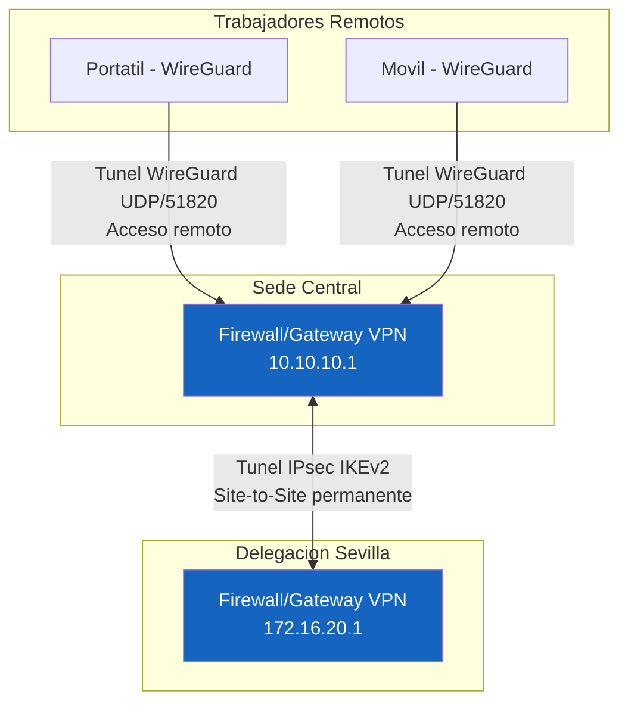

# UD 4: Redes Privadas Virtuales (VPN - IPsec, OpenVPN, WireGuard)

!!! info "Ficha Técnica de la Unidad"
    * **Resultados de Aprendizaje (RA):** RA2 - Implementa mecanismos de seguridad pasiva y control de acceso a redes.
    * **Criterios de Evaluación (CE):** e) Se han identificado las ventajas de una VPN respecto a otras alternativas; f) Se han implementado soluciones de VPN de sitio a sitio y de acceso remoto.
    * **Tecnologías Involucradas:** [WireGuard](../tech/wireguard.md), [OpenVPN e IPsec](../tech/openvpn-ipsec.md)
    * **Marcos y Estándares:** ENS `mp.com.3` (Protección de la confidencialidad e integridad); NIST SP 800-77 (Guide to IPsec VPNs); RFC 4301 (IPsec Architecture), RFC 7296 (IKEv2); WireGuard whitepaper (Noise Protocol Framework).

---

## 📖 1. Fundamentos Teóricos y Arquitectura de Seguridad

### 1.1 Modelos de VPN: sitio a sitio vs. acceso remoto

- **Site-to-Site**: conecta dos redes completas de forma permanente (ej. sede central ↔ delegación), habitualmente con **IPsec**, transparente para los usuarios finales.
- **Acceso remoto (Road Warrior)**: conecta un dispositivo individual a la red corporativa, típicamente con **OpenVPN** o **WireGuard**, requiriendo autenticación por usuario.

### 1.2 Comparativa de tecnologías VPN

| Característica | IPsec (IKEv2) | OpenVPN | WireGuard |
|---|---|---|---|
| Capa OSI | Red (3) | Aplicación/Transporte (TLS sobre UDP/TCP) | Red (3), en kernel |
| Código base | Complejo (~decenas de miles de líneas) | Complejo (dependiente de OpenSSL) | Minimalista (~4.000 líneas) |
| Rendimiento | Alto (aceleración hardware AES-NI común) | Medio (overhead de TLS) | Muy alto (criptografía moderna, kernel-space) |
| Criptografía | Configurable (riesgo de mala configuración) | Configurable (riesgo de mala configuración) | Fija: ChaCha20, Poly1305, Curve25519, BLAKE2s (sin negociación = sin downgrade) |
| Auditoría de seguridad | Compleja por su tamaño | Compleja | Sencilla, código auditado formalmente |

!!! tip "Buenas Prácticas Sysadmin / SecOps"
    **WireGuard** elimina la negociación de cifrados (*cipher agility*) que ha sido origen de múltiples vulnerabilidades históricas en IPsec/OpenVPN (downgrade a cifrados débiles). Al fijar un único conjunto de primitivas modernas, reduce drásticamente la superficie de configuración insegura, aunque exige que el administrador entienda que **no hay opción de negociar** — si un extremo no soporta el conjunto fijo, la conexión simplemente falla, lo cual es una decisión de diseño deliberada por seguridad.

### 1.3 Arquitectura de topología híbrida



### 1.4 El protocolo Noise en WireGuard

WireGuard implementa el patrón `Noise_IK` del **Noise Protocol Framework**, realizando un *handshake* de una sola ida y vuelta (1-RTT) con **Perfect Forward Secrecy** (rotación de claves de sesión cada 2 minutos o 2^60 paquetes, lo que ocurra antes), de forma que el compromiso de una clave de sesión no compromete comunicaciones pasadas ni futuras.

---

## ⚙️ 2. Configuración Avanzada, Despliegue y Hardening

### 2.1 WireGuard: acceso remoto (Road Warrior)

```bash title="Generación de claves (servidor y clientes)" linenums="1"
umask 077
wg genkey | tee server_private.key | wg pubkey > server_public.key
wg genkey | tee client1_private.key | wg pubkey > client1_public.key
```

```ini title="/etc/wireguard/wg0.conf (SERVIDOR)" linenums="1"
[Interface]
Address = 10.200.200.1/24
ListenPort = 51820
PrivateKey = <CONTENIDO_server_private.key>
PostUp = nft add rule inet filter forward iif wg0 oif eth0 accept
PostDown = nft delete rule inet filter forward iif wg0 oif eth0 accept

# Cliente 1 - jgarcia (portatil)
[Peer]
PublicKey = <CONTENIDO_client1_public.key>
AllowedIPs = 10.200.200.2/32
PersistentKeepalive = 25
```

```ini title="/etc/wireguard/wg0-client1.conf (CLIENTE)" linenums="1"
[Interface]
Address = 10.200.200.2/24
PrivateKey = <CONTENIDO_client1_private.key>
DNS = 10.10.10.53

[Peer]
PublicKey = <CONTENIDO_server_public.key>
Endpoint = vpn.asir-corp.local:51820
AllowedIPs = 10.10.10.0/24, 10.200.200.0/24
PersistentKeepalive = 25
```

```bash title="Activación del túnel" linenums="1"
sysctl -w net.ipv4.ip_forward=1
wg-quick up wg0
systemctl enable wg-quick@wg0
```

!!! danger "Alerta Crítica y Bastionado (CIS / CCN-CERT)"
    `AllowedIPs` en la sección `[Peer]` del servidor actúa simultáneamente como **tabla de enrutado** y como **firewall implícito**: WireGuard descarta cualquier paquete cuya IP origen no coincida con el `AllowedIPs` declarado para ese peer, incluso si el paquete llega cifrado correctamente. Restringir siempre a `/32` por cliente en acceso remoto — nunca usar `0.0.0.0/0` como `AllowedIPs` de un peer individual salvo que sea intencionadamente el único gateway de salida (full-tunnel).

### 2.2 IPsec Site-to-Site con strongSwan (IKEv2)

```ini title="/etc/ipsec.conf" linenums="1"
config setup
    charondebug="ike 2, knl 2, cfg 2"

conn sede-central-a-delegacion
    keyexchange=ikev2
    authby=psk
    left=%defaultroute
    leftid=@sede-central.asir-corp.local
    leftsubnet=10.10.10.0/24
    right=172.16.20.1
    rightid=@delegacion.asir-corp.local
    rightsubnet=172.16.20.0/24
    ike=aes256gcm16-sha384-ecp384!
    esp=aes256gcm16-ecp384!
    keyingtries=%forever
    ikelifetime=8h
    lifetime=1h
    dpddelay=30
    dpdtimeout=120
    dpdaction=restart
    auto=start
```

```text title="/etc/ipsec.secrets" linenums="1"
@sede-central.asir-corp.local @delegacion.asir-corp.local : PSK "CLAVE_PRECOMPARTIDA_ALTA_ENTROPIA_MIN_32_CARACTERES"
```

!!! warning "Vector de Ataque y Vulnerabilidad"
    El uso de **PSK (Pre-Shared Key)** es aceptable para túneles site-to-site en entornos controlados, pero en despliegues de categoría ALTA (ENS) se recomienda **autenticación basada en certificados X.509** (`authby=rsasig` o `pubkey`) emitidos por la PKI corporativa (UD1), ya que una PSK filtrada compromete el túnel sin posibilidad de revocación selectiva — hay que rotarla manualmente en ambos extremos.

```bash title="Comandos de gestión strongSwan" linenums="1"
systemctl enable --now strongswan-starter
ipsec restart
ipsec statusall
ipsec up sede-central-a-delegacion
```

---

## 🛠️ 3. Laboratorio Práctico Dirigido

!!! example "Laboratorio Práctico Paso a Paso"
    **Objetivo:** Desplegar un túnel WireGuard de acceso remoto funcional y un túnel IPsec site-to-site, verificando cifrado y conectividad extremo a extremo.

    **Paso 1.** Desplegar el servidor WireGuard (sección 2.1) sobre el gateway perimetral, e integrarlo con las reglas nftables de UD3 (`PostUp`/`PostDown`).

    **Paso 2 — Verificar el estado del túnel:**
    ```bash
    wg show wg0
    ```
    Debe mostrarse el peer con `latest handshake` reciente y contadores de tráfico `transfer`.

    **Paso 3 — Capturar tráfico y confirmar cifrado:**
    ```bash
    tcpdump -i eth0 udp port 51820 -X -c 5
    ```
    El payload capturado debe ser ininteligible (cifrado ChaCha20-Poly1305), sin cabeceras de protocolo visibles en claro.

    **Paso 4 — Desplegar el túnel IPsec (sección 2.2) entre dos gateways de laboratorio y verificar:**
    ```bash
    ipsec statusall | grep -A5 "sede-central-a-delegacion"
    ping -I 10.10.10.1 172.16.20.1
    ```

    **Paso 5 — Prueba de resiliencia:** cortar la conectividad WAN temporalmente y comprobar que `dpdaction=restart` reestablece el túnel IPsec automáticamente al recuperarse la red (Dead Peer Detection).

    **Criterio de éxito:** `wg show` refleja tráfico bidireccional reciente, `tcpdump` no revela contenido en claro, y el túnel IPsec se reestablece automáticamente tras la interrupción simulada.

---

## 🛡️ 4. Monitoreo, Análisis de Eventos y Respuesta a Incidentes

| Log/Comando | Ubicación | Contenido |
|---|---|---|
| WireGuard | `wg show wg0 dump` | Handshakes, tráfico por peer, sin logging persistente por diseño |
| strongSwan | `/var/log/syslog` (facility `daemon`) | Negociación IKE, errores de autenticación, eventos DPD |
| Conexiones activas | `ipsec statusall` | Estado de cada Security Association (SA) |

```bash title="Detección de handshakes fallidos repetidos (posible fuerza bruta de claves)" linenums="1"
watch -n5 'wg show wg0 latest-handshakes'
```

!!! note "Normativa y Estándares (ENS / ISO 27001 / RFC)"
    WireGuard, por diseño, **no registra logs de aplicación** de las conexiones (a diferencia de OpenVPN/IPsec) para minimizar superficie de ataque y metadatos. Si el ENS exige trazabilidad de accesos remotos (`op.exp.8`), debe complementarse con **logging a nivel de firewall** (contadores nftables por peer/IP) o herramientas de terceros como `wg-json` + exportador a SIEM.

---

## ❓ 5. Casos Prácticos y Autoevaluación Técnica

**Caso 1 — Cliente WireGuard no reconecta tras cambio de red móvil.** *Resolución:* `PersistentKeepalive = 25` es imprescindible en clientes detrás de NAT/CGNAT (redes móviles) para mantener el mapeo NAT activo; sin este valor, el servidor no puede reiniciar el handshake hacia un cliente cuya IP pública cambió.

**Caso 2 — Túnel IPsec cae cada pocas horas.** *Resolución:* revisar `ikelifetime`/`lifetime` — si ambos extremos tienen valores de renegociación distintos o `dpdtimeout` demasiado agresivo en redes con jitter, se producen caídas por temporización; alinear ambos extremos y aumentar tolerancia de DPD si la red WAN es inestable.

**Caso 3 — Filtración de `AllowedIPs` demasiado amplio.** Un cliente de acceso remoto queda configurado con `AllowedIPs = 0.0.0.0/0` en el servidor por error, otorgándole acceso a toda la red interna, no solo a su segmento asignado. *Resolución:* auditar `/etc/wireguard/wg0.conf` regularmente; restringir cada peer a su `/32` y usar reglas nftables adicionales para limitar qué subredes internas puede alcanzar cada rango de clientes VPN.

**Caso 4 — Compromiso de clave privada de un cliente VPN.** Un portátil corporativo es robado con la clave privada WireGuard en disco sin cifrar. *Resolución:* eliminar inmediatamente el `[Peer]` correspondiente del servidor (`wg set wg0 peer <PUBKEY> remove`), generar nuevo par de claves para el usuario, y aplicar cifrado de disco completo (LUKS) como control compensatorio obligatorio en el inventario de dispositivos móviles.

**Caso 5 — PSK de túnel site-to-site compartida en texto claro por email.** *Resolución:* rotar inmediatamente la PSK en ambos extremos vía canal seguro (llamada telefónica verificada + gestor de secretos), y migrar el túnel a autenticación por certificados X.509 de la PKI corporativa para eliminar el riesgo estructural de compartir un secreto simétrico entre equipos.
