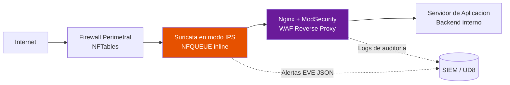

# UD 5: Sistemas de Detección/Prevención de Intrusiones (IDS/IPS) y WAF

!!! info "Ficha Técnica de la Unidad"
    * **Resultados de Aprendizaje (RA):** RA2 - Implementa mecanismos de seguridad pasiva y control de acceso a redes; RA3 - Asegura la privacidad de la información transmitida en redes.
    * **Criterios de Evaluación (CE):** RA2-g) Se ha instalado y configurado un sistema de detección de intrusiones; RA3-a) Se han descrito las técnicas de bastionado de servicios web frente a ataques comunes.
    * **Tecnologías Involucradas:** [Suricata](../tech/suricata.md), [ModSecurity WAF](../tech/modsecurity.md)
    * **Marcos y Estándares:** ENS `mp.com.4` (Segregación de redes), `op.mon` (Monitorización del sistema); OWASP Top 10; OWASP Core Rule Set (CRS); NIST SP 800-94 (Guide to Intrusion Detection and Prevention Systems).

---

## 📖 1. Fundamentos Teóricos y Arquitectura de Seguridad

### 1.1 IDS vs. IPS: detección pasiva vs. prevención activa

- **IDS (Intrusion Detection System)**: analiza tráfico (copia/espejo, modo `promiscuous`) y **alerta**, sin interferir en el flujo original. Riesgo cero de afectar disponibilidad, pero reacción reactiva.
- **IPS (Intrusion Prevention System)**: se sitúa **en línea** (inline) en el camino del tráfico y puede **bloquear** activamente paquetes maliciosos en tiempo real. Mayor eficacia, pero introduce riesgo de falsos positivos que bloqueen tráfico legítimo (y de latencia/punto único de fallo).

### 1.2 Métodos de detección

| Método | Descripción | Ventaja | Limitación |
|---|---|---|---|
| Basado en firmas | Coincidencia con patrones conocidos (reglas Suricata/Snort) | Muy preciso para amenazas conocidas | Ineficaz contra ataques de día cero |
| Basado en anomalías | Modelo de comportamiento "normal", alerta ante desviaciones | Detecta amenazas desconocidas | Mayor tasa de falsos positivos |
| Basado en reputación | Listas de IP/dominios maliciosos conocidos | Bloqueo rápido de infraestructura ya reportada | Depende de feeds externos actualizados |

### 1.3 Arquitectura de despliegue IDS/IPS + WAF



!!! note "Normativa y Estándares (ENS / ISO 27001 / RFC)"
    El **OWASP Top 10** (versión vigente) identifica las categorías de riesgo más críticas en aplicaciones web: *Broken Access Control*, *Injection*, *Security Misconfiguration*, entre otras. Un **WAF** con el **OWASP Core Rule Set (CRS)** actúa como control compensatorio de defensa en profundidad, pero **nunca sustituye** la corrección del código vulnerable — es una mitigación, no una solución estructural.

### 1.4 Defensa en profundidad: por qué IDS/IPS y WAF no son excluyentes

Un **IDS/IPS de red** (Suricata) opera a nivel de paquete/flujo, detectando escaneos de puertos, exploits de protocolo, tráfico C2 (Command & Control) y patrones de malware conocidos en cualquier servicio. Un **WAF** opera específicamente a nivel de aplicación HTTP/HTTPS, entendiendo semántica de peticiones (SQLi, XSS, path traversal). Ambas capas son complementarias: el WAF no detecta un escaneo de puertos SSH, y el IDS de red no interpreta el cuerpo de una petición HTTP cifrada sin terminación TLS previa.

---

## ⚙️ 2. Configuración Avanzada, Despliegue y Hardening

### 2.1 Suricata en modo IPS inline (NFQUEUE)

```bash title="Redirección de tráfico a Suricata vía NFQUEUE (nftables)" linenums="1"
# Añadir en /etc/nftables.conf, dentro de la cadena forward, ANTES de las reglas de aceptacion:
nft add rule inet filter forward iif eth0 oif eth1 queue num 0-3
```

```yaml title="/etc/suricata/suricata.yaml (fragmento relevante)" linenums="1"
af-packet:
  - interface: eth1
    threads: auto
    cluster-id: 99
    cluster-type: cluster_flow
    defrag: yes

nfq:
  mode: accept
  repeat-mark: 1
  repeat-mask: 1
  route-queue: 2

default-rule-path: /var/lib/suricata/rules
rule-files:
  - suricata.rules
  - local.rules

outputs:
  - eve-log:
      enabled: yes
      filetype: regular
      filename: eve.json
      types:
        - alert:
            payload: yes
            metadata: yes
        - http:
        - dns:
        - tls:
            extended: yes
        - ssh:

vars:
  address-groups:
    HOME_NET: "[10.10.10.0/24,10.10.20.0/24]"
    EXTERNAL_NET: "!$HOME_NET"
  port-groups:
    HTTP_PORTS: "80"
    HTTPS_PORTS: "443"
```

```bash title="Regla personalizada de deteccion (local.rules)" linenums="1"
# /var/lib/suricata/rules/local.rules
# Deteccion de intento de fuerza bruta SSH: mas de 5 intentos de conexion en 60s desde la misma IP
alert tcp $EXTERNAL_NET any -> $HOME_NET 22 (msg:"POSIBLE FUERZA BRUTA SSH - multiples intentos SYN"; \
  flags:S; threshold: type threshold, track by_src, count 5, seconds 60; \
  classtype:attempted-recon; sid:1000001; rev:1;)

# Deteccion de escaneo de puertos tipo Nmap SYN scan
alert tcp $EXTERNAL_NET any -> $HOME_NET any (msg:"POSIBLE ESCANEO DE PUERTOS NMAP SYN"; \
  flags:S; threshold: type threshold, track by_src, count 15, seconds 10; \
  classtype:attempted-recon; sid:1000002; rev:1;)

# Deteccion de exfiltracion via DNS (longitud de consulta anormalmente alta - tunel DNS)
alert dns $HOME_NET any -> any 53 (msg:"POSIBLE TUNEL DNS - consulta de longitud anomala"; \
  dns.query; content:"."; pcre:"/^.{60,}$/"; classtype:policy-violation; sid:1000003; rev:1;)
```

```bash title="Arranque de Suricata en modo IPS" linenums="1"
suricata -c /etc/suricata/suricata.yaml --nfq -q 0 -q 1 -q 2 -q 3 -D
systemctl enable suricata
```

!!! danger "Alerta Crítica y Bastionado (CIS / CCN-CERT)"
    Antes de desplegar Suricata **en modo IPS** (bloqueo activo) en producción, es obligatorio un periodo de validación previo en **modo IDS puro** (solo alerta) de al menos 2-4 semanas, ajustando el conjunto de reglas para eliminar falsos positivos. Activar bloqueo inline con reglas sin depurar puede provocar una **denegación de servicio autoinfligida** sobre tráfico legítimo.

### 2.2 ModSecurity WAF con OWASP CRS sobre Nginx

```bash title="Instalación del módulo ModSecurity para Nginx" linenums="1"
apt install libnginx-mod-http-modsecurity -y
git clone https://github.com/coreruleset/coreruleset /etc/nginx/modsec/coreruleset
cp /etc/nginx/modsec/coreruleset/crs-setup.conf.example /etc/nginx/modsec/coreruleset/crs-setup.conf
```

```apache title="/etc/nginx/modsec/modsecurity.conf" linenums="1"
SecRuleEngine On
SecRequestBodyAccess On
SecResponseBodyAccess Off
SecRequestBodyLimit 13107200
SecRequestBodyNoFilesLimit 131072
SecAuditEngine RelevantOnly
SecAuditLogRelevantStatus "^(?:5|4(?!04))"
SecAuditLogParts ABIJDEFHZ
SecAuditLogType Serial
SecAuditLog /var/log/modsec_audit.log
SecArgumentSeparator "&"
SecCookieFormat 0
SecDataDir /var/cache/modsecurity

Include /etc/nginx/modsec/coreruleset/crs-setup.conf
Include /etc/nginx/modsec/coreruleset/rules/*.conf
```

```apache title="/etc/nginx/modsec/coreruleset/crs-setup.conf (parametros clave)" linenums="1"
# Nivel de paranoia: 1 (basico, pocos falsos positivos) a 4 (maximo, requiere mucho ajuste)
SecAction "id:900000,phase:1,pass,t:none,nolog,setvar:tx.paranoia_level=1"

# Umbral de puntuacion de anomalia antes de bloquear la peticion
SecAction "id:900110,phase:1,pass,t:none,nolog,\
  setvar:tx.inbound_anomaly_score_threshold=5,\
  setvar:tx.outbound_anomaly_score_threshold=4"
```

```nginx title="/etc/nginx/sites-available/app-waf.conf" linenums="1"
server {
    listen 443 ssl;
    server_name app.asir-corp.local;

    ssl_certificate     /opt/ca/intermediate-ca/certs/app.asir-corp.local.cert.pem;
    ssl_certificate_key /opt/ca/intermediate-ca/private/app.asir-corp.local.key.pem;

    modsecurity on;
    modsecurity_rules_file /etc/nginx/modsec/modsecurity.conf;

    location / {
        proxy_pass http://127.0.0.1:8080;
        proxy_set_header Host $host;
        proxy_set_header X-Real-IP $remote_addr;
        proxy_set_header X-Forwarded-For $proxy_add_x_forwarded_for;
        proxy_set_header X-Forwarded-Proto $scheme;
    }
}
```

!!! tip "Buenas Prácticas Sysadmin / SecOps"
    El **Paranoia Level (PL)** del OWASP CRS controla el equilibrio entre cobertura de detección y falsos positivos. Se recomienda comenzar en **PL1** en producción, y solo escalar a PL2/PL3 tras un periodo de ajuste (*tuning*) mediante `SecRuleRemoveById` para excepciones legítimas específicas de la aplicación, documentando cada exclusión con su justificación.

---

## 🛠️ 3. Laboratorio Práctico Dirigido

!!! example "Laboratorio Práctico Paso a Paso"
    **Objetivo:** Desplegar Suricata en modo IDS, generar tráfico de ataque simulado, y verificar la detección tanto a nivel de red como de aplicación web (WAF).

    **Paso 1.** Desplegar Suricata en modo IDS (`af-packet`, sin NFQUEUE) monitorizando la interfaz que da a la DMZ.

    **Paso 2 — Simular un escaneo de puertos desde una máquina externa:**
    ```bash
    nmap -sS -p 1-1000 <IP_SERVIDOR_DMZ>
    ```

    **Paso 3 — Verificar la alerta generada:**
    ```bash
    tail -f /var/log/suricata/eve.json | jq 'select(.event_type=="alert")'
    ```

    **Paso 4 — Desplegar ModSecurity+CRS delante de una aplicación web de prueba (DVWA o Juice Shop) y simular una inyección SQL:**
    ```bash
    curl "https://app.asir-corp.local/producto?id=1' OR '1'='1"
    ```
    Debe recibirse un `403 Forbidden` del WAF.

    **Paso 5 — Revisar el log de auditoría de ModSecurity:**
    ```bash
    grep -A20 "id \"942100\"" /var/log/modsec_audit.log | tail -40
    ```

    **Paso 6 — Activar Suricata en modo IPS (NFQUEUE, sección 2.1) y repetir el escaneo Nmap**, verificando que las conexiones son bloqueadas activamente (no solo alertadas).

    **Criterio de éxito:** el escaneo genera alertas categorizadas correctamente en `eve.json`, la inyección SQL es bloqueada por el WAF con código 403, y en modo IPS el tráfico de escaneo queda efectivamente interrumpido.

---

## 🛡️ 4. Monitoreo, Análisis de Eventos y Respuesta a Incidentes

| Log | Ruta | Formato |
|---|---|---|
| Alertas Suricata | `/var/log/suricata/eve.json` | JSON estructurado (EVE), ideal para ingesta SIEM |
| Estadísticas Suricata | `/var/log/suricata/stats.log` | Contadores de rendimiento y descartes |
| Auditoría ModSecurity | `/var/log/modsec_audit.log` | Detalle completo de peticiones bloqueadas |
| Acceso Nginx | `/var/log/nginx/access.log` | Correlación con códigos 403 del WAF |

```bash title="Análisis rápido de alertas Suricata por severidad" linenums="1"
jq 'select(.event_type=="alert") | {ts:.timestamp, src:.src_ip, sig:.alert.signature, sev:.alert.severity}' /var/log/suricata/eve.json | tail -50
```

!!! warning "Vector de Ataque y Vulnerabilidad"
    Un WAF mal configurado puede generar un **falso sentido de seguridad**: si `SecRuleEngine` está en `DetectionOnly` en lugar de `On`, el WAF **solo registra** pero no bloquea ninguna petición maliciosa. Verificar explícitamente este parámetro tras cualquier despliegue o actualización.

---

## ❓ 5. Casos Prácticos y Autoevaluación Técnica

**Caso 1 — Falso positivo del WAF bloqueando formularios legítimos.** Un formulario de contacto con campo "comentarios" es bloqueado sistemáticamente por la regla CRS 942100 (SQLi) al contener la palabra "select" en texto libre. *Resolución:* crear una exclusión específica con `SecRuleUpdateTargetById` limitada a ese parámetro concreto, nunca desactivar la regla globalmente.

**Caso 2 — IPS bloqueando tráfico de backup legítimo.** Tras activar Suricata en modo IPS, las réplicas de backup nocturnas (UD11) se cortan por activar una regla de "transferencia de datos anómala". *Resolución:* añadir una excepción explícita (`pass` con `bypass`) para el rango IP y puerto del servicio de backup autorizado, documentada y revisada periódicamente para evitar que se convierta en un "agujero" olvidado.

**Caso 3 — Evasión de IDS mediante fragmentación de paquetes.** Un pentest logra evadir la detección fragmentando manualmente los paquetes de un exploit conocido. *Resolución:* verificar que `defrag: yes` está activo en la configuración de `af-packet`/`nfq` de Suricata, forzando el reensamblado de fragmentos antes de la inspección de firmas.

**Caso 4 — Ataque de día cero no detectado por firmas.** Un ataque nuevo no coincide con ninguna firma conocida y pasa desapercibido. *Resolución:* esto confirma la limitación estructural de la detección basada en firmas (sección 1.2); complementar con reglas de anomalía de comportamiento (umbrales de tráfico, `threshold` en Suricata) y correlación en el SIEM (UD8) con indicadores de compromiso post-explotación (conexiones salientes anómalas, nuevos procesos).

**Caso 5 — Log de auditoría del WAF satura el disco.** `SecAuditEngine On` (registrando todas las peticiones, no solo las relevantes) llena el disco en pocos días. *Resolución:* configurar `SecAuditEngine RelevantOnly` junto con `SecAuditLogRelevantStatus` limitado a códigos de error/bloqueo, y establecer rotación de logs (`logrotate`) con retención acorde a la política de conservación de evidencias del ENS.
