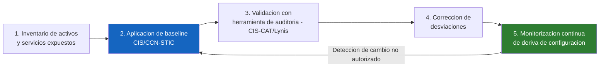

# UD 6: Bastionado de Sistemas Operativos y Servicios Web (Hardening Linux/Windows)

!!! info "Ficha Técnica de la Unidad"
    * **Resultados de Aprendizaje (RA):** RA3 - Asegura la privacidad de la información transmitida en redes reconociendo vulnerabilidades e instalando software específico.
    * **Criterios de Evaluación (CE):** b) Se han descrito los conceptos de bastionado de servidores; c) Se han identificado las herramientas de hardening del sistema operativo; d) Se ha securizado un servicio de acceso remoto (SSH) y un servidor web.
    * **Tecnologías Involucradas:** [Fail2ban](../tech/fail2ban.md)
    * **Marcos y Estándares:** CIS Benchmarks (Level 1/Level 2 Server); CCN-STIC 599A/599B (Bastionado GNU/Linux); ENS `mp.eq.1`, `mp.sw.1` (Protección de equipos y software); NIST SP 800-123 (Guide to General Server Security).

---

## 📖 1. Fundamentos Teóricos y Arquitectura de Seguridad

### 1.1 Principio de superficie mínima de ataque

El bastionado (*hardening*) se rige por el principio de **reducción de superficie de ataque**: cada servicio activo, puerto abierto, paquete instalado o cuenta con privilegios es una potencial vía de compromiso. La metodología CIS estructura el hardening en **niveles**:

- **Nivel 1 (L1)**: configuraciones de seguridad básicas, compatibles con la mayoría de entornos, mínimo impacto funcional.
- **Nivel 2 (L2)**: configuraciones para entornos de alta sensibilidad, pueden requerir ajustes funcionales o reducir compatibilidad.

### 1.2 Ciclo de vida del bastionado



!!! note "Normativa y Estándares (ENS / ISO 27001 / RFC)"
    La guía **CCN-STIC 599A/599B** (Recomendaciones de seguridad y bastionado GNU/Linux) es la referencia oficial de aplicación obligatoria en organismos sujetos al ENS, y su estructura es directamente compatible con los **CIS Benchmarks** internacionales, permitiendo auditar un mismo sistema contra ambos marcos con una única herramienta (`Lynis`, `OpenSCAP`).

---

## ⚙️ 2. Configuración Avanzada, Despliegue y Hardening

### 2.1 Bastionado de acceso SSH (CIS Benchmark)

```bash title="/etc/ssh/sshd_config.d/99-hardening.conf" linenums="1"
# Deshabilitar login directo de root (obligar uso de sudo tras login nominal)
PermitRootLogin no

# Forzar autenticacion por clave publica, deshabilitar contraseñas (mitiga fuerza bruta)
PasswordAuthentication no
PubkeyAuthentication yes
KbdInteractiveAuthentication no

# Restringir protocolo y algoritmos criptograficos debiles
Protocol 2
Ciphers chacha20-poly1305@openssh.com,aes256-gcm@openssh.com,aes128-gcm@openssh.com
MACs hmac-sha2-512-etm@openssh.com,hmac-sha2-256-etm@openssh.com
KexAlgorithms curve25519-sha256,diffie-hellman-group16-sha512

# Limitar reintentos y tiempo de negociacion (mitiga escaneo/DoS)
MaxAuthTries 3
LoginGraceTime 30
MaxSessions 4
MaxStartups 10:30:60

# Restringir acceso a un grupo especifico de administradores
AllowGroups sysadmins

# Deshabilitar reenvio X11 y variables de entorno innecesarias (reduce superficie)
X11Forwarding no
PermitUserEnvironment no
AllowTcpForwarding no

# Banner legal (obligatorio en sistemas de la Administracion, ENS op.exp)
Banner /etc/issue.net

# Timeout de sesiones inactivas
ClientAliveInterval 300
ClientAliveCountMax 2
```

```bash title="Aplicar y validar" linenums="1"
sshd -t                          # Validar sintaxis antes de recargar
systemctl reload sshd
ss -tlnp | grep :22              # Confirmar que el servicio escucha correctamente
```

!!! danger "Alerta Crítica y Bastionado (CIS / CCN-CERT)"
    `PermitRootLogin no` es una de las directivas de **mayor impacto** del bastionado SSH: elimina el vector de ataque más directo de fuerza bruta (la cuenta `root` es siempre conocida por el atacante, a diferencia de un usuario nominal). Todo acceso administrativo debe realizarse mediante login nominal + `sudo`, garantizando trazabilidad individual (requisito de no repudio del ENS).

### 2.2 Hardening del kernel (sysctl) — CIS Level 1/2

```bash title="/etc/sysctl.d/99-cis-hardening.conf" linenums="1"
# --- Proteccion de memoria y ejecucion ---
# Habilita ASLR completo (Address Space Layout Randomization) - dificulta explotacion de buffer overflows
kernel.randomize_va_space = 2

# Restringe el acceso a dmesg solo a root (evita fuga de informacion del kernel a usuarios sin privilegios)
kernel.dmesg_restrict = 1

# Restringe ptrace a procesos hijos del mismo padre (mitiga tecnicas de inyeccion de codigo entre procesos)
kernel.yama.ptrace_scope = 1

# --- Proteccion de red adicional (complementa UD3) ---
net.ipv4.conf.all.accept_redirects = 0
net.ipv4.tcp_syncookies = 1
net.ipv4.conf.all.rp_filter = 1

# --- Proteccion de enlaces simbolicos/hardlinks (mitiga TOCTOU y escalada de privilegios) ---
fs.protected_symlinks = 1
fs.protected_hardlinks = 1
fs.suid_dumpable = 0
```

### 2.3 Gestión de cuentas y permisos (CIS)

```bash title="Auditoria de cuentas con privilegios y politica de caducidad" linenums="1"
# Forzar caducidad maxima de contraseñas a 90 dias para cuentas locales (defensa en profundidad, complementa MFA de UD2)
sed -i 's/^PASS_MAX_DAYS.*/PASS_MAX_DAYS   90/' /etc/login.defs

# Localizar cuentas con UID 0 distintas de root (indicador de backdoor/escalada)
awk -F: '($3 == 0) {print}' /etc/passwd

# Localizar ficheros con permisos SUID/SGID no justificados (superficie de escalada de privilegios)
find / -xdev -type f \( -perm -4000 -o -perm -2000 \) -exec ls -la {} \; 2>/dev/null

# Restringir permisos sobre ficheros criticos del sistema
chmod 600 /etc/shadow /etc/gshadow
chmod 644 /etc/passwd /etc/group
```

### 2.4 Hardening de servicios web (Nginx)

```nginx title="/etc/nginx/conf.d/hardening.conf" linenums="1"
# Ocultar version del servidor (reduce fingerprinting)
server_tokens off;

# Cabeceras de seguridad HTTP recomendadas por OWASP Secure Headers Project
add_header X-Frame-Options "SAMEORIGIN" always;
add_header X-Content-Type-Options "nosniff" always;
add_header Referrer-Policy "strict-origin-when-cross-origin" always;
add_header Content-Security-Policy "default-src 'self'; script-src 'self'; object-src 'none';" always;
add_header Permissions-Policy "geolocation=(), microphone=(), camera=()" always;

# Limitar tamaño de peticiones (mitiga ataques de saturacion)
client_max_body_size 10m;
client_body_timeout 10s;
client_header_timeout 10s;

# Limitacion de tasa de peticiones por IP (mitiga fuerza bruta / scraping agresivo)
limit_req_zone $binary_remote_addr zone=general:10m rate=10r/s;
limit_req zone=general burst=20 nodelay;
```

!!! tip "Buenas Prácticas Sysadmin / SecOps"
    La cabecera **Content-Security-Policy (CSP)** es la defensa más efectiva contra XSS a nivel de navegador, pero debe construirse de forma incremental: desplegarla primero en modo `Content-Security-Policy-Report-Only` para identificar recursos legítimos que romperían con una política estricta, antes de aplicarla en modo bloqueante.

### 2.5 Validación automatizada con Lynis

```bash title="Auditoria de bastionado con Lynis" linenums="1"
apt install lynis -y
lynis audit system --pentest

# Revisar el informe de hallazgos y el indice de fortalecimiento (hardening index)
cat /var/log/lynis-report.dat | grep hardening_index
less /var/log/lynis.log
```

---

## 🛠️ 3. Laboratorio Práctico Dirigido

!!! example "Laboratorio Práctico Paso a Paso"
    **Objetivo:** Aplicar el bastionado completo sobre una instalación base de Debian/Ubuntu Server, medir la mejora con Lynis, y validar la resistencia frente a un intento de fuerza bruta SSH.

    **Paso 1.** Instalar Lynis y ejecutar una auditoría base **antes** de aplicar ningún cambio, anotando el `hardening_index` inicial.

    **Paso 2.** Aplicar el bastionado SSH (2.1), kernel (2.2), cuentas (2.3) y Nginx (2.4) de forma completa.

    **Paso 3 — Desplegar Fail2ban para protección activa contra fuerza bruta** (ver detalles en [tech/fail2ban.md](../tech/fail2ban.md)):
    ```bash
    apt install fail2ban -y
    systemctl enable --now fail2ban
    fail2ban-client status sshd
    ```

    **Paso 4 — Simular un ataque de fuerza bruta SSH desde otra máquina** con `hydra` o intentos manuales repetidos, y comprobar el bloqueo automático:
    ```bash
    fail2ban-client status sshd
    ```
    Debe reflejar la IP atacante en `Banned IP list`.

    **Paso 5 — Reejecutar Lynis** tras todos los cambios y comparar el `hardening_index` final.

    **Criterio de éxito:** el `hardening_index` de Lynis mejora significativamente (objetivo: por encima de 80/100), y la IP de origen del ataque simulado queda bloqueada automáticamente por Fail2ban tras superar el umbral de intentos configurado.

---

## 🛡️ 4. Monitoreo, Análisis de Eventos y Respuesta a Incidentes

| Log | Ruta | Contenido |
|---|---|---|
| Autenticación SSH | `/var/log/auth.log` | Intentos de login, éxitos/fallos, sesiones sudo |
| Fail2ban | `/var/log/fail2ban.log` | Baneos aplicados/expirados por jail |
| Lynis | `/var/log/lynis.log`, `/var/log/lynis-report.dat` | Hallazgos de auditoría y sugerencias |
| Nginx acceso/error | `/var/log/nginx/{access,error}.log` | Peticiones HTTP, errores de servicio |

```bash title="Deteccion de intentos de escalada de privilegios via SUID" linenums="1"
# Comparar el listado SUID actual contra una linea base guardada tras el bastionado inicial
find / -xdev -type f -perm -4000 2>/dev/null > /tmp/suid_actual.txt
diff /opt/baseline/suid_baseline.txt /tmp/suid_actual.txt
```

!!! warning "Vector de Ataque y Vulnerabilidad"
    Cualquier binario nuevo con bit **SUID** que aparezca fuera de la línea base establecida tras el bastionado inicial es un indicador de alta prioridad de **post-explotación**: los atacantes suelen desplegar binarios SUID (`cp /bin/bash /tmp/.rootbash; chmod +s /tmp/.rootbash`) como mecanismo de persistencia y escalada de privilegios.

---

## ❓ 5. Casos Prácticos y Autoevaluación Técnica

**Caso 1 — Servicio heredado con `PermitRootLogin yes` reintroducido.** Una actualización del paquete `openssh-server` sobrescribe la configuración personalizada. *Resolución:* usar siempre `/etc/ssh/sshd_config.d/*.conf` (directorio de override, procesado tras el fichero principal) en lugar de modificar `sshd_config` directamente, garantizando persistencia frente a actualizaciones de paquete.

**Caso 2 — Falso sentido de seguridad por `server_tokens off`.** Un pentest identifica igualmente la versión exacta de Nginx mediante fingerprinting de comportamiento (orden de cabeceras, manejo de errores). *Resolución:* ocultar la versión reduce el reconocimiento pasivo básico, pero no sustituye mantener el software **actualizado** con parches de seguridad — el hardening de cabeceras es complementario, no un sustituto de la gestión de parches.

**Caso 3 — Cuenta de servicio con contraseña sin caducidad detectada en auditoría.** *Resolución:* revisar `chage -l <usuario>`; las cuentas de servicio deben preferentemente usar autenticación por clave (SSH) o gestión de secretos (Vault, UD12) en lugar de contraseñas estáticas, y en cualquier caso nunca quedar exentas de las políticas de caducidad sin justificación documentada.

**Caso 4 — Regresión del `hardening_index` tras una migración.** Tras migrar servicios a un nuevo servidor, Lynis reporta una puntuación notablemente inferior. *Resolución:* la plantilla de aprovisionamiento (Ansible/Terraform) no incluía el módulo de bastionado; integrar el hardening como parte obligatoria y versionada del proceso de aprovisionamiento (Infrastructure as Code), no como paso manual posterior.

**Caso 5 — CSP bloqueando funcionalidad legítima tras despliegue directo en modo bloqueante.** *Resolución:* desplegar siempre primero en `Content-Security-Policy-Report-Only`, analizar los reportes de violación durante un periodo de observación, y solo entonces migrar a la cabecera bloqueante definitiva con las directivas ajustadas a los recursos reales de la aplicación.
