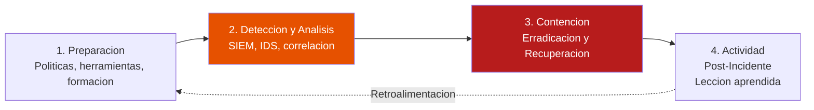
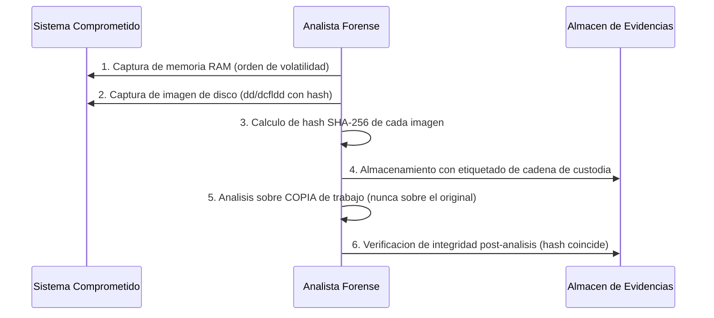
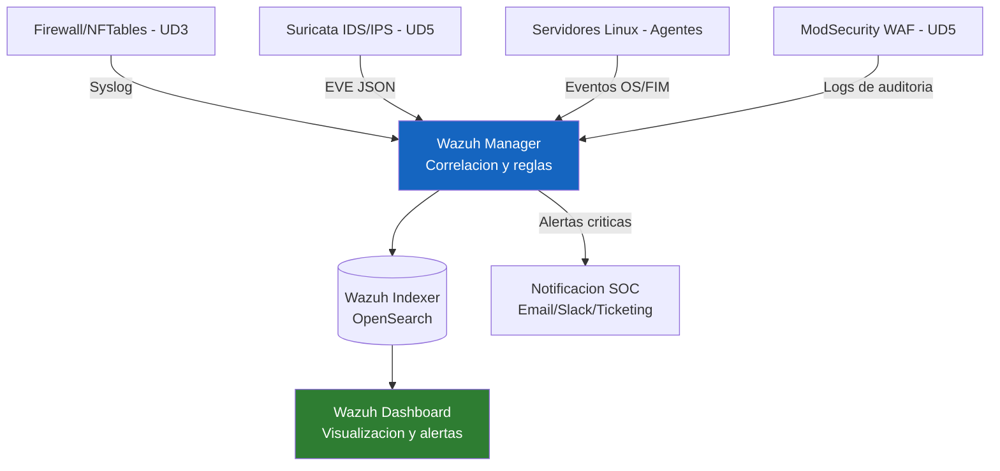

# UD 8: Análisis Forense Digital, Gestión de Eventos y Sistemas SIEM

!!! info "Ficha Técnica de la Unidad"
    * **Resultados de Aprendizaje (RA):** RA4 - Implementa sistemas de almacenamiento redundante y elabora un plan de recuperación ante desastres, reconociendo la importancia de la disponibilidad.
    * **Criterios de Evaluación (CE):** a) Se ha valorado la importancia de la gestión centralizada de eventos; b) Se ha implementado un sistema SIEM; c) Se han descrito las fases de un análisis forense digital.
    * **Tecnologías Involucradas:** [Wazuh](../tech/wazuh.md)
    * **Marcos y Estándares:** NIST SP 800-61 Rev.2 (Computer Security Incident Handling Guide); NIST SP 800-86 (Guide to Integrating Forensic Techniques); ENS `op.exp.8` (Registro de la actividad), `op.exp.9` (Registro de gestión de incidentes); ISO/IEC 27035 (Gestión de incidentes de seguridad).

---

## 📖 1. Fundamentos Teóricos y Arquitectura de Seguridad

### 1.1 El ciclo de gestión de incidentes (NIST SP 800-61)



!!! note "Normativa y Estándares (ENS / ISO 27001 / RFC)"
    **NIST SP 800-61 Rev. 2** establece que la fase de **Contención** debe subdividirse en estrategias a corto plazo (aislar el sistema afectado inmediatamente) y a largo plazo (aplicar parches, reconstruir desde una imagen limpia), evitando el error común de "limpiar" apresuradamente un sistema comprometido antes de haber preservado la evidencia forense necesaria para el análisis de causa raíz.

### 1.2 Principios de la cadena de custodia forense

Toda evidencia digital recopilada durante la respuesta a un incidente debe mantener una **cadena de custodia** verificable: quién la recolectó, cuándo, cómo, y garantía de que no ha sido alterada (mediante hashes criptográficos, ver UD1).



!!! danger "Alerta Crítica y Bastionado (CIS / CCN-CERT)"
    El **orden de volatilidad** (RFC 3227) dicta la prioridad de captura de evidencia: registros de CPU/caché → memoria RAM → conexiones de red activas → procesos en ejecución → disco → logs remotos → configuración física. Apagar un sistema comprometido antes de capturar la memoria RAM **destruye irrecuperablemente** evidencia crítica (claves de cifrado en memoria, malware fileless, conexiones activas de un atacante).

### 1.3 Arquitectura SIEM centralizada



---

## ⚙️ 2. Configuración Avanzada, Despliegue y Hardening

### 2.1 Despliegue del agente Wazuh en un endpoint

```bash title="Instalacion del agente Wazuh (Debian/Ubuntu)" linenums="1"
curl -so wazuh-agent.deb https://packages.wazuh.com/4.x/apt/pool/main/w/wazuh-agent/wazuh-agent_4.8.0-1_amd64.deb
WAZUH_MANAGER='wazuh-manager.asir-corp.local' dpkg -i ./wazuh-agent.deb

systemctl daemon-reload
systemctl enable --now wazuh-agent
```

```xml title="/var/ossec/etc/ossec.conf (fragmento agente)" linenums="1"
<ossec_config>
  <client>
    <server>
      <address>wazuh-manager.asir-corp.local</address>
      <port>1514</port>
      <protocol>tcp</protocol>
    </server>
  </client>

  <!-- File Integrity Monitoring (FIM) sobre ficheros criticos -->
  <syscheck>
    <frequency>43200</frequency>
    <directories check_all="yes" report_changes="yes">/etc,/opt/ca,/etc/nginx,/etc/ssh</directories>
    <directories check_all="yes">/bin,/sbin,/usr/bin,/usr/sbin</directories>
    <ignore>/etc/mtab</ignore>
    <alert_new_files>yes</alert_new_files>
  </syscheck>

  <!-- Deteccion de rootkits -->
  <rootcheck>
    <disabled>no</disabled>
    <frequency>43200</frequency>
  </rootcheck>

  <!-- Recoleccion de logs del sistema -->
  <localfile>
    <log_format>syslog</log_format>
    <location>/var/log/auth.log</location>
  </localfile>
  <localfile>
    <log_format>json</log_format>
    <location>/var/log/suricata/eve.json</location>
  </localfile>
</ossec_config>
```

### 2.2 Reglas de correlación personalizadas en el manager

```xml title="/var/ossec/etc/rules/local_rules.xml" linenums="1"
<group name="local,custom_rules,">

  <!-- Correlacion: 5 fallos de sudo en 2 minutos desde el mismo usuario -->
  <rule id="100010" level="10" frequency="5" timeframe="120">
    <if_matched_sid>5401</if_matched_sid>
    <description>Multiples intentos fallidos de sudo - posible escalada de privilegios en curso</description>
    <group>privilege_escalation,</group>
  </rule>

  <!-- Correlacion: alerta Suricata de severidad alta + modificacion de fichero critico -->
  <rule id="100011" level="15" frequency="1" timeframe="300">
    <if_group>syscheck</if_group>
    <field name="file">^/etc/nftables.conf|^/etc/ssh/sshd_config</field>
    <description>ALERTA CRITICA: modificacion de fichero de seguridad critico del sistema</description>
    <group>fim_critical,</group>
  </rule>

</group>
```

!!! tip "Buenas Prácticas Sysadmin / SecOps"
    El **File Integrity Monitoring (FIM)** de Wazuh sobre rutas críticas (`/etc/nftables.conf`, `/etc/ssh/sshd_config`, binarios del sistema) es una de las capacidades de detección más valiosas: cualquier modificación no planificada de estos ficheros, correlacionada con la ausencia de un ticket de cambio autorizado, es un indicador directo de compromiso o de una acción de personal no autorizada.

### 2.3 Captura forense de memoria (LiME) y disco (dcfldd)

```bash title="Captura de memoria RAM con LiME" linenums="1"
insmod lime.ko "path=/mnt/evidencia/memoria_$(hostname)_$(date +%Y%m%d%H%M).lime format=lime"
sha256sum /mnt/evidencia/memoria_*.lime > /mnt/evidencia/memoria_hash.sha256
```

```bash title="Captura de imagen de disco con verificacion de integridad" linenums="1"
dcfldd if=/dev/sda of=/mnt/evidencia/disco_$(hostname)_$(date +%Y%m%d).img \
  hash=sha256 hashlog=/mnt/evidencia/disco_hash.log bs=4M conv=noerror,sync
```

---

## 🛠️ 3. Laboratorio Práctico Dirigido

!!! example "Laboratorio Práctico Paso a Paso"
    **Objetivo:** Desplegar Wazuh manager+agente, provocar un evento de seguridad controlado, verificar su detección y correlación, y realizar una captura forense básica.

    **Paso 1.** Desplegar Wazuh Manager (`wazuh-install --all-in-one` en entorno de laboratorio) y un agente en un servidor de prueba.

    **Paso 2 — Provocar un evento de FIM:** modificar `/etc/ssh/sshd_config` en el endpoint monitorizado.
    ```bash
    echo "# cambio de prueba" >> /etc/ssh/sshd_config
    ```

    **Paso 3 — Verificar la alerta en el Dashboard de Wazuh**, filtrando por `rule.id: 100011`, y confirmar que aparece el detalle del fichero modificado, usuario y timestamp.

    **Paso 4 — Provocar la regla de correlación de fuerza bruta sudo:** generar 5 intentos fallidos de `sudo` en menos de 2 minutos con contraseña incorrecta, y verificar la alerta `rule.id: 100010`.

    **Paso 5 — Realizar una captura forense de memoria** con LiME sobre una máquina de laboratorio, calcular su hash SHA-256, y documentar el procedimiento de cadena de custodia aplicado.

    **Criterio de éxito:** ambas reglas de correlación personalizadas generan alerta visible en el Dashboard con el nivel de severidad esperado, y la captura forense incluye un hash verificable de la evidencia recolectada.

---

## 🛡️ 4. Monitoreo, Análisis de Eventos y Respuesta a Incidentes

| Componente | Ruta/Ubicación | Función |
|---|---|---|
| Wazuh Manager | `/var/ossec/logs/ossec.log` | Log operativo del propio manager |
| Wazuh Indexer | `/var/log/wazuh-indexer/` | Almacén de eventos indexados (OpenSearch) |
| Reglas activas | `/var/ossec/etc/rules/` | Reglas base + personalizadas (`local_rules.xml`) |
| Agentes conectados | `/var/ossec/bin/agent_control -l` | Estado de conectividad de cada endpoint |

```bash title="Consulta rapida de alertas por nivel de severidad" linenums="1"
grep '"level":1[0-5]' /var/ossec/logs/alerts/alerts.json | tail -50
```

!!! warning "Vector de Ataque y Vulnerabilidad"
    Un agente Wazuh que deja de reportar (visible como `Disconnected` en `agent_control -l`) sin que exista un mantenimiento planificado registrado es en sí mismo un indicador de compromiso: los atacantes suelen intentar detener servicios de monitorización (`systemctl stop wazuh-agent`) como parte de su fase de evasión de detección.

---

## ❓ 5. Casos Prácticos y Autoevaluación Técnica

**Caso 1 — Evidencia forense inválida por captura de disco antes que de memoria.** Un analista apaga el servidor comprometido para "preservarlo" antes de capturar RAM. *Resolución:* esto viola el orden de volatilidad (RFC 3227); documentar la pérdida de evidencia en el informe, y establecer un procedimiento operativo estándar (runbook) que obligue a capturar memoria RAM **antes** de cualquier apagado o aislamiento del sistema.

**Caso 2 — Agente Wazuh desconectado sin explicación.** *Resolución:* investigar inmediatamente como posible IOC; revisar logs locales del endpoint (si aún accesible vía otro canal) buscando comandos de detención de servicios, y aislar la máquina de la red mientras se confirma o descarta compromiso.

**Caso 3 — Alerta de FIM en fichero crítico coincide con un cambio autorizado.** *Resolución:* esto no es un fallo del sistema, sino el comportamiento correcto esperado; el proceso de gestión de cambios debe incluir la correlación con el ticket de cambio (CAB) para descartar rápidamente falsos positivos operativos, documentando la excepción en el propio sistema de tickets, no silenciando la regla de FIM.

**Caso 4 — Volumen de alertas ingobernable (alert fatigue).** El SOC recibe miles de alertas de baja severidad diarias y comienza a ignorar el panel. *Resolución:* revisar y ajustar el umbral (`level`) de las reglas, agrupar eventos relacionados mediante reglas de correlación (como en 2.2) para reducir ruido, y priorizar el triage basado en severidad y contexto de activo crítico, no en volumen bruto de eventos.

**Caso 5 — Cadena de custodia cuestionada en un procedimiento judicial.** Una evidencia recolectada no puede usarse porque no se documentó el hash en el momento de la captura. *Resolución:* establecer como procedimiento obligatorio (no opcional) el cálculo y registro inmediato de hash SHA-256 de toda evidencia en el mismo momento de su adquisición, con doble verificación por un segundo analista cuando el incidente pueda derivar en actuación legal.
