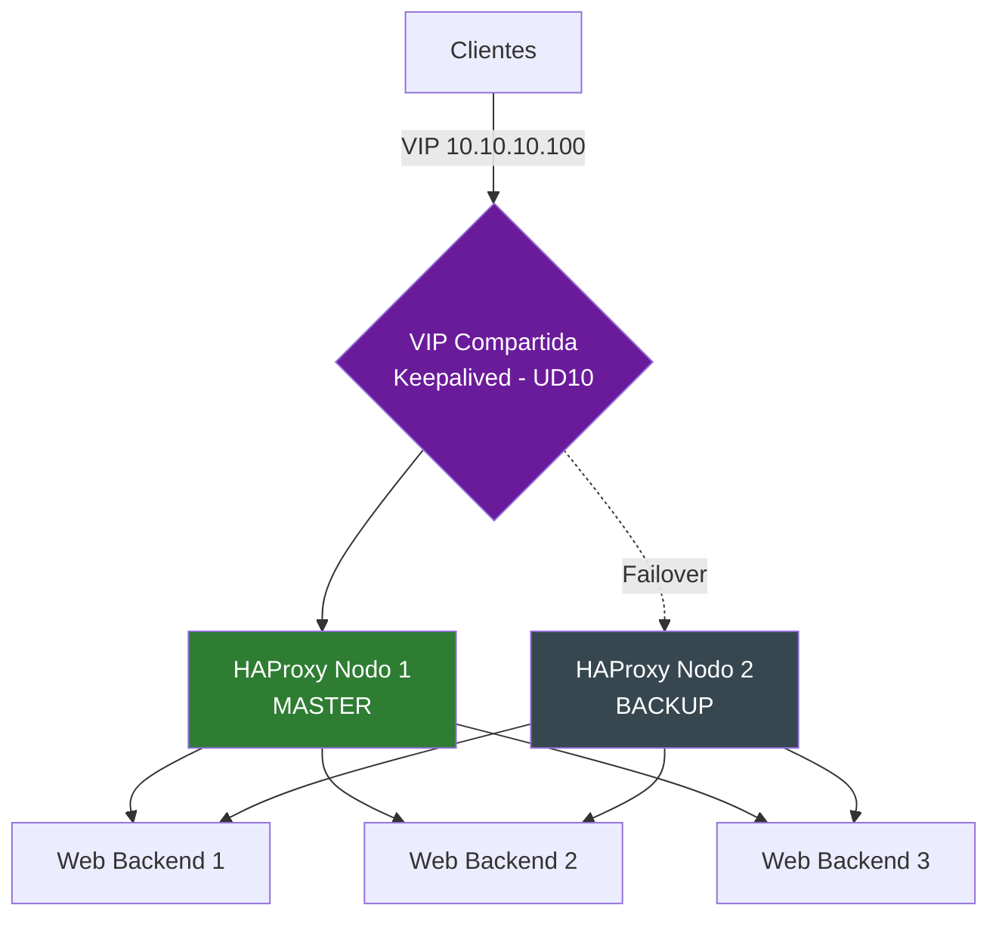

# UD 9: Alta Disponibilidad - Balanceo de Carga y Proxies Reversos (HAProxy / Nginx)

!!! info "Ficha Técnica de la Unidad"
    * **Resultados de Aprendizaje (RA):** RA5 - Implementa soluciones de alta disponibilidad empleando métodos de balanceo de carga y elección de sistemas redundantes.
    * **Criterios de Evaluación (CE):** a) Se ha valorado la necesidad de la alta disponibilidad; b) Se han descrito los algoritmos de balanceo de carga; c) Se ha implementado un balanceador de carga con verificación de estado (health checks).
    * **Tecnologías Involucradas:** [HAProxy](../tech/haproxy.md)
    * **Marcos y Estándares:** ENS `mp.info.9` (Copias de seguridad), `mp.eq.2` (Disponibilidad); RFC 7231 (HTTP/1.1 Semantics); NIST SP 800-53 (Control CP - Contingency Planning).

---

## 📖 1. Fundamentos Teóricos y Arquitectura de Seguridad

### 1.1 Alta disponibilidad: definiciones y métricas

La **disponibilidad** se mide habitualmente en "nueves": un SLA del 99,9% ("tres nueves") permite hasta 8,76 horas de caída anual; un 99,99% ("cuatro nueves") reduce ese margen a 52,6 minutos. Alcanzar estos niveles requiere **eliminar puntos únicos de fallo (SPOF)** en cada capa de la arquitectura: red, balanceador, aplicación y datos.

### 1.2 Algoritmos de balanceo de carga

| Algoritmo | Descripción | Caso de uso ideal |
|---|---|---|
| Round Robin | Reparto secuencial equitativo entre backends | Backends homogéneos en capacidad |
| Least Connections | Envía al backend con menos conexiones activas | Peticiones de duración variable (ej. APIs) |
| Source IP Hash | Asigna un cliente siempre al mismo backend según su IP | Sesiones sin almacenamiento compartido (sticky sessions) |
| Weighted Round Robin | Round robin ponderado por capacidad de cada backend | Backends heterogéneos (distinta capacidad de hardware) |

### 1.3 Arquitectura de balanceo con eliminación de SPOF



!!! note "Normativa y Estándares (ENS / ISO 27001 / RFC)"
    El balanceador de carga por sí solo introduce un **nuevo punto único de fallo** si se despliega en una única instancia. La arquitectura de referencia de este módulo combina **HAProxy** (balanceo de capa 4/7, tratado en esta unidad) con **Keepalived** (redundancia de la propia capa de balanceo mediante VRRP, tratado en UD10) para eliminar el SPOF en cascada.

### 1.4 Terminación TLS: en el balanceador vs. en el backend

- **TLS Termination** (descifrado en el balanceador): simplifica la gestión de certificados (centralizada, ver UD1), pero el tráfico balanceador→backend viaja en claro salvo que se cifre explícitamente en un segmento interno adicional.
- **TLS Passthrough** (el balanceador reenvía el tráfico cifrado sin descifrarlo, operando en capa 4): mantiene cifrado extremo a extremo, pero impide que el balanceador inspeccione o enrute por contenido HTTP (capa 7).

---

## ⚙️ 2. Configuración Avanzada, Despliegue y Hardening

### 2.1 HAProxy como balanceador de capa 7 con health checks activos

```haproxy title="/etc/haproxy/haproxy.cfg" linenums="1"
global
    log /dev/log local0
    log /dev/log local1 notice
    chroot /var/lib/haproxy
    stats socket /run/haproxy/admin.sock mode 660 level admin
    stats timeout 30s
    user haproxy
    group haproxy
    daemon
    maxconn 4096

    # Bastionado TLS: restringe la version y cifrados del propio HAProxy (CCN-STIC 807)
    ssl-default-bind-ciphers ECDHE-ECDSA-AES256-GCM-SHA384:ECDHE-RSA-AES256-GCM-SHA384:ECDHE-ECDSA-CHACHA20-POLY1305
    ssl-default-bind-options ssl-min-ver TLSv1.2 no-tls-tickets

defaults
    log     global
    mode    http
    option  httplog
    option  dontlognull
    timeout connect 5s
    timeout client  30s
    timeout server  30s
    timeout http-request 10s
    retries 3
    option  redispatch

frontend http_frontend
    bind *:80
    # Redireccion forzosa a HTTPS
    redirect scheme https code 301 if !{ ssl_fc }

frontend https_frontend
    bind *:443 ssl crt /opt/ca/intermediate-ca/haproxy-bundle.pem
    mode http

    # Cabeceras de seguridad e informacion de origen real del cliente
    http-request set-header X-Forwarded-Proto https
    http-request add-header X-Frame-Options SAMEORIGIN

    # ACL para enrutado basado en contenido (path-based routing)
    acl es_api path_beg /api
    use_backend backend_api if es_api
    default_backend backend_web

backend backend_web
    balance leastconn
    option httpchk GET /health
    http-check expect status 200
    default-server inter 3s fall 3 rise 2

    server web1 10.10.20.11:8080 check weight 10
    server web2 10.10.20.12:8080 check weight 10
    server web3 10.10.20.13:8080 check weight 5 backup

backend backend_api
    balance roundrobin
    option httpchk GET /api/health
    http-check expect status 200
    server api1 10.10.20.21:9090 check
    server api2 10.10.20.22:9090 check

listen stats
    bind *:8404
    stats enable
    stats uri /stats
    stats refresh 10s
    stats auth admin:CAMBIAR_PASSWORD_FUERTE_AQUI
```

!!! danger "Alerta Crítica y Bastionado (CIS / CCN-CERT)"
    Los parámetros `fall 3 rise 2` en `default-server` son críticos para la estabilidad: un servidor se marca como caído tras **3** comprobaciones fallidas consecutivas (`fall`), pero requiere **2** comprobaciones exitosas consecutivas (`rise`) para volver a considerarse sano. Esta asimetría evita el fenómeno de "flapping" (un backend entrando y saliendo del pool repetidamente por fallos intermitentes), que degradaría la experiencia de los clientes.

### 2.2 Endpoint de health check en el backend

```nginx title="/etc/nginx/conf.d/health.conf (en cada servidor backend)" linenums="1"
server {
    listen 8080;
    location /health {
        access_log off;
        # Verifica no solo que Nginx responde, sino que la aplicacion backend esta operativa
        proxy_pass http://127.0.0.1:3000/internal/health;
        proxy_connect_timeout 2s;
        proxy_read_timeout 2s;
    }
}
```

!!! tip "Buenas Prácticas Sysadmin / SecOps"
    Un health check robusto **nunca** debe limitarse a comprobar que el proceso web escucha en el puerto (falso positivo de "sano"); debe verificar la cadena de dependencias reales de la aplicación (conexión a base de datos, caché, servicios externos críticos), devolviendo `200 OK` solo si el servicio puede realmente atender peticiones de negocio.

---

## 🛠️ 3. Laboratorio Práctico Dirigido

!!! example "Laboratorio Práctico Paso a Paso"
    **Objetivo:** Desplegar HAProxy balanceando 3 backends web, validar los algoritmos de balanceo y comprobar la detección automática de caída de un nodo.

    **Paso 1.** Desplegar 3 máquinas backend con Nginx sirviendo una página que identifique el nodo (`hostname`) y el endpoint `/health`.

    **Paso 2.** Configurar HAProxy según la sección 2.1, apuntando a las 3 IPs de los backends.

    **Paso 3 — Verificar el reparto de carga:**
    ```bash
    for i in $(seq 1 10); do curl -s https://balanceador.asir-corp.local | grep hostname; done
    ```

    **Paso 4 — Consultar el panel de estadísticas:**
    ```bash
    curl -u admin:CAMBIAR_PASSWORD_FUERTE_AQUI http://balanceador.asir-corp.local:8404/stats
    ```

    **Paso 5 — Simular la caída de un backend** (detener Nginx en `web1`) y verificar en el panel de stats que HAProxy lo marca como `DOWN` tras 3 comprobaciones fallidas, redirigiendo automáticamente el tráfico a los nodos restantes sin interrupción visible para el cliente.

    **Paso 6 — Restaurar `web1`** y comprobar que vuelve a incorporarse al pool tras 2 comprobaciones exitosas (`rise 2`).

    **Criterio de éxito:** el tráfico se reparte según el algoritmo configurado, la caída de un backend es detectada y gestionada automáticamente sin que el cliente perciba error 5xx, y la reincorporación del nodo es igualmente transparente.

---

## 🛡️ 4. Monitoreo, Análisis de Eventos y Respuesta a Incidentes

| Log/Fuente | Ubicación | Contenido |
|---|---|---|
| Log HAProxy | `/var/log/haproxy.log` (via rsyslog local0) | Peticiones, códigos de estado, tiempos de respuesta, backend usado |
| Panel de stats | `http://<host>:8404/stats` | Estado en tiempo real de cada backend, sesiones activas |
| Socket de administración | `/run/haproxy/admin.sock` | Interacción en caliente (deshabilitar servidor, ver stats via `socat`) |

```bash title="Consulta del estado de servidores via socket de administracion" linenums="1"
echo "show servers state" | socat stdio /run/haproxy/admin.sock

# Sacar un servidor de produccion en caliente para mantenimiento (drenaje de conexiones)
echo "set server backend_web/web1 state maint" | socat stdio /run/haproxy/admin.sock
```

!!! warning "Vector de Ataque y Vulnerabilidad"
    Un aumento sostenido de código **503 Service Unavailable** en el log de HAProxy, correlacionado con todos los servidores de un backend marcados `DOWN` simultáneamente, puede indicar tanto un fallo de infraestructura genuino como un **ataque de denegación de servicio (DoS)** dirigido a agotar los recursos de los backends; correlacionar con el IDS/IPS (UD5) para descartar esta segunda hipótesis.

---

## ❓ 5. Casos Prácticos y Autoevaluación Técnica

**Caso 1 — Sesiones de usuario perdidas tras balanceo Round Robin.** Una aplicación sin sesión compartida (sin Redis/Memcached centralizado) pierde el carrito de compra del usuario al alternar de backend. *Resolución:* aplicar `balance source` (sticky por IP) como solución táctica inmediata, y como solución estructural migrar el estado de sesión a un almacén compartido externo a los backends.

**Caso 2 — Health check "engañoso" que no refleja el estado real.** El endpoint `/health` devuelve siempre 200 aunque la base de datos backend esté caída, ocultando el problema al balanceador. *Resolución:* corregir el endpoint para que verifique explícitamente sus dependencias críticas (sección 2.2), y en el ínterin, revisar métricas de error de aplicación (tasa de 5xx real) para detectar la discrepancia entre "health check verde" y "servicio realmente funcional".

**Caso 3 — Flapping de un backend con `fall`/`rise` mal ajustados.** Con `fall 1 rise 1`, un backend con latencia de red ocasional entra y sale constantemente del pool. *Resolución:* ajustar a valores más tolerantes (`fall 3 rise 2` o superiores) según la variabilidad observada de latencia en el entorno real, evitando penalizar servidores sanos por fallos transitorios puntuales.

**Caso 4 — Certificado TLS caducado provoca caída total del servicio.** Al usar terminación TLS centralizada en HAProxy, un único certificado caducado afecta a **todos** los backends simultáneamente. *Resolución:* implementar el sistema de alertas de expiración de certificados de UD1 específicamente sobre el bundle usado por HAProyx, con antelación suficiente para renovación sin interrupción.

**Caso 5 — Panel de estadísticas expuesto sin autenticación fuerte en Internet.** Un escaneo externo revela el endpoint `/stats` accesible públicamente con credenciales débiles. *Resolución:* restringir el acceso al panel de stats exclusivamente a la red de administración mediante regla de firewall (UD3) además de credenciales robustas, ya que expone información sensible de la topología interna (IPs, puertos de backends) útil para un atacante en fase de reconocimiento.
