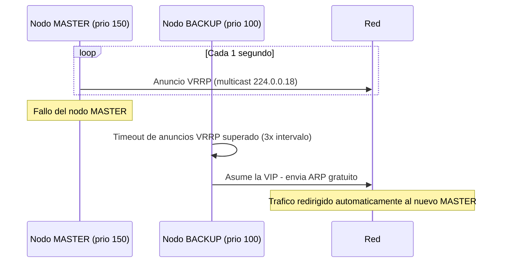
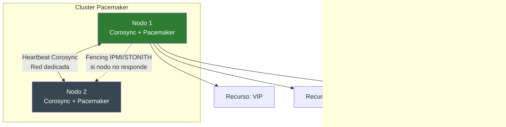

# UD 10: Alta Disponibilidad - Clusters de Redundancia y Failover (Keepalived / Corosync-Pacemaker)

!!! info "Ficha Técnica de la Unidad"
    * **Resultados de Aprendizaje (RA):** RA5 - Implementa soluciones de alta disponibilidad empleando métodos de balanceo de carga y elección de sistemas redundantes.
    * **Criterios de Evaluación (CE):** d) Se ha implementado un clúster de alta disponibilidad activo-pasivo; e) Se ha configurado un mecanismo de IP virtual compartida; f) Se han descrito los mecanismos de prevención del split-brain.
    * **Tecnologías Involucradas:** [Keepalived](../tech/keepalived.md), [Corosync-Pacemaker](../tech/corosync-pacemaker.md)
    * **Marcos y Estándares:** ENS `mp.eq.2` (Disponibilidad); NIST SP 800-53 (CP-9 Information System Backup, CP-10 Recovery and Reconstitution); RFC 5798 (VRRP versión 3).

---

## 📖 1. Fundamentos Teóricos y Arquitectura de Seguridad

### 1.1 Modelos de clúster: activo-pasivo vs. activo-activo

- **Activo-Pasivo (Failover)**: un nodo atiende todo el tráfico (MASTER); el otro permanece en espera (BACKUP), listo para asumir el servicio si el MASTER falla. Más simple de gestionar, pero infrautiliza el nodo pasivo.
- **Activo-Activo**: ambos nodos atienden tráfico simultáneamente, requiriendo mecanismos de sincronización de estado más complejos (bases de datos replicadas, almacenamiento compartido).

### 1.2 VRRP (Virtual Router Redundancy Protocol) — RFC 5798

**Keepalived** implementa VRRP para gestionar una **IP Virtual (VIP)** compartida entre nodos. El nodo con mayor prioridad asume el rol MASTER y "posee" la VIP; si deja de enviar paquetes de anuncio (`advertisement`) dentro del intervalo esperado, el nodo BACKUP con siguiente prioridad más alta asume la VIP automáticamente.



!!! danger "Alerta Crítica y Bastionado (CIS / CCN-CERT)"
    El fenómeno de **split-brain** ocurre cuando, por una partición de red, ambos nodos se consideran simultáneamente MASTER y ambos intentan poseer la VIP, provocando corrupción de datos o comportamiento indefinido. La mitigación estándar combina: (1) un canal de comunicación redundante y dedicado entre nodos (heartbeat en interfaz separada de la red de producción), y (2) mecanismos de **fencing/STONITH** ("Shoot The Other Node In The Head") en clústeres Pacemaker, que fuerzan el apagado físico o desconexión del nodo sospechoso de estar en estado inconsistente.

### 1.3 Corosync + Pacemaker: gestión de clúster de propósito general

Mientras Keepalived está especializado en VIP para balanceadores/proxies, **Pacemaker** (motor de gestión de recursos) sobre **Corosync** (capa de mensajería de clúster) permite gestionar failover de recursos más complejos: sistemas de ficheros compartidos, bases de datos, servicios con estado, con políticas de dependencia y orden de arranque entre recursos.



---

## ⚙️ 2. Configuración Avanzada, Despliegue y Hardening

### 2.1 Keepalived: VIP compartida para el par de balanceadores HAProxy (UD9)

```ini title="/etc/keepalived/keepalived.conf (NODO MASTER)" linenums="1"
global_defs {
    router_id HAPROXY_NODO_1
    enable_script_security
    script_user keepalived_script
}

# Script de verificacion: el failover solo debe ocurrir si HAProxy realmente ha fallado
vrrp_script chk_haproxy {
    script "/usr/local/bin/check_haproxy.sh"
    interval 2
    weight -20
    fall 2
    rise 2
}

vrrp_instance VI_1 {
    state MASTER
    interface eth1
    virtual_router_id 51
    priority 150
    advert_int 1

    # Autenticacion entre nodos VRRP - mitiga inyeccion de anuncios VRRP falsos
    authentication {
        auth_type PASS
        auth_pass CLAVE_VRRP_COMPARTIDA_SEGURA
    }

    # Interfaz dedicada de heartbeat, separada de la red de produccion (mitiga split-brain)
    unicast_src_ip 10.10.30.1
    unicast_peer {
        10.10.30.2
    }

    virtual_ipaddress {
        10.10.10.100/24 dev eth0
    }

    track_script {
        chk_haproxy
    }

    notify_master "/usr/local/bin/notify.sh MASTER"
    notify_backup "/usr/local/bin/notify.sh BACKUP"
    notify_fault  "/usr/local/bin/notify.sh FAULT"
}
```

```ini title="/etc/keepalived/keepalived.conf (NODO BACKUP - solo difiere en state/priority/IPs)" linenums="1"
vrrp_instance VI_1 {
    state BACKUP
    priority 100
    unicast_src_ip 10.10.30.2
    unicast_peer {
        10.10.30.1
    }
    # ... resto identico al MASTER (virtual_ipaddress, authentication, track_script)
}
```

```bash title="/usr/local/bin/check_haproxy.sh" linenums="1"
#!/bin/bash
# Verifica que el proceso HAProxy esta activo Y respondiendo en el puerto 443
if ! systemctl is-active --quiet haproxy; then
    exit 1
fi
if ! curl -sf -o /dev/null https://127.0.0.1/health; then
    exit 1
fi
exit 0
```

!!! tip "Buenas Prácticas Sysadmin / SecOps"
    Usar `unicast_src_ip`/`unicast_peer` en lugar del multicast VRRP por defecto (`224.0.0.18`) es una práctica recomendada en entornos cloud/virtualizados donde el multicast puede estar bloqueado por el proveedor de infraestructura, además de reducir el ruido de red en entornos con múltiples clústeres VRRP coexistiendo.

### 2.2 Corosync + Pacemaker: clúster de failover para un recurso con VIP y servicio

```ini title="/etc/corosync/corosync.conf (fragmento)" linenums="1"
totem {
    version: 2
    cluster_name: cluster-asir-corp
    transport: udpu
    interface {
        ringnumber: 0
        bindnetaddr: 10.10.30.0
        mcastport: 5405
    }
}

nodelist {
    node {
        ring0_addr: 10.10.30.1
        nodeid: 1
    }
    node {
        ring0_addr: 10.10.30.2
        nodeid: 2
    }
}

quorum {
    provider: corosync_votequorum
    two_node: 1
}
```

```bash title="Configuracion de recursos Pacemaker" linenums="1"
pcs cluster setup cluster-asir-corp node1 node2
pcs cluster start --all
pcs property set stonith-enabled=false   # Solo en laboratorio; en produccion requiere fencing real

# Recurso VIP gestionado por Pacemaker
pcs resource create vip_cluster ocf:heartbeat:IPaddr2 ip=10.10.10.100 cidr_netmask=24 op monitor interval=5s

# Recurso de servicio con dependencia de orden respecto a la VIP
pcs resource create servicio_web systemd:nginx op monitor interval=10s
pcs constraint order vip_cluster then servicio_web
pcs constraint colocation add servicio_web with vip_cluster INFINITY
```

!!! danger "Alerta Crítica y Bastionado (CIS / CCN-CERT)"
    `stonith-enabled=false` es **únicamente aceptable en entornos de laboratorio**. En un clúster de producción, deshabilitar el fencing (STONITH) elimina la única protección real contra split-brain: sin un mecanismo que garantice que un nodo caído/aislado queda efectivamente inoperativo (apagado por IPMI, desconexión de red gestionada), ambos nodos pueden terminar gestionando el mismo recurso simultáneamente con resultados catastróficos (corrupción de datos compartidos).

---

## 🛠️ 3. Laboratorio Práctico Dirigido

!!! example "Laboratorio Práctico Paso a Paso"
    **Objetivo:** Desplegar un par de nodos HAProxy con Keepalived en modo activo-pasivo, verificar la VIP y provocar un failover controlado.

    **Paso 1.** Desplegar 2 nodos con HAProxy (UD9) ya configurado y Keepalived según la sección 2.1.

    **Paso 2 — Verificar que la VIP responde en el nodo MASTER:**
    ```bash
    ip addr show eth0 | grep 10.10.10.100
    curl -I https://10.10.10.100
    ```

    **Paso 3 — Provocar un fallo controlado del servicio HAProxy en el MASTER:**
    ```bash
    systemctl stop haproxy
    ```

    **Paso 4 — Verificar el failover automático:** en pocos segundos, la VIP debe migrar al nodo BACKUP.
    ```bash
    # En el nodo BACKUP (ahora MASTER):
    ip addr show eth0 | grep 10.10.10.100
    journalctl -u keepalived -f
    ```

    **Paso 5 — Restaurar el servicio en el nodo original** y verificar el comportamiento de `preempt` (si la prioridad configurada provoca que recupere el rol MASTER automáticamente al restablecerse).

    **Criterio de éxito:** el failover ocurre en menos de `3 × advert_int` segundos, sin intervención manual, y la VIP es alcanzable de forma continua durante toda la prueba salvo la breve ventana de conmutación.

---

## 🛡️ 4. Monitoreo, Análisis de Eventos y Respuesta a Incidentes

```bash title="Monitorizacion del estado VRRP" linenums="1"
journalctl -u keepalived -f
ip addr show eth0 | grep -A1 "10.10.10.100"
```

```bash title="Estado del cluster Pacemaker" linenums="1"
pcs status
crm_mon -1
```

!!! warning "Vector de Ataque y Vulnerabilidad"
    Un ataque de **inyección de anuncios VRRP falsos** desde un nodo no autorizado en la red puede provocar que un atacante fuerce la asunción de la VIP hacia un equipo malicioso (interceptando todo el tráfico destinado al servicio legítimo). La directiva `authentication { auth_type PASS }` mitiga este vector, aunque su protección es limitada (contraseña en texto plano dentro del protocolo VRRPv2); en entornos de alta sensibilidad, aislar la red de heartbeat en una VLAN dedicada sin acceso desde segmentos no confiables es el control compensatorio principal.

---

## ❓ 5. Casos Prácticos y Autoevaluación Técnica

**Caso 1 — Split-brain tras corte de la red de heartbeat.** Ambos nodos Keepalived se declaran MASTER simultáneamente tras perder conectividad entre sí, pero manteniendo cada uno conectividad con los clientes. *Resolución:* esto confirma la necesidad de un canal de heartbeat redundante (segunda interfaz física/VLAN dedicada) y, en clústeres Pacemaker, de fencing real (STONITH) que garantice que un nodo aislado deja de operar en lugar de asumir presunciones sobre su propio estado.

**Caso 2 — Failover no ocurre pese a caída del servicio.** HAProxy está caído en el nodo MASTER pero Keepalived no promueve al BACKUP. *Resolución:* revisar que `vrrp_script` (`chk_haproxy.sh`) esté correctamente vinculado con `track_script` y que el script realmente detecte el fallo (no solo verificar el proceso, sino la respuesta funcional del servicio, como en el ejemplo de la sección 2.1).

**Caso 3 — El nodo original no recupera el rol MASTER tras restaurarse.** *Resolución:* por defecto Keepalived tiene comportamiento "preemptive" (el nodo de mayor prioridad siempre recupera MASTER); si se requiere evitar conmutaciones innecesarias (y su breve interrupción), configurar `nopreempt`, asumiendo el trade-off de que el servicio seguirá en el nodo BACKUP hasta el siguiente evento de fallo.

**Caso 4 — Recursos Pacemaker arrancan en orden incorrecto.** El servicio web intenta arrancar antes de que la VIP esté disponible, causando errores de bind. *Resolución:* las restricciones `pcs constraint order` y `colocation` (sección 2.2) son obligatorias para garantizar la secuencia correcta; revisar y corregir las dependencias declaradas entre recursos.

**Caso 5 — Ataque de suplantación VRRP exitoso por ausencia de autenticación.** Un pentest interno logra hacerse pasar por MASTER VRRP inyectando anuncios con prioridad más alta, interceptando tráfico. *Resolución:* habilitar `authentication` en todas las instancias VRRP del clúster (omitida por error en el despliegue original), y migrar el heartbeat a una VLAN aislada sin acceso desde redes de usuario final.
