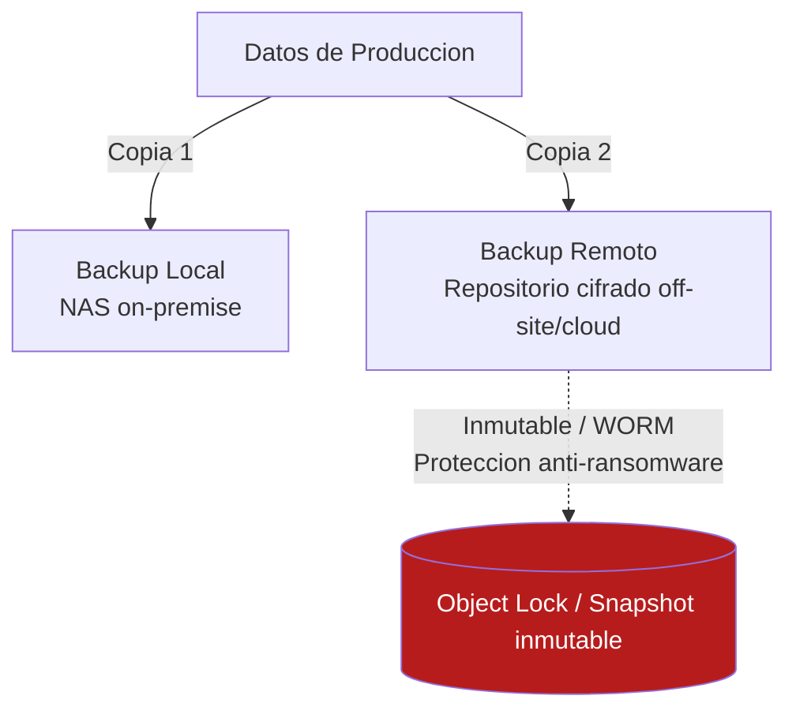

# UD 11: Almacenamiento Redundante (RAID/SAN/NAS), Backups y Disaster Recovery

!!! info "Ficha Técnica de la Unidad"
    * **Resultados de Aprendizaje (RA):** RA4 - Implementa sistemas de almacenamiento redundante y elabora un plan de recuperación ante desastres; RA5 - Implementa soluciones de alta disponibilidad (g - almacenamiento redundante).
    * **Criterios de Evaluación (CE):** RA4-d) Se han descrito los niveles RAID y su nivel de tolerancia a fallos; e) Se ha implementado una política de copias de seguridad 3-2-1. RA5-g) Se ha configurado almacenamiento compartido de alta disponibilidad.
    * **Tecnologías Involucradas:** [Restic y Bacula](../tech/restic-bacula.md)
    * **Marcos y Estándares:** ENS `mp.info.9` (Copias de seguridad); NIST SP 800-34 (Contingency Planning Guide); ISO 27001 Anexo A.12.3 (Copias de seguridad de la información).

---

## 📖 1. Fundamentos Teóricos y Arquitectura de Seguridad

### 1.1 Niveles RAID y su tolerancia a fallos

| Nivel RAID | Descripción | Tolerancia a fallo de disco | Rendimiento | Capacidad útil |
|---|---|---|---|---|
| RAID 0 | Striping (fragmentación sin redundancia) | Ninguna (0 discos) | Máximo | 100% |
| RAID 1 | Mirroring (espejo completo) | 1 disco (de un par) | Lectura alta, escritura normal | 50% |
| RAID 5 | Striping + paridad distribuida | 1 disco | Bueno | (N-1)/N |
| RAID 6 | Striping + doble paridad distribuida | 2 discos | Algo menor que RAID 5 | (N-2)/N |
| RAID 10 | Combinación de mirroring + striping | 1 disco por par espejado | Excelente | 50% |

!!! danger "Alerta Crítica y Bastionado (CIS / CCN-CERT)"
    **RAID no es una copia de seguridad.** Protege exclusivamente contra el fallo físico de uno o más discos, pero no contra borrado accidental, corrupción lógica, cifrado por ransomware o eliminación malintencionada — cualquiera de estos eventos se replica instantáneamente en todos los discos del array. Confundir RAID con backup es uno de los errores de diseño más graves y frecuentes en la gestión de infraestructura.

### 1.2 La regla 3-2-1(-1) de copias de seguridad

- **3** copias de los datos (1 original + 2 copias de seguridad).
- **2** soportes/medios de almacenamiento distintos (ej. disco local + cinta/NAS remoto).
- **1** copia fuera de las instalaciones (off-site), para sobrevivir a un desastre físico total (incendio, inundación).
- **(1)** — extensión moderna: al menos 1 copia **inmutable o desconectada** (air-gapped/immutable storage), como protección específica frente a ransomware que cifra también las copias de backup accesibles en red.



### 1.3 Tipos de backup y su impacto en RTO/RPO

| Tipo | Descripción | Ventaja | Coste |
|---|---|---|---|
| Completo | Copia íntegra de todos los datos | Restauración simple y rápida | Máximo espacio y tiempo |
| Incremental | Solo cambios desde el último backup (completo o incremental) | Mínimo espacio/tiempo por ejecución | Restauración más lenta (requiere toda la cadena) |
| Diferencial | Cambios desde el último backup completo | Restauración más rápida que incremental | Crece con el tiempo hasta el siguiente completo |

**RTO (Recovery Time Objective)**: tiempo máximo aceptable para restaurar el servicio tras un desastre. **RPO (Recovery Point Objective)**: cantidad máxima aceptable de pérdida de datos, medida en tiempo (ej. "máximo 1 hora de datos perdidos").

!!! note "Normativa y Estándares (ENS / ISO 27001 / RFC)"
    La medida `mp.info.9` del ENS exige la realización de copias de seguridad con una **periodicidad acorde a la frecuencia de cambio de la información** y la **verificación periódica** de que dichas copias son recuperables — un backup nunca probado no es un backup fiable, es una suposición.

---

## ⚙️ 2. Configuración Avanzada, Despliegue y Hardening

### 2.1 Configuración de RAID por software con `mdadm`

```bash title="Creacion de un array RAID 10 con mdadm" linenums="1"
mdadm --create /dev/md0 --level=10 --raid-devices=4 /dev/sdb /dev/sdc /dev/sdd /dev/sde

# Formatear y montar
mkfs.ext4 /dev/md0
mkdir -p /mnt/data
mount /dev/md0 /mnt/data

# Persistir la configuracion del array
mdadm --detail --scan >> /etc/mdadm/mdadm.conf
update-initramfs -u

# Añadir al fstab para montaje automatico
echo "/dev/md0 /mnt/data ext4 defaults 0 2" >> /etc/fstab
```

```bash title="Monitorizacion del estado del array" linenums="1"
cat /proc/mdstat
mdadm --detail /dev/md0
```

!!! warning "Vector de Ataque y Vulnerabilidad"
    Un array RAID 5/6 en estado **degraded** (con un disco fallido) es especialmente vulnerable durante el proceso de **rebuild**: la carga de lectura intensiva sobre los discos restantes durante la reconstrucción incrementa significativamente la probabilidad de un segundo fallo de disco antes de completarse, lo que en RAID 5 provocaría pérdida total de datos. Esto justifica preferir RAID 6 o RAID 10 sobre RAID 5 en discos de gran capacidad, donde los tiempos de rebuild son más largos.

### 2.2 Backup cifrado con `restic` hacia repositorio remoto (regla 3-2-1)

```bash title="Inicializacion de repositorio remoto cifrado (S3-compatible)" linenums="1"
export RESTIC_REPOSITORY="s3:https://backup-endpoint.asir-corp.local/backups-produccion"
export RESTIC_PASSWORD_FILE="/etc/restic/password.txt"
export AWS_ACCESS_KEY_ID="..."
export AWS_SECRET_ACCESS_KEY="..."

restic init
```

```bash title="/usr/local/sbin/backup-diario.sh (script programado via cron/systemd timer)" linenums="1"
#!/bin/bash
set -euo pipefail

export RESTIC_REPOSITORY="s3:https://backup-endpoint.asir-corp.local/backups-produccion"
export RESTIC_PASSWORD_FILE="/etc/restic/password.txt"

LOGFILE="/var/log/restic-backup.log"

echo "=== Backup iniciado: $(date) ===" >> "$LOGFILE"

restic backup /etc /opt/ca /var/www /home \
  --exclude-caches \
  --tag "diario-$(hostname)" >> "$LOGFILE" 2>&1

# Politica de retencion: 7 diarias, 4 semanales, 12 mensuales (aplicando 3-2-1 en el ciclo de vida)
restic forget --keep-daily 7 --keep-weekly 4 --keep-monthly 12 --prune >> "$LOGFILE" 2>&1

# Verificacion de integridad del repositorio (obligatorio, no opcional)
restic check >> "$LOGFILE" 2>&1

echo "=== Backup finalizado: $(date) ===" >> "$LOGFILE"
```

```ini title="/etc/systemd/system/backup-diario.timer" linenums="1"
[Unit]
Description=Ejecucion diaria de backup con restic

[Timer]
OnCalendar=*-*-* 02:30:00
Persistent=true

[Install]
WantedBy=timers.target
```

!!! tip "Buenas Prácticas Sysadmin / SecOps"
    `restic check` tras cada ciclo de backup **no es opcional**: verifica la integridad criptográfica del repositorio (todos los blobs y packs referenciados existen y no están corruptos). Programar además una **prueba de restauración completa trimestral** en un entorno aislado es la única forma real de validar que el RTO/RPO definido es alcanzable en la práctica, no solo sobre el papel.

### 2.3 Backup empresarial con Bacula (entornos con múltiples clientes)

```ini title="/etc/bacula/bacula-dir.conf (fragmento - definicion de Job)" linenums="1"
Job {
  Name = "Backup-Servidor-Web"
  Type = Backup
  Level = Incremental
  Client = srv-web-fd
  FileSet = "FileSet-Web"
  Schedule = "Diario-Nocturno"
  Storage = Cinta-LTO
  Pool = Pool-Mensual
  Priority = 10
  Write Bootstrap = "/var/lib/bacula/%c.bsr"
}

FileSet {
  Name = "FileSet-Web"
  Include {
    Options {
      signature = SHA256
      compression = GZIP
    }
    File = /var/www
    File = /etc/nginx
  }
  Exclude {
    File = /var/www/cache
  }
}

Schedule {
  Name = "Diario-Nocturno"
  Run = Full 1st sun at 01:00
  Run = Differential 2nd-5th sun at 01:00
  Run = Incremental mon-sat at 01:00
}
```

---

## 🛠️ 3. Laboratorio Práctico Dirigido

!!! example "Laboratorio Práctico Paso a Paso"
    **Objetivo:** Configurar un array RAID, desplegar un backup automatizado con restic siguiendo la regla 3-2-1, y ejecutar una prueba real de restauración ante desastre.

    **Paso 1.** Crear un array RAID 10 con `mdadm` (sección 2.1) sobre discos virtuales de laboratorio.

    **Paso 2 — Simular el fallo de un disco:**
    ```bash
    mdadm --manage /dev/md0 --fail /dev/sdc
    cat /proc/mdstat
    ```
    Verificar que el array continúa operativo en estado `degraded`.

    **Paso 3 — Sustituir el disco fallido y reconstruir:**
    ```bash
    mdadm --manage /dev/md0 --remove /dev/sdc
    mdadm --manage /dev/md0 --add /dev/sdf
    watch cat /proc/mdstat   # Observar el progreso del rebuild
    ```

    **Paso 4.** Desplegar el backup automatizado con restic (sección 2.2) contra un repositorio S3 de laboratorio (MinIO).

    **Paso 5 — Prueba de Disaster Recovery real:** eliminar deliberadamente un directorio de prueba y restaurarlo completamente desde el backup:
    ```bash
    rm -rf /opt/ca/intermediate-ca/certs
    restic restore latest --target /tmp/restauracion --path /opt/ca/intermediate-ca/certs
    diff -r /tmp/restauracion/opt/ca/intermediate-ca/certs /opt/ca/intermediate-ca/certs.backup_verificacion
    ```

    **Criterio de éxito:** el array RAID sobrevive al fallo simulado sin pérdida de datos, el rebuild se completa correctamente, y la restauración desde restic recupera el contenido exacto (verificado por comparación de hashes/diff) dentro del RTO objetivo definido.

---

## 🛡️ 4. Monitoreo, Análisis de Eventos y Respuesta a Incidentes

```bash title="Monitorizacion proactiva del estado RAID (cron)" linenums="1"
#!/bin/bash
# /usr/local/sbin/check-raid-health.sh
STATUS=$(cat /proc/mdstat | grep -c "_")
if [ "$STATUS" -gt 0 ]; then
    logger -t raid-monitor "ALERTA: array RAID en estado degradado"
    mail -s "ALERTA CRITICA: RAID degradado en $(hostname)" secops@asir-corp.local < /proc/mdstat
fi
```

```bash title="Verificacion de la ultima ejecucion exitosa de backup" linenums="1"
restic snapshots --latest 1
tail -30 /var/log/restic-backup.log
```

!!! warning "Vector de Ataque y Vulnerabilidad"
    Un indicador crítico de un ataque de **ransomware en curso** es un incremento anómalo y repentino en la tasa de cambio de ficheros detectada por el siguiente backup incremental (volumen de datos modificados muy superior al patrón habitual). Correlacionar el tamaño de cada backup incremental con una línea base histórica permite detectar cifrado masivo de ficheros incluso antes de que otros sistemas de detección lo identifiquen.

---

## ❓ 5. Casos Prácticos y Autoevaluación Técnica

**Caso 1 — Confusión entre RAID y backup provoca pérdida total de datos.** Un administrador borra accidentalmente una base de datos completa, confiando en que "está en RAID 1, hay redundancia". *Resolución:* el borrado se replica instantáneamente en ambos discos del espejo; sin un backup independiente y versionado (con `restic snapshots` conservando puntos en el tiempo anteriores), los datos son irrecuperables. Refuerza la necesidad estructural de separar conceptualmente disponibilidad (RAID) de recuperabilidad (backup).

**Caso 2 — Backup exitoso pero irrestaurable.** Tras meses de backups aparentemente correctos, una prueba de restauración real falla por corrupción del repositorio no detectada. *Resolución:* esto confirma por qué `restic check` tras cada ciclo y las **pruebas de restauración periódicas programadas** (no solo verificación de "backup completado sin error") son un requisito, no una buena práctica opcional.

**Caso 3 — Ransomware cifra también las copias de backup accesibles en red.** El backup en el NAS, montado permanentemente como recurso de red desde el servidor de producción, es cifrado junto con los datos originales. *Resolución:* implementar el principio "(1)" de la regla 3-2-1-1: mantener al menos una copia inmutable (Object Lock en almacenamiento S3-compatible) o desconectada (air-gapped), inaccesible para escritura/cifrado desde el sistema de producción comprometido.

**Caso 4 — RAID 5 sufre pérdida total de datos durante un rebuild.** Tras el fallo de un disco, un segundo disco falla durante el proceso de reconstrucción. *Resolución:* esto confirma el riesgo descrito en la sección 2.1; para arrays de discos de gran capacidad, migrar a RAID 6 (tolera 2 fallos simultáneos) o RAID 10, y en cualquier caso, este escenario refuerza que el RAID nunca sustituye a un backup independiente actualizado.

**Caso 5 — RTO incumplido en un ejercicio real de Disaster Recovery.** El plan documentaba un RTO de 4 horas, pero la restauración real tomó 14 horas por el volumen de datos y el ancho de banda disponible hacia el repositorio remoto. *Resolución:* recalcular el RTO realista basándose en pruebas empíricas (no en estimaciones teóricas), y considerar estrategias complementarias como una réplica local adicional de recuperación rápida para los sistemas más críticos, reservando el repositorio remoto para escenarios de desastre total del centro de datos principal.
